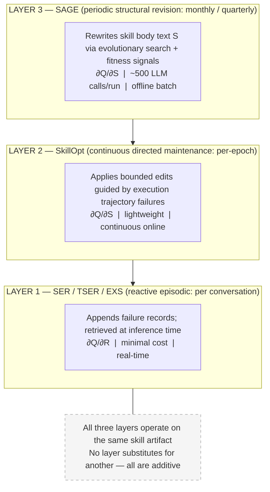

# SAGE: Agents That Rewrite Themselves

**[Author names redacted for review]**
*Preprint. Under review.*

---

## Abstract

Production agentic systems do not rewrite their own skills. When an agent fails, the standard response is episodic annotation: a failure record is appended to the skill's log and retrieved in future conversations, injecting compensatory guidance into the context window without touching the underlying instruction text. This workaround scales gracefully — until it doesn't. We name the structural ceiling it creates **Structural Semantic Stagnation**: the skill body text *S* is frozen at creation time, and no mechanism in an episodic system ever modifies it. As failure records accumulate, the context window fills with compensatory history, the base instruction's effective weight in prediction degrades, and the defect in *S* that generated every one of those records remains unaddressed. The cost of not fixing the skill grows indefinitely with every new failure.

**SAGE** (Skill-Adaptive Genetic Evolution) is the production-grade evolutionary optimizer built to close this gap. It takes the population-based evolutionary search architecture of GEPA — the strongest existing foundation for macro skill optimization — and rebuilds every component of the optimization loop for production deployment. SAGE's measurement apparatus is a seven-metric fitness family calibrated to the actual failure modes of enterprise skills: where lexical overlap metrics are paraphrase-blind, order-blind, and structure-blind, SAGE measures semantic equivalence, graph structure, format compliance, entity accuracy, and instruction adherence independently. Its evaluation architecture enforces a per-dimension no-regression constraint — no candidate deploys if any quality dimension has regressed, regardless of aggregate score improvement — closing the structural vulnerability that makes both localized editing and scalar evolutionary optimization dangerous in production. Its intelligence layer applies Thompson Sampling at three decision levels — skill scheduler, training example selector, and Bayesian acceptance gate — transforming SAGE from a stateless optimizer into a system that learns which skills reward optimization, which training examples expose real weaknesses, and how much confidence the current evidence warrants before authorizing a change. This paper establishes the complete theoretical foundation and design rationale for each of these decisions: the definitive architectural specification for a system trusted with unsupervised authority over production skill rewriting.

---

## 1. Introduction

Production agent skills do not remain static in a static world. A skill document authored at deployment serves production traffic for months — over which the environment shifts, user expectations evolve, and edge-case failure patterns accumulate in ways the original author could not have anticipated. The engineering response to this degradation has never been uniform. At one end, standard architectures default to *episodic annotation*: failures are captured as structured records, retrieved at inference time, and injected into the context window alongside the base skill text — analogous to affixing Post-it Notes to a broken page of an instruction manual. The notes help the agent navigate the defect. The underlying text of the manual is never touched. At the other end, a growing number of production platforms — recognizing that annotation alone cannot repair the underlying instruction — are aggressively forcing direct modifications onto the skill body text itself: pattern-matched correction appends, schedule-driven LLM edits, operator-guided iterative rewrites. The industry is not static. It is actively, and recklessly, attempting to self-evolve. The problem is that both strategies fail — in different ways, at different scales, for reasons that are architecturally fundamental.

We formalize agent output quality as *Q* = *f*(*S*, *R*, *C*), where *S* is the skill body text, *R* is the experience record set, and *C* is conversation context. Episodic annotation operates entirely on ∂*Q*/∂*R*: it enriches the record set at inference time without ever acting on *S*. We formally name this structural consequence **Structural Semantic Stagnation** — *S* is frozen at creation time, and no mechanism in an episodic system ever modifies it. Structural defects in *S* — ambiguous instructions, missing steps, outdated constraints, contradictory requirements — are not corrected; they are navigated around with each new compensatory record. As those records accumulate, the consequences compound: the context window fills with competing histories from different operational periods, the LLM's finite attention is progressively diluted away from the base instruction, latency spikes, and token costs scale. The cumulative result is **Episodic Compensation Load** — a growing structural debt where the base instruction's effective weight in prediction degrades with every new failure that is recorded but never repaired. The agent gets better at coping with the defect. It never eliminates it.

The architecturally obvious response is to target ∂*Q*/∂*S* directly — to migrate corrective knowledge out of the runtime context window and into the permanent parametric layer of the skill itself. Production platforms have already made this move. Some intercept user correction phrases and append them directly to the skill file. Others commit LLM-proposed edits on a proactive scheduling interval. Others apply iterative rewrites against graded benchmarks, or surgical patches derived from contrastive execution traces. Every one of these approaches successfully writes corrective knowledge into *S*. Every one of them does so in a structural vacuum. The modification is derived from a localized failure signal without a holistic verification engine that examines the full behavioral surface of the modified skill. **The Regression Trap** is the structural consequence: a patch that eliminates one failure mode simultaneously, through the compositional effects of LLM attention over co-located text, may degrade performance on adjacent workflows, break schema validation constraints, or silently relax procedural compliance requirements that exist nowhere in the editing agent's correction context. The localized edit succeeds on its own terms. It fails silently everywhere else. The whole class — from primitive correction appending to formally verified contrastive patches — shares this liability.

Macro-level evolutionary approaches escape the locality constraint entirely. Rather than patching specific sentences in response to specific failure signals, they synthesize entirely new skill structures through population-based search, multi-agent generative pipelines, or co-evolution of skill content and multi-agent routing topology — producing structural improvements that no bounded edit could reach. They represent a genuine architectural advance. They also share a structural vulnerability that prevents their deployment in enterprise production: every framework in this class is calibrated against scalar academic benchmarks where a binary signal captures what matters. In enterprise production environments, quality cannot be compressed into a single scalar metric. An evolutionary rewrite that improves a task-completion proxy may simultaneously violate brand-mandated tone-of-voice constraints, produce output that fails the JSON schemas required by downstream API consumers, introduce hallucinations on input distributions underrepresented in the training set, or silently relax procedural compliance constraints that are legally required. None of these failures are visible to a scalar fitness function. **The Production Trust Gap** is the structural consequence: macro evolutionary search cannot earn production authorization when the fitness apparatus cannot see the full behavioral surface of the skill it is optimizing.

**SAGE** (Skill-Adaptive Genetic Evolution) is the production-grade Layer 3 engine built to close both gaps. It takes the population-based evolutionary search architecture — the only approach with the structural scope to produce genuine parametric improvements — and wraps it in the production apparatus the prior landscape has been unable to provide. Its seven-metric fitness family measures what actually fails in production: semantic equivalence, graph structure, format compliance, entity accuracy, and instruction adherence — not vocabulary overlap. Its regression-aware holdout architecture enforces a hard per-dimension no-regression constraint: no candidate deploys if any quality dimension has regressed, regardless of aggregate score improvement, making The Regression Trap structurally impossible. Its three-level Thompson Sampling intelligence layer — Beta-Bernoulli skill scheduler, training example selector, and Bayesian acceptance gate — transforms SAGE from a stateless optimizer into a system that learns from its own run history: concentrating effort where optimization produces results, selecting training examples that expose real weaknesses, and calibrating confidence before authorizing a change. SAGE does not treat every optimization run as the first. It does not deploy to production when its measurement apparatus cannot see what matters. And it does not accept a candidate that looks better overall while becoming worse at what the skill was built to do.

This paper makes the following contributions:

- **A Structural Typology of Skill Adaptability (§3):** A multi-layer lifecycle formalization that maps existing production frameworks and academic literature as an interconnected architectural progression — identifying the specific structural failure mode of each layer and tracing the argument that terminates with SAGE.
- **A Multi-Dimensional Measurement Apparatus (§4.3):** A seven-metric production fitness family — `f1`, `rouge_l`, `semantic`, `graph`, `format`, `ner` — designed from first principles to evaluate the structural, semantic, and formatting requirements that lexical overlap metrics are constitutionally blind to.
- **A Regression-Aware Evaluation Architecture (§4.4):** A seven-mode holdout framework with adaptive dimension weighting and hard per-dimension no-regression gates that make The Regression Trap structurally impossible.
- **An Adaptive Optimization Intelligence Layer (§4.5):** A three-level Thompson Sampling architecture that tracks optimization yields across historical runs to dynamically allocate optimization budgets, select high-signal training examples, and govern candidate acceptance with calibrated Bayesian uncertainty.

Section 2 reviews the theoretical foundations. Section 3 maps the skill adaptability landscape as a connected architectural argument. Section 4 presents SAGE's design. Section 5 discusses theoretical limitations. Section 6 defines the empirical evaluation methodology. Section 7 concludes.

---

## 2. Background

### 2.1 Discrete Optimization and Meta-Optimizers

The optimization of language model prompts to maximize downstream task performance has undergone a fundamental conceptual reframing. Early approaches treated prompts as natural language strings to be manually tuned — configuration artifacts, not design targets. OPRO [Yang et al., 2023] established that LLMs can serve as meta-optimizers for their own prompts, proposing revisions based on performance signals and outperforming human-written instructions on structured benchmarks. DSPy [Khattab et al., 2023] generalized this to multi-module pipelines with the notion of *compilation*: a prompt is compiled against a training distribution until it satisfies a performance criterion, making the optimization process systematic rather than artisanal.

The significance of this transition is not merely computational. It is conceptual: it treats the skill body text *S* as a *parametric code asset* — subject to formal optimization against an objective, version-controlled, and deployable — rather than as a static document. GEPA (Genetic Evolutionary Prompt Adaptation) pushes this further with a population-based search strategy: rather than a single gradient-like update, GEPA maintains a population of candidate skill variants, evaluates each against a fitness metric, and uses a reflection LLM to propose mutations guided by relative scores. This is evolutionary search over the parametric skill space — capable of exploring structural regions that any single-step update cannot reach. It is the foundation on which SAGE is built.

### 2.2 Memory Separation: The Tulving Mapping

Lewis et al. [2020] established that prepending retrieved documents to LLM context (RAG) is a powerful mechanism for incorporating external knowledge at inference time without modifying model weights. Experience record systems in agentic frameworks implement a structurally analogous pattern: relevant past-failure records are retrieved by score or recency and prepended to the agent's context alongside the base skill document. This is not a retrieval optimization. It is a memory architecture — and the distinction matters.

Tulving [1972] identified two neurologically and functionally distinct memory systems: *episodic memory*, which encodes specific past events (what went wrong, when, in what context), and *semantic memory*, which encodes generalized world knowledge (how to perform a class of task, independent of any specific instance). The two systems are updated by different mechanisms and serve different computational roles. Experience records constitute episodic storage: reactive, event-specific, retrieved on demand. The skill body text *S* constitutes semantic storage: generalized, parametric, available without retrieval cost, but unchanged until explicitly rewritten.

The architectural consequence of this mapping is not subtle. A mechanism that appends to the episodic store does not improve the semantic store — by definition. ∂*Q*/∂*R* and ∂*Q*/∂*S* are independent derivatives of the quality function *Q* = *f*(*S*, *R*, *C*). Optimizing one does not move the other. An agent whose episodic layer accumulates a thousand correction records has a semantic layer that has not been touched once. The Tulving split is not psychological trivia: it is the theoretical basis for why episodic annotation and semantic rewriting are structurally non-substitutable operations targeting different layers of the agent's knowledge architecture.

### 2.3 The Lexical Measurement Mirage

Automatic evaluation of natural language generation quality is an open and consequential problem for any optimizer that must determine whether a candidate skill is better than its predecessor. Lexical overlap metrics — BLEU, ROUGE, F1 — are computationally efficient but constitutionally limited: they measure shared token identity between hypothesis and reference strings without sensitivity to semantic equivalence, structural validity, or logical correctness [Liu et al., 2023]. A skill that produces the correct answer in different words scores poorly. A skill that produces a plausible-sounding wrong answer built from the right vocabulary scores well. LLM-as-judge approaches [Zheng et al., 2023] improve semantic validity at the cost of evaluation latency and potential inconsistency.

For an optimizer like GEPA, this limitation is not a minor measurement inefficiency. It is a direct structural source of The Production Trust Gap. GEPA's baseline configuration evaluates candidate fitness with bag-of-words word overlap — a metric that is order-blind, paraphrase-blind, and structure-blind. Under this fitness function, an evolved skill that rearranges critical procedural steps, drops named entities, or violates output format constraints can still score higher than its predecessor if vocabulary overlap improves. The aggregate score improves. The skill degrades. No mechanism in the optimizer can see the degradation because no mechanism in the fitness apparatus was designed to look for it. Multi-dimensional scoring — decomposing quality into interpretable sub-objectives such as correctness, format compliance, entity coverage, and instruction-following — has been shown to improve diagnostic value and correlate more strongly with human judgments [Liu et al., 2023]. SAGE's seven-metric fitness family is the direct operationalization of this requirement: each metric is designed to catch the specific class of production failure that lexical overlap is constitutionally incapable of seeing.

---

## 3. The Landscape of Skill Adaptability: An Architectural Typology

Production agentic systems that attempt to adapt over time converge on two fundamental operations against the quality function *Q* = *f*(*S*, *R*, *C*): accumulating runtime evidence into the experience record set *R* (the **episodic pathway**, ∂*Q*/∂*R*), or permanently rewriting the skill body text *S* (the **semantic pathway**, ∂*Q*/∂*S*). What the combined record of deployed systems and recent academic literature reveals, however, is not two clean alternatives. It is a fragmented progression of partial solutions — each one responding to the structural liabilities of the approach that preceded it, each one introducing new liabilities of its own. Mapping this progression as a connected architectural argument, rather than a catalogue, is the purpose of this section. That argument terminates with a single structural conclusion: SAGE.

### 3.1 The Real-Time Buffer: Episodic Accumulation (∂*Q*/∂*R*)

The most immediate response to an agent failure is not to repair the agent. Record what went wrong as a structured event, retrieve it at the next relevant invocation, and inject it into the context window alongside the base skill text. This is the episodic pathway, and it is the dominant adaptive strategy in production deployments today. Its appeal is real: the base skill asset is untouched, failures are captured immediately, and the correction begins at the next session. Its ceiling is equally real, and it is structural.

**JiuwenSwarm** provides the most architecturally complete deployed implementation of this paradigm. Its full episodic stack — **SkillEvolutionRail (SER)** for reactive per-conversation failure capture, **TeamSkillEvolutionRail (TSER)** for multi-agent coordination failures, **ExperienceScorer (ES)** for record quality governance and pruning, and **ExperienceSharer (EXS)** for cross-instance distribution — is purpose-built to make the episodic layer function as reliably as it possibly can. Every mechanism in this stack serves the same architectural function: convert failures into structured records and inject them into the prompt context at inference time. None of them modifies *S*.

**MUSE-Autoskill** [Lin et al., 2026] elevates this architecture to a full lifecycle management layer — tracking experience across runs, supporting cross-agent record transfer, gating updates through unit tests and runtime feedback. It is the most sophisticated expression of what the episodic paradigm can become. It is also, therefore, the most complete demonstration of what the episodic paradigm cannot be.

That limit is the **Structural Semantic Stagnation** (SSS) problem. In any architecture that operates exclusively on ∂*Q*/∂*R*, the skill body text *S* is immutable after deployment. No mechanism in the stack — however sophisticated its governance or distribution logic — ever acts on *S*. Structural defects in *S* — ambiguous instructions, missing steps, outdated constraints, contradictory requirements — are not corrected; they are navigated around at growing cost. Each new record is not a repair. It is another compensatory layer over a defect that remains.

The cumulative consequence is **Episodic Compensation Load**: the context window fills with competing historical records from different operational periods, with partially overlapping concerns and potentially contradictory guidance. The LLM's attention is finite; as the retrieved context grows, the base instruction's effective weight in prediction degrades. Latency increases. Token costs scale. Instruction adherence deteriorates. The structural defect in *S* that generated every one of those records is never addressed. The episodic architecture is not a quality solution. It is an indefinitely deferred cost that accrues interest with every new failure.

### 3.2 The First-Response Patch: Localized Semantic Editing (∂*Q*/∂*S*, Local)

The architectural response to Episodic Compensation Load is structurally obvious: migrate corrective knowledge out of the runtime context window and into the permanent parametric layer where it belongs. A cluster of production deployments and academic frameworks from 2026 does exactly this. Their triggers differ — user correction phrases, scheduling intervals, execution failure traces, operator directives. Their editorial scope differs — single-sentence appends, multi-paragraph rewrites, surgery derived from contrastive traces, iterative drafts against graded benchmarks. But the underlying conviction is identical across every implementation in this class, whether it runs in a production enterprise deployment or in an academic benchmark harness: **the correct response to a skill defect is a targeted modification of *S*.**

**OpenClaw's Autocapture** intercepts user correction phrases from successful sessions — seven regex patterns matching phrases like "next time...", "from now on...", "always..." — and generates a proposal to append the corrective instruction directly to the skill's `SKILL.md` body. After operator approval, this is a permanent structural modification of *S*: the correction is encoded into the parametric layer rather than stored in an episodic log. OpenClaw also provides a **Skill Workshop** — a versioned proposal pipeline with hash-based conflict detection and a formal approval state machine (pending → applied / rejected / quarantined) — for operator-initiated revisions, and a **Skill Creator** that handles creation, editing, auditing, and restructuring through direct agent authoring validated against a schema checker. **SkillOpt** [Zhu et al., 2026] performs the same fundamental operation with more formal machinery: it analyzes execution failure trajectories, isolates the specific contrastive failure point, and proposes text edits committed only if they clear a held-out split. The trigger is different. The analytical rigor is different. **The architectural operation is identical. OpenClaw's primitive regex-matched appending and SkillOpt's surgical trace-derived patches are the same philosophical operation: derive a corrective modification from a localized failure signal and commit it to *S*.**

**Hermes BackgroundReviewRail** makes this imperative most aggressive in production: a proactive schedule triggers an LLM to propose and immediately commit add, modify, or remove edits to the skill body — no failure trigger required, no approval gate. **JiuwenSwarm SkillDev IMPROVE** provides the most sophisticated user-guided variant: a ReAct agent that iteratively rewrites the skill body against a graded benchmark identifying specific test failures, accumulating feedback history across revision cycles for increasingly targeted correction. **SkillEvolver** [Zhang et al., 2026] generates K=4 strategy-diversified variants, collects labeled pass/fail traces, and applies contrastive patches validated by a nine-check auditor. The tooling sophistication across this class spans orders of magnitude. The underlying paradigm does not.

Every system in this class — from the simplest production append to the most formally verified academic patch — shares one structural property: the modification to *S* is derived from a localized failure signal in the absence of holistic verification. The optimizer sees one failure mode, proposes a correction, and commits the change without evaluating the full behavioral surface of the modified skill. This is **The Regression Trap**, and it is not a risk that better tooling manages. It is the architectural inevitability of the paradigm itself. There is no localized repair of *S* that is structurally guaranteed safe without a multi-dimensional holdout evaluation that examines every quality dimension of the modified skill against a comprehensive test surface. A patch that eliminates a procedural error may subtly relax a constraint enforcing schema compliance on adjacent inputs. An appended instruction may, through text co-location effects in the LLM's attention, alter how surrounding procedural requirements are interpreted. The modification succeeds locally. It fails elsewhere. Nothing in the localized editing paradigm can see the failure.

### 3.3 The Structural Wave: Generative Pipeline Synthesis (∂*Q*/∂*S*, Macro)

Localized text patching addresses individual failure symptoms. It cannot address structural deficiencies that no bounded edit would reach. A more recent wave of academic frameworks escalates the intervention scope: rather than modifying specific sentences in response to specific failures, they synthesize entire new skill artifacts, generate pipeline structures through multi-agent collaboration, or co-evolve skill content and multi-agent routing topology simultaneously. **EvoSkill** [Alzubi et al., 2026] synthesizes structured skill folders from failure-pattern analysis through three collaborating agents operating against a held-out validation frontier with top-K admission. **SkillGen** [Ma et al., 2026] frames the problem as causal intervention: not "what fix reduces this failure?" but "what skill text causes these repairs without causing those regressions?" — measuring both failures fixed and successes broken on identical held-out instances and optimizing a generation-verification-refinement loop against that balance. **SkillMAS** [Pan et al., 2026] argues that skill quality is coupled to multi-agent routing topology and that skills and MAS organization must be co-evolved together against verified-trace evidence. **Skill-MAS** [Lin et al., 2026] takes a different macro angle: rather than co-evolving skill content and routing, it treats high-level orchestration itself as an evolvable parametric artifact — a three-module Meta-Skill (task decomposition, agent engineering, workflow orchestration) that is rewritten across rounds through a two-phase loop of multi-trajectory rollout and hierarchical contrastive analysis. Trajectories are scored by an uncertainty-times-difficulty priority function that concentrates reflection effort on tasks where the current Meta-Skill is most inconsistent and most often wrong — a scheduling heuristic that converges on the same intuition as Thompson Sampling without the Bayesian formalism. These represent a genuine architectural advance: structural changes no bounded-edit gradient could reach, skill synthesis from no prior textual form, reasoning about agent behavior at the system level.

These frameworks share a critical structural feature that prevents their deployment in enterprise production: every one of them is built to run against clean scalar academic benchmarks. In a benchmark environment — where a code solution either passes unit tests or it does not, where a web navigation task either reaches the target URL or it does not — a scalar reward signal faithfully represents task quality. Evolutionary search can run safely against it.

In production, this assumption does not hold. A macro evolutionary rewrite that improves a scalar task-completion metric may simultaneously violate brand-mandated tone-of-voice constraints, produce output that fails the JSON schemas required by downstream API consumers, introduce hallucinations on input distributions not represented in the training set, or silently relax procedural compliance constraints that are legally required. None of these failures are visible to a scalar fitness metric. The evolved skill scores better. The skill is worse. This is **The Production Trust Gap**: the structural impossibility of authorizing production deployment of macro evolutionary search when the fitness apparatus cannot represent the full behavioral surface of a production skill. Every framework in this wave optimizes boldly inside a measurement perimeter too narrow to protect what matters. Until the fitness apparatus includes a multi-metric family calibrated to production failure modes — format compliance, entity coverage, procedural ordering, semantic equivalence, instruction adherence — and until the verification layer independently confirms each dimension before authorizing deployment, macro evolutionary search cannot earn production authorization.

### 3.4 The Synthesis: The Evolutionary Imperative for Production

**Layer 1 solves the wrong problem.** Episodic accumulation — JiuwenSwarm's complete SER/TSER/ES/EXS stack, MUSE-Autoskill's lifecycle management layer — proves that real-time failure capture is architecturally necessary. Agents that cannot record what went wrong repeat the same errors indefinitely. But ∂*Q*/∂*R* is not a quality solution. It is an indefinitely deferred cost. The context window fills. Retrieved records compete. Instruction weight degrades. Latency compounds. *S* is never touched. Every compensatory record is a fresh admission that the parametric defect still exists and a decision, again, not to fix it. Episodic accumulation does not improve the skill. It accumulates proof that the skill needs improving.

**Layer 2 fixes the window but breaks the workflow.** OpenClaw, Hermes BackgroundReviewRail, JiuwenSwarm SkillDev IMPROVE, SkillOpt, and SkillEvolver all prove that the structural response to the episodic ceiling is correct: write the correction into *S*, not into the annotation log. But every implementation of this imperative shares one inescapable liability. The modification is derived from a localized signal. It is committed in the absence of holistic verification. The Regression Trap is not a bug in any specific implementation. It is the consequence of the paradigm: there is no localized edit of *S* that is structurally safe without a multi-dimensional verification layer that examines the full behavioral surface of the modified skill. The whole class of localized semantic editing — from primitive regex-matched appending to formally verified contrastive patches — succeeds locally and fails silently elsewhere.

**Layer 3 achieves macro optimization but fails the enterprise verification test.** EvoSkill, SkillGen, SkillMAS, and Skill-MAS prove that evolutionary search across the macro structural space is both computationally feasible and empirically effective — capable of producing skill improvements that no bounded-edit gradient could reach. But every framework in this wave is calibrated against scalar academic benchmarks where a single metric captures what matters. In production, scalar fitness cannot protect tone compliance, schema validity, entity coverage, or procedural ordering. The evolutionary search succeeds by its own metric while the enterprise deployment fails by the enterprise's guardrails. **The Production Trust Gap** is not closed by better search. It is closed by an honest measurement apparatus — one that does not yet exist in any framework in this wave.

**GEPA** is the inflection point. Built on DSPy and adapted by Hermes for production deployment, it is the only macro evolutionary optimizer embedded in production infrastructure — making it simultaneously the closest thing to what SAGE requires and the clearest illustration of exactly what is missing. GEPA measures fitness with bag-of-words word overlap: order-blind, paraphrase-blind, structure-blind. It accepts candidates against a holistic scalar holdout that cannot see regressions hidden by aggregate improvement. It allocates identical optimization budgets regardless of what prior runs have learned. It has the right search architecture. It has the wrong apparatus for everything else. SAGE is what GEPA becomes when every component is rebuilt for production from first principles.

**SAGE** is not a Layer 4. It is the production-grade instantiation of Layer 3 — evolutionary macro optimization equipped with the apparatus the entire prior landscape has been unable to provide. Its seven-metric fitness family measures what actually fails in production: lexical coverage, semantic equivalence, graph structure, format compliance, entity accuracy. Its regression-aware holdout architecture makes The Regression Trap structurally impossible: no evolved skill deploys if any quality dimension has regressed, regardless of aggregate score. Its Thompson Sampling intelligence layer learns from accumulated run evidence — which skills reward optimization, which examples expose real weaknesses, how much confidence the evidence warrants — so that each run builds on the last rather than starting from zero. When SAGE accepts an evolved skill, every dimension has been independently verified. When SAGE deploys to production, **The Production Trust Gap is closed.** The entire landscape, read as a connected argument, converges here.

**Reference summary — systems and frameworks discussed in §3:**

| System / Framework | Paradigm | Pathway | Key vulnerability |
|---|---|---|---|
| JiuwenSwarm: SER, TSER, ES, EXS | Episodic accumulation | ∂*Q*/∂*R* | **Episodic Compensation Load** |
| MUSE-Autoskill [Lin et al., 2026] | Lifecycle episodic management | ∂*Q*/∂*R* + test-gated ∂*Q*/∂*S* | Context bloat; scalar test gate |
| OpenClaw: Autocapture, Workshop, Skill Creator | Correction-driven parametric append / operator authoring | ∂*Q*/∂*S* local | **The Regression Trap** (unverified append) |
| Hermes: BackgroundReviewRail | Schedule-driven direct edit | ∂*Q*/∂*S* local | **The Regression Trap** (no verification gate) |
| JiuwenSwarm: SkillDev IMPROVE | User-guided iterative rewrite | ∂*Q*/∂*S* local | **The Regression Trap** (test loop, not multi-dimensional holdout) |
| SkillOpt [Zhu et al., 2026] | Bounded local optimization | ∂*Q*/∂*S* local | **The Regression Trap** (held-out split, scalar) |
| SkillEvolver [Zhang et al., 2026] | Contrastive patch + 9-check auditor | ∂*Q*/∂*S* local | **The Regression Trap** (9-check audit, not multi-dimensional regression gate) |
| EvoSkill [Alzubi et al., 2026] | Failure-driven macro synthesis | ∂*Q*/∂*S* macro | **The Production Trust Gap** (top-K scalar admission) |
| SkillGen [Ma et al., 2026] | Causal intervention synthesis | ∂*Q*/∂*S* macro | **The Production Trust Gap** (repair/regression balance on benchmark) |
| SkillMAS [Pan et al., 2026] | Skill + MAS co-evolution | ∂*Q*/∂*S* macro | **The Production Trust Gap** (co-evolution on benchmark metrics) |
| Skill-MAS [Lin et al., 2026] | Evolvable Meta-Skill for orchestration | ∂*Q*/∂*S* macro | **The Production Trust Gap** (scalar benchmark; requires ground-truth labels) |
| Hermes: GEPA | Evolutionary search (production prototype) | ∂*Q*/∂*S* macro | Both Trust Gap + Regression Trap (bag-of-words + holistic scalar) |
| **SAGE** (this work) | Production-grade evolutionary optimization | ∂*Q*/∂*S* macro | — |

---

## 4. SAGE: Evolutionary Skill Optimization, Built for Production

The argument in §3 terminates at a precise conclusion: what the prior landscape lacks is not better search, not more sophisticated patching, and not broader benchmark coverage. It lacks an evolutionary search engine equipped with an honest measurement apparatus, a regression-aware verification architecture, and an intelligence layer that reasons from its own history. **SAGE** (Skill-Adaptive Genetic Evolution) is that engine. It takes GEPA's population-based evolutionary search as its structural foundation — the only approach with the scope to produce genuine parametric improvements — and rebuilds every surrounding component from first principles for production deployment. §4.1 establishes why evolutionary search is the right foundation. §4.2 defines what the apparatus around it must provide. §4.3–§4.5 specify each designed capability in full.

### 4.1 Why the Evolutionary Approach — and Why Now

The operational landscape detailed in §3 presents divergent paths for direct semantic optimization (∂*Q*/∂*S*): localized, trace-driven editing versus macro-level population-based search. SAGE selects the evolutionary paradigm as its foundation — a decision dictated not by experimental convenience, but by the mathematical properties of multi-input agent architectures.

In production deployments, the skill text *S* does not operate in a stateless vacuum. It shares execution context with live conversational histories *C* and highly dense episodic experience records *R*. Consequently, the optimization surface of *Q* relative to *S* is non-convex, characterized by massive discontinuities and sharp local minima. Bounded local edits — appending string corrections or executing surgical sentence mutations — represent small gradient steps. These localized steps are structurally incapable of escaping local minima: they alter individual phrases to clear an isolated failure trace while leaving the surrounding procedural logic misaligned. Layer 2 approaches converge on a local repair and call it done. They cannot see the structural chasm on the other side.

Population-based evolutionary search treats *S* as a compiled, holistic asset. By maintaining a parallel population of diverse skill candidates, executing tournament selection based on structural fitness, and leveraging LLM-driven reflection to synthesize macro-mutations, evolutionary systems can bridge structural chasms in the instruction topology that localized editing approaches would require dozens of sequential iterations to discover — iterations that would inevitably collapse into **The Regression Trap** before completion. GEPA has been adapted and deployed within Hermes, making it a running production implementation rather than a research sketch. It is the right search architecture. What follows — the measurement system, the evaluation architecture, the adaptive intelligence layer — addresses the only question that remains: what does it take to build the apparatus that makes evolutionary search production-safe?

### 4.2 What Production Readiness Requires

While GEPA offers the necessary structural scope for macro-optimization, its academic instantiation remains a blind prototype. To elevate evolutionary search to an unsupervised enterprise asset capable of direct deployment within live environments, three structural requirements must be met:

1. **Honest Measurement ($f_m$ Alignment).** The optimization loop must be evaluated against proxies that reflect execution integrity, not string proximity. Lexical matching metrics (`bag_of_words`) are blind to syntax, order, and paraphrasing. A system that appends raw keywords to a completely broken, hallucinated response will register a false positive gain under a token-overlap model, misdirecting the entire evolutionary trajectory. An optimizer evolving against this proxy is not improving skills. It is optimizing within a misdirected coordinate space.
2. **Accountable Verification ($\mathcal{G}$ Gate Isolation).** The optimization engine must guarantee that an aggregate performance increase does not mask a localized catastrophic regression. If a candidate expands task coverage at the expense of a critical schema or security boundary, a single holistic scalar rating will accept the asset. Production stability demands a multi-dimensional holdout gate that explicitly isolates and penalizes directional regressions — closing **The Regression Trap** at the architectural level.
3. **Historical Exploitation ($\mathcal{H}$ State Tracking).** A stateless optimization loop treats every execution run as the first. In an enterprise topology managing hundreds of discrete skills, this causes severe computational waste. The system must maintain a historical state layer to dynamically learn which skills yield the highest optimization returns, which training trajectories contain genuine edge cases, and when the empirical evidence warrants an automated deployment.

With these three requirements defined, the following table maps how SAGE addresses each relative to GEPA's research prototype baseline, and the pipeline diagram shows how the three designed capabilities compose into a single continuous system:

| Design Dimension | GEPA Baseline (Research Prototype) | SAGE (Production Engine) | Architectural Objective |
| --- | --- | --- | --- |
| **Measurement Fidelity** | `bag_of_words` — token overlap, order/paraphrase blind | Selectable 7-metric fitness family $\mathcal{F}$ | Expose the specific failure class that matters for the target skill class |
| **Gating Accountability** | `holistic` — single scalar LLM judge, conflates dimensions | Selectable 7-mode holdout gate with hard per-dimension $\Delta$-bounds | Neutralize **The Regression Trap** via dimensional isolation |
| **Resource Allocation** | Static, uniform budget allocation per asset/run | Three-level Thompson Sampling architecture | Concentrate compute where optimization yields results |

```
                       [Trajectories / Traces]
                                  │
                                  ▼
┌────────────────────────────────────────────────────────────────────────┐
│                      EVOLUTIONARY OPTIMIZATION LOOP                    │
│                                                                        │
│   ┌───────────────┐        ┌───────────────┐       ┌───────────────┐   │
│   │ Candidate S_i │───────►│ Trace Exec.   │──────►│ Fitness Eval. │   │
│   └───────────────┘        └───────────────┘       └───────┬───────┘   │
│           ▲                        │                       │           │
│           │ Mutation               ▼ Dynamic Weighting     ▼           │
│   ┌───────┴───────┐        ┌───────────────┐       ┌───────────────┐   │
│   │ Reflection    │◄───────│ Trace Selector│◄──────│ Selected      │   │
│   │ LLM Engine    │        │ (Thompson L2) │       │ Fitness Metric│   │
│   └───────────────┘        └───────────────┘       └───────────────┘   │
└─────────────────────────────────┬──────────────────────────────────────┘
                                  │
                                  ▼ (Optimal Structural Candidate)
┌────────────────────────────────────────────────────────────────────────┐
│                       HOLDOUT EVALUATION GATE  (§4.4)                  │
│                                                                        │
│   - Selected Evaluation Mode (holistic / rubrics / comparative / …)   │
│   - Inter-Run Adaptive Weighting (Curriculum Tuning, rubrics mode)     │
│   - Hard Per-Dimension No-Regression Constraints: κ_d ≥ −0.02          │
└─────────────────────────────────┬──────────────────────────────────────┘
                                  │
                                  ▼
┌────────────────────────────────────────────────────────────────────────┐
│                    BAYESIAN ACCEPTANCE GATE  (§4.5)                    │
│                                                                        │
│                 Is P(Evolved > Baseline) ≥ 0.75?                       │
│            Calculated via Monte Carlo Posterior Draws (M=100)          │
└─────────────────────────────────┬──────────────────────────────────────┘
                                  │
                 ┌────────────────┴────────────────┐
                 ▼ YES                             ▼ NO
       [Deploy New SKILL.md]             [Retain Current Baseline]
       Update Skill Scheduler Arm (+)    Update Skill Scheduler Arm (−)
```

### 4.3 The Measurement System: A Multi-Metric Fitness Family

GEPA's `bag_of_words` baseline functions and is not wrong — it provides a real signal that drives real improvements. The problem is what it cannot see. There are entire classes of skill failure it is constitutionally blind to: semantic equivalence under paraphrase, sequential ordering of procedural steps, structural co-location of related concepts, format compliance, entity coverage. For skills where these properties matter — and they matter differently for different skill types — the lexical proxy misdirects the evolutionary search.

SAGE's response is not to impose a fixed replacement metric, but to offer a family of seven fitness measures, each designed to expose a specific failure class that lexical overlap misses. **These are alternatives, not a combined pipeline.** An operator selects the metric appropriate for the target skill class: `rouge_l` for a skill that governs a sequential multi-step procedure, `semantic` for a conversational advisory skill where paraphrase equivalence is the key correctness criterion, `graph` for a relational analysis skill where concept co-location determines accuracy. The base `bag_of_words` metric remains available and is the right choice when fast, library-free optimization is sufficient or when no more specific failure class is identified.

No single metric will always outperform the others. Which metric produces the best-evolved skill depends on what the skill does and where its failure modes lie. A core research question for SAGE's empirical validation (§6) is precisely this: under what skill-class conditions does each metric yield the strongest improvement? What we do expect — and what the design of each metric as a targeted failure-class detector supports — is that across diverse skill types, at least one alternative metric will produce a meaningfully better evolved skill than the base lexical proxy. The metric family is a precision instrument: it gives the operator the right measurement apparatus for the job rather than one universal proxy that fits nothing perfectly.

SAGE defines a complete metric space $\mathcal{F}$ of seven available fitness functions. For each optimization run, the operator selects exactly one via a one-hot weight vector $\mathbf{w}$:

$$f_{\text{active}} = \mathbf{w}^T \mathcal{F}(S_i), \quad \|\mathbf{w}\|_0 = 1$$

where $\mathcal{F}(S_i) = \left[ f_{\text{bow}},\ f_{\text{f1}},\ f_{\text{ner}},\ f_{\text{rouge}},\ f_{\text{sem}},\ f_{\text{graph}},\ f_{\text{fmt}} \right]^T$.

The table below maps each metric to its diagnostic target and the specific failure class that `bag_of_words` cannot see that it can:

| Metric | Diagnostic Target | What `bag_of_words` misses that this metric catches |
|---|---|---|
| `bag_of_words` | Token-overlap lexical coverage | — (baseline) |
| `f1` | Asymmetric recall/precision balance over content words | Recall failures and verbosity inflation invisible to a pure coverage ratio |
| `ner` | Named entity recall/precision | Missing critical entity references (organizations, dates, parameters) across skill rewrites |
| `rouge_l` | LCS-based sequential ordering | Procedure ordering violations: correct steps executed in wrong sequence |
| `semantic` | Dense vector cosine similarity | Semantically correct paraphrases penalized as wrong by surface-form mismatch |
| `graph` | Concept-graph node and edge structural overlap | Semantic scattering: all required terms present, but relational structure between them severed |
| `format` | Structural marker match ratio | Structural output degradation when format is traded away for lexical fluency |

**`bag_of_words` ($f_{\text{bow}}$) — GEPA's deployed baseline.** This is the metric GEPA ships with: token-overlap over lowercased, stop-word-filtered sets, with a floor that prevents zero-score stalls during early, highly divergent generations. It is retained as the default because it requires no external libraries and provides a real signal. It is not wrong. It is blind:

$$f_{\text{bow}} = \max\!\left(0.3,\ 0.7 \times \frac{|T_{\text{expected}} \cap T_{\text{output}}|}{|T_{\text{expected}}|}\right)$$

**Asymmetric Content Balance ($f_{\text{f1}}$).** Implements a recall-biased content word matching function across stop-word-filtered sets. By heavily favoring recall over precision, SAGE directly forces the optimization loop to maintain instruction coverage while penalizing excessive verbosity or token-stuffing:

$$f_{\text{f1}} = 0.7 \times \frac{|T_{\text{exp}} \cap T_{\text{out}}|}{|T_{\text{exp}}|} + 0.3 \times \frac{|T_{\text{exp}} \cap T_{\text{out}}|}{|T_{\text{out}}|}$$

**Factual Domain Coverage ($f_{\text{ner}}$).** Computes asymmetric recall/precision exclusively over named entity classes (organizations, technical parameters, location attributes, dates), ensuring that critical specific references are preserved across extensive skill rewrites. The recall-bias mirrors $f_{\text{f1}}$: the rubric defines the entities the agent must mention; the operator defines their class:

$$f_{\text{ner}} = 0.7 \times \text{Recall}_{\text{NER}} + 0.3 \times \text{Precision}_{\text{NER}}$$

**Sequential Sequence Alignment ($f_{\text{rouge}}$).** Enforces strict procedural ordering by extracting the Longest Common Subsequence (LCS) of tokens. For skills governing sequential state machines or linear multi-step procedures, any deviation in execution order sharply degrades $f_{\text{rouge}}$, preserving deterministic step sequence logic:

$$f_{\text{rouge}} = \frac{2 \cdot \text{Recall}_{\text{LCS}} \cdot \text{Precision}_{\text{LCS}}}{\text{Recall}_{\text{LCS}} + \text{Precision}_{\text{LCS}}}$$

**Paraphrastic Invariance ($f_{\text{sem}}$).** Projects outputs into a dense vector space using a unified embedding encoder and computes the normalized directional similarity. This ensures that semantic correctness is fully captured even when the evolved skill uses entirely novel vocabulary or restructured prose, bypassing the rigid constraints of surface-level string matching:

$$f_{\text{sem}} = \frac{\cos(\mathbf{e}_{\text{expected}},\ \mathbf{e}_{\text{output}}) + 1}{2}$$

**Relational Co-location ($f_{\text{graph}}$).** Constructs a conceptual graph $G = (V, E)$ for both target and hypothesis texts. Nodes $V$ consist of unigrams and domain-specific bigrams; directed edges $E$ are instantiated for concepts co-occurring within a strict sliding window of 5 tokens. This metric addresses **semantic scattering** — a failure mode where an agent drops all required terms into a response but entirely severs the causal or structural connections between them:

$$f_{\text{graph}} = 0.6 \times f_{\text{f1}}(V) + 0.4 \times \frac{|E_{\text{expected}} \cap E_{\text{output}}|}{|E_{\text{expected}} \cup E_{\text{output}}|}$$

**Syntactic Enforcement ($f_{\text{fmt}}$).** Evaluates structural output morphology by matching explicit document markers (Markdown headers, pipe tables, code blocks, valid JSON schemas). This metric operates orthogonally to textual content, ensuring that skills driving downstream programmatic dependencies do not degrade structural formatting in pursuit of lexical fluency:

$$f_{\text{fmt}} = \frac{|M_{\text{expected}} \cap M_{\text{output}}|}{|M_{\text{expected}}|}$$

Because the metric space transformation alters the target coordinate plane, any runtime modification to the selector vector $\mathbf{w}$ by an operator executes an automatic cascading invalidation of the current population's fitness history. SAGE forces a comprehensive re-evaluation epoch under the newly selected metric before tournament selection resumes, preventing structural cross-contamination of legacy score profiles from a prior coordinate space.

Taken together, this metric family closes **The Production Trust Gap** at the measurement layer. GEPA's `bag_of_words` baseline registers a false positive gain when an agent appends raw keywords to a hallucinated response; the $\mathbf{w}^T \mathcal{F}$ selection architecture exposes the structural, relational, and syntactic failure simultaneously — at the precision level the failure actually lives. The fitness apparatus is finally calibrated for the failure modes that matter in production.

### 4.4 The Evaluation Architecture: Regression-Aware Holdout Judgment

GEPA's `holistic` baseline evaluation functions and is not wrong — a single LLM quality scalar provides a real accept/reject signal. The problem is its resolution. It conflates every quality dimension into one number: an evolved skill that gains completeness while losing instruction compliance scores positive overall and is accepted. The regression is real. The gate cannot see it.

SAGE's response mirrors the approach taken in §4.3: not a fixed replacement judge, but a family of seven evaluation modes, each designed to surface a different dimension of the acceptance decision. **These are alternatives, not simultaneous layers.** An operator selects the mode appropriate for the skill's risk profile: `rubrics` when multi-dimensional regression visibility matters, `checklist` when compliance-critical behaviors must be explicitly verified, `consistency` when overfitting to training surface forms is a concern. The base `holistic` mode remains available and is the right choice when a fast, single-call accept/reject signal is sufficient.

Although it is mechanically possible to chain multiple evaluation modes sequentially — running a candidate through `rubrics` and then `consistency` before accepting — SAGE does not recommend this pattern. Sequential chaining compounds independent gating thresholds multiplicatively: a candidate must clear two independent $P \ge 0.75$ Bayesian acceptance conditions, which structurally privileges conservatism over improvement and will reject genuinely strong candidates at anomalous rates. The correct engineering decision is to match one evaluation mode to the dominant risk profile of the skill class and gate against that dimension cleanly. A skill whose primary risk is compliance failure belongs behind `checklist`; a skill whose primary risk is generalization failure belongs behind `consistency`. Applying both simultaneously does not double the protection — it halves the deployment rate.

No single evaluation mode will always produce the most reliable acceptance decisions across all skill types. Which mode best surfaces genuine improvements versus regressions depends on the skill's behavioral profile and where its risks lie. An empirical research question for SAGE's validation (§6) is which mode performs best under which conditions. What we expect — based on each mode targeting a distinct failure class that holistic scoring is blind to — is that across diverse skill types, at least one mode will catch regressions that `holistic` would silently accept, and produce more reliable deployment decisions as a result.

| Mode | Diagnostic Target | What `holistic` misses that this mode catches |
|---|---|---|
| `holistic` | Single-scalar quality rating | — (baseline) |
| `rubrics` | 5-dimension scoring: correctness, procedure-following, format-adherence, completeness, specificity | Per-dimension regressions hidden by aggregate gains |
| `comparative` | Pairwise baseline vs. evolved judgment | Anchoring bias, order effects, scale inconsistency |
| `checklist` | Binary check against enumerated behavioral criteria | Specific required behaviors absent despite high overall score |
| `instruction_following` | Compliance with skill instructions specifically | Verbose, fluent rewrites that silently drop required constraints |
| `consistency` | Output stability across semantically equivalent inputs | Overfitting to training surface forms rather than generalized capability |
| `graph` | Concept-graph structural similarity at evaluation level | Correct vocabulary, broken relational structure |

**`holistic` (GEPA's deployed baseline).** This is the evaluation mode GEPA ships with: a single LLM judge call that produces one overall quality score for the evolved skill's output relative to the baseline. It is the simplest and cheapest evaluation — one LLM call per holdout example. Its structural limitation is precisely the limitation named in §3.3 as **The Production Trust Gap**: it conflates all quality concerns into a single number, so a behavioral regression on any individual dimension can be masked if the net aggregate score is positive. It is the correct default when the risk profile does not require dimensional resolution — and it is the mode being replaced when it is not.

**`rubrics`.** Decomposes the evaluation into five named quality dimensions — correctness, procedure-following, format-adherence, completeness, and specificity — scored independently before a weighted aggregate is produced. Because each dimension is reported separately, any regression is visible even when the aggregate improves. Combined with the cross-run mechanisms described below, this mode is the only one that can enforce the no-regression constraint: it is the evaluation mode that makes The Regression Trap structurally impossible.

**`comparative`.** Presents the evolved and baseline outputs to the LLM judge simultaneously as a pairwise comparison — "which is better, and by how much?" — rather than scoring each independently. This format directly addresses known failure modes of independent absolute scoring: anchoring bias (the score assigned to the first output influences the second), order effects, and scale inconsistency across examples. Pairwise preference judgments have been shown to be more consistent and more human-aligned than independent absolute ratings [Zheng et al., 2023]. Expected to produce lower-variance accept/reject decisions across evaluation runs on the same holdout set.

**`checklist`.** Derives an explicit, enumerated list of required behaviors directly from the skill's own instructions — "confirm before deleting", "always return a structured JSON object", "never proceed without all required inputs" — and evaluates the evolved output as a binary check against each item. Unlike holistic scoring, which relies on the LLM's implicit weighting of quality concerns, checklist evaluation makes the evaluation criteria fully explicit and consistent across runs. The diagnostic value is highest for compliance-sensitive skills (security procedures, regulated workflows, safety-critical actions) where a holistic score of 0.8 may conceal the complete absence of a specific required behavior.

**`instruction_following`.** LLM judges are known to exhibit a bias toward outputs that are verbose, well-written, and coherent, independent of whether those outputs follow the task instructions [Liu et al., 2023]. This mode decomposes the skill's instructions into measurable behavioral constraints and evaluates the evolved output specifically against those constraints, not against general quality signals. Expected to be most diagnostic for skills where the evolutionary rewrite produced text that reads well but has silently dropped or relaxed a specific required procedural constraint.

**`consistency`.** A skill that scores well on one phrasing of a task input but poorly on a semantically equivalent phrasing has not been genuinely improved — it has overfit to the surface form of the training examples. This mode evaluates the evolved skill on multiple paraphrases of each holdout input and measures the variance of the resulting quality scores. A low-variance, high-mean result is strong evidence of genuine generalization; high variance indicates the optimization is responding to surface cues rather than learning a stable capability. Expected to be most diagnostic when the training dataset is small or synthetically generated from a narrow distribution of phrasings.

**`graph` (at holdout level).** Applies concept-graph structural comparison at the evaluation stage, mirroring the $f_{\text{graph}}$ fitness metric (§4.3) but in the role of the judge rather than the inner-loop fitness function. The judge constructs concept graphs over both the evolved and baseline outputs and compares them for structural equivalence: which entities are mentioned, and what causal or relational connections are asserted between them. For skills whose outputs are relational in nature — dependency analyses, comparative evaluations, causal reasoning — this is the most faithful evaluation of whether the evolved skill is producing structurally correct content. Holistic evaluation may reward fluency over relational accuracy; this mode rewards correctness of the relational structure directly.

Regardless of which evaluation mode is active, all seven modes produce a unified scalar output $\mathcal{G} \in [0,1]$. This scalar is the single value that feeds the Level 3 Bayesian acceptance gate (§4.5): the Monte Carlo estimator draws $\mathcal{G}(S_{\text{candidate}}^{(m)})$ and $\mathcal{G}(S_{\text{baseline}}^{(m)})$ from the posterior and compares them directly. The selection of evaluation mode changes what $\mathcal{G}$ measures — dimensional resolution, structural fidelity, compliance coverage — but not the interface through which the acceptance decision is made.

To maintain complete structural isolation between inner-loop optimization and final verification, all seven evaluation modes run exclusively over a segregated holdout dataset split containing unseen conversational traces that did not participate in the mutation cycle. This prevents the Bayesian Acceptance Gate from verifying localized optimization artifacts or proxy-cheating behaviors developed during inner-loop reflection — ensuring that a high $\mathcal{G}$ score reflects generalized capability, not fitness memorization.

The `rubrics` mode introduces two cross-run mechanisms that apply only when it is selected as the active evaluation mode.

#### Adaptive Dimension Weighting

When evaluating an evolved skill over successive iterations, individual quality dimensions frequently converge at asymmetrical rates. If correctness reaches saturation while formatting remains blocked, a static scoring mechanism continues to waste optimization pressure on the solved dimension. SAGE implements a dynamic curriculum update rule across optimization epochs. Let $\Delta_{d,t}$ be the change in performance for quality dimension $d$ at epoch $t$. When improvement stalls over three consecutive intervals:

$$\text{If } \max\!\left(\Delta_{d,t},\ \Delta_{d,t-1},\ \Delta_{d,t-2}\right) < 0.01 \implies \omega_d^{(t+1)} = \omega_d^{(t)} + 0.25$$

Following the adjustment, the entire dimension weight vector $\boldsymbol{\omega}$ is re-normalized to sum to $1.0$. This mathematically reorients the reflection engine to concentrate mutation generation explicitly on stubborn performance dimensions.

#### Hard Per-Dimension No-Regression Constraint

The primary mechanism of **The Regression Trap** is the optimization trade-off: a candidate acquires global score improvements by silently trading away localized behavioral constraints. SAGE enforces a strict boundary condition across all evaluated dimensions. Let $\mathbf{D} = \{\text{correctness},\ \text{procedure-following},\ \text{format-adherence},\ \text{completeness},\ \text{specificity}\}$ be the five rubric dimensions scored independently under the `rubrics` evaluation mode. Let $S_{\text{baseline}}$ be the operational skill and $S_{\text{candidate}}$ be the optimized mutation. The candidate is permanently rejected if any isolated dimension exhibits a performance drop exceeding the threshold:

$$\text{Reject } S_{\text{candidate}} \quad \text{if } \exists\, d \in \mathbf{D} :\ \left( M_d(S_{\text{candidate}}) - M_d(S_{\text{baseline}}) \right) < -0.02$$

This gate ensures that an overall score increase can never mask a regression in procedural compliance, schema enforcement, or security boundaries. An evolved skill that gains completeness at the cost of instruction compliance does not deploy. **The Regression Trap is closed.**

### 4.5 The Intelligence Layer: Thompson Sampling at Three Levels

Rather than running as a stateless, computationally blind process, SAGE leverages historical execution evidence to maximize optimization yield. By formulating search decisions as multi-armed bandit problems and employing Thompson Sampling via Beta-Bernoulli conjugate priors, SAGE builds a continuous learning loop across three internal decision boundaries.

#### Level 1: Skill Scheduling Optimization

To prevent wasting high-cost LLM tokens on skills that have reached an algorithmic ceiling, SAGE models skill selection dynamically. For each skill $k$ in the enterprise catalog, the system maintains independent conjugate parameters $\alpha_k$ (successful deployment) and $\beta_k$ (candidate rejected by holdout gate). At each optimization interval, the scheduler draws a probability sample from the posterior of each arm:

$$\theta_k \sim \text{Beta}(\alpha_k,\ \beta_k)$$

The system selects the skill maximizing $\theta_k$ for the next evolutionary cycle. Upon run completion, the posterior parameters are updated conditionally:

$$(\alpha_k,\ \beta_k) \leftarrow \begin{cases} (\alpha_k + 1,\ \beta_k), & \text{if } S_{\text{candidate}} \text{ passes holdout evaluation} \\ (\alpha_k,\ \beta_k + 1), & \text{if } S_{\text{candidate}} \text{ is rejected by holdout gate} \end{cases}$$

This structure forces the system to automatically deprecate stagnant assets and concentrate resource allocation on highly responsive skill documents.

#### Level 2: Training Trajectory Discrimination

Not all training traces contain equal diagnostic value; low-signal trajectories inject noise into the reflection loop, while critical edge cases drive meaningful structural mutations. SAGE instantiates an arm for each execution trace $i$, maintaining independent conjugate parameters $\alpha_i$ (trace produced a constructive mutation) and $\beta_i$ (trace failed to produce improvement). Before launching a new mutation cycle, the system draws a posterior sample for each trace:

$$\phi_i \sim \text{Beta}(\alpha_i,\ \beta_i)$$

Traces are ranked by their drawn $\phi_i$ values, and only the top-performing quartile is activated for the mutation cycle. After each run, the parameters update conditionally on whether the mutation triggered by trace $i$ outperformed the localized population median under the active fitness metric:

$$(\alpha_i,\ \beta_i) \leftarrow \begin{cases} (\alpha_i + 1,\ \beta_i), & \text{if } f_{\text{active}}(S_{\text{mutation}}) > \text{median}\!\left(f_{\text{active}}(P)\right) \\ (\alpha_i,\ \beta_i + 1), & \text{otherwise} \end{cases}$$

This shifts the optimization loop away from broad, generic training sets and refocuses it directly onto high-discrimination evaluation boundaries — the traces where the skill's failure modes are most exposed.

To handle the structural cold-start boundary at both Level 1 and Level 2, all conjugate tracking variables are initialized uniformly to a non-informative prior ($\alpha = 1,\ \beta = 1$). SAGE enforces a mandatory exploratory burn-in phase consisting of five unweighted, uniform allocation intervals before Thompson Sampling pressure engages. This ensures the historical state layer accumulates a foundational empirical distribution before allocation begins biasing compute toward any skill or trace arm.

#### Level 3: The Bayesian Acceptance Gate

Deterministic gating thresholds are inherently vulnerable to evaluation noise and LLM-as-judge stochasticity. To insulate production pipelines from volatile score jumps, SAGE implements a Bayesian acceptance gate. Rather than executing a direct scalar comparison, the gate runs a Monte Carlo estimation of the true probability that the evolved candidate structurally outperforms the operational baseline:

$$P(S_{\text{candidate}} > S_{\text{baseline}}) = \frac{1}{M}\sum_{m=1}^{M} \mathbb{I}\!\left( \mathcal{G}(S_{\text{candidate}}^{(m)}) > \mathcal{G}(S_{\text{baseline}}^{(m)}) \right)$$

Using $M = 100$ independent posterior draws, SAGE authorizes direct unsupervised deployment to production if and only if:

$$P(S_{\text{candidate}} > S_{\text{baseline}}) \ge 0.75$$

When evidence is highly volatile or holdout dimensions exhibit high variance, the gate naturally tightens, forcing a structural fallback to the safe baseline asset. SAGE does not deploy changes it is not confident in.

#### Beyond Optimization: Porting Learned Priors to Online Routing

The $(\alpha, \beta)$ distributions accumulated across Level 1 and Level 2 do not expire when the offline optimization run concludes. They represent the system's learned empirical confidence in its own assets — and they are directly portable into a live production routing layer, transitioning SAGE from an offline batch optimizer into a continuously self-refining runtime.

**Online Dynamic Skill Routing (Level 1 Posteriors).** When multiple variations of a skill coexist in production, the Level 1 posterior distributions replace static traffic routing. For each incoming request, the production router draws $\theta_k \sim \text{Beta}(\alpha_k, \beta_k)$ for each available skill variation and routes to the maximizing arm. Live telemetry closes the loop: a successful session increments $\alpha_k$; a failure or dropout increments $\beta_k$. The optimization phase seeds the initial routing weights; the production environment continuously refines them.

**Runtime Trace Discriminators and Failure Fallbacks (Level 2 Posteriors).** The Level 2 distributions track which input context types yield successful outcomes. Online, each incoming prompt is mapped to its nearest historical trace cluster $i$. When the cluster's posterior mean $\frac{\alpha_i}{\alpha_i + \beta_i}$ falls below an operator-defined risk threshold (e.g., $0.40$), the runtime classifies the input as high-risk for the evolved skill and routes it to the conservative $S_{\text{baseline}}$ instead:

```
Incoming User Input
       │
       ▼
[Context Vector Encoder] ──► Matches Cluster Registry (Trace i)
                                         │
                                         ▼
                             Draw Sample: φ_i ~ Beta(α_i, β_i)
                                         │
                 ┌───────────────────────┴───────────────────────┐
                 ▼ φ_i ≥ 0.40                                    ▼ φ_i < 0.40 (High Risk Zone)
      [Execute Evolved Skill]                         [Activate Safe Baseline Fallback]
```

**Exploitation vs. Exploration in Production.** Operators can choose between two runtime postures. For strict production exploitation, the sampling step is replaced by the deterministic posterior mean $\mu_k = \frac{\alpha_k}{\alpha_k + \beta_k}$, routing all traffic to the highest-performing skill variant with zero variance. For controlled canary testing, the sampling is preserved: a highly successful skill with a tight distribution such as $\text{Beta}(95, 5)$ will naturally capture $\approx 95\%$ of production traffic while a new or volatile variant is automatically throttled to a safe canary allocation — with no manual percentage configuration required.

By serializing the $(\alpha, \beta)$ state matrices into the deployment payload alongside `SKILL.md` files, SAGE passes its learned confidence directly to the runtime. The system does not enter production blind; it arrives with a mathematically precise empirical map of its own strengths and failure boundaries.

---

## 5. Theoretical Limitations

```
[Real Execution World] ──(Proxy Indirection 1)──► [Synthetic Scenario Gen]
                                                           │
                                                   (Proxy Indirection 2)
                                                           │
                                                           ▼
                                               [Lexical Fitness Metrics]
                                                           │
                                                   (Proxy Indirection 3)
                                                           │
                                                           ▼
                                               [Evaluator Judge Prompts]
```

### 5.1 The Proxy Metric Cascade

Despite the multi-metric safeguards introduced in SAGE, any offline discrete optimization loop operating on natural language assets remains constrained by a multi-layered proxy cascade. When real trajectory data is unavailable and the engine defaults to synthetic bootstrapping, performance updates are calculated across three distinct layers of distributional indirection:

1. **Distributional Shift ($\text{Proxy}_1$).** Synthetic evaluation profiles are generated programmatically from the initial skill description, functioning as a simulated approximation of live user interactions. This boundary is highly vulnerable to unforeseen covariate shifts in production environments.
2. **Measurement Indirection ($\text{Proxy}_2$).** The vector fitness metrics function as a structural mathematical proxy for the actual, latent operational success of the agent.
3. **Evaluation Alignment ($\text{Proxy}_3$).** The holdout judgment matrix relies on automated LLM prompting strategies, creating a final proxy layer that attempts to predict true enterprise satisfaction.

Consequently, any measured optimization gain $\Delta Q$ across this network must be treated as an estimate of an estimate. While SAGE systematically compresses the error margins of $\text{Proxy}_2$ and $\text{Proxy}_3$, optimization performance remains fundamentally bounded by the distributional fidelity of the initial training data. SAGE addresses this constraint by prioritizing real archived conversation histories over synthetic generations — eliminating the first proxy layer entirely when real trajectories are available.

### 5.2 Marginal Contribution of Skill Body Text in Multi-Agent Topologies

The expected yield of a SAGE optimization run is directly dependent on the operational architecture of the target platform. In completely stateless single-agent runtimes, the skill document $S$ represents the primary operational repository of task context. Here the partial derivative of quality relative to text quality is exceptionally large; any instruction failure or ambiguous constraint directly correlates with execution failure.

In advanced multi-agent environments where the system state is deeply buffered by dense episodic experience records $R$ and active conversational routing layers, the episodic management layer absorbs the operational costs of a defective semantic asset by injecting real-time context corrections into the prompt window. Consequently, the marginal contribution of direct skill rewriting is naturally minimized:

$$\left( \frac{\partial Q}{\partial S} \right)_{\text{Multi-Agent}} < \left( \frac{\partial Q}{\partial S} \right)_{\text{Stateless}}$$

This drop in optimization yield does not imply that the underlying structural semantic stagnation is resolved. It demonstrates that the system is masking structural defects through massive context bloat and increased token costs — **Episodic Compensation Load** in its most advanced form. The operational value of SAGE in these multi-agent frameworks is primarily realized during asset initialization (when no episodic logs exist) or when removing systemic, recurring errors that episodic notes cannot steer around.

### 5.3 Optimization Context vs. Deployment Context

To achieve clear, non-volatile measurement signals within the inner loop, SAGE optimizes the core skill text $S$ in a clean-room environment — evaluating fitness without experience records in context, in order to measure the contribution of the body text independently of the episodic layer. This is correct by design.

However, this abstraction introduces a distinct operational divergence from actual deployment conditions, where the evolved skill document and live episodic memory records are appended together within the same context window. SAGE may dedicate computational budget to optimizing specific procedural steps that are already perfectly mitigated by active experience records in production. While the adaptive dimension weighting engine partially minimizes this conflict by automatically down-weighting dimensions that exhibit stagnant performance across epochs, this contextual delta remains a fundamental trade-off of isolated discrete prompt optimization.

### 5.4 Computational Overhead and Operational Cadence

SAGE achieves production-grade verification by consciously trading computational efficiency. The total LLM token overhead required per optimization epoch scales non-linearly:

$$\text{Cost} \propto |P| \times I \times \left( |T_{\text{train}}| + \mathbf{E}_{\text{mode}} \cdot |T_{\text{hold}}| \right)$$

Where $|P|$ represents the parallel candidate population size, $I$ denotes the mutation refinement iterations, $|T|$ signifies the respective training and holdout dataset splits, and $\mathbf{E}_{\text{mode}}$ tracks the multiplier of the active holdout evaluation mode (*rubrics* demands five distinct evaluation sub-calls per case). A standard execution run evaluating 8 candidate variations over 3 iterations against a 20-example test split consumes approximately 500–700 independent LLM calls.

```
       Intra-Period Maintenance                     Periodic Structural Alignment
 ┌───────────────────────────────────┐            ┌───────────────────────────────────┐
 │       EPISODIC / DIRECTED         │            │               SAGE                │
 │  Reactive, short-term patches     │───────────►│  Offline, macro semantic rewrite  │
 │  Low-latency, high context cost   │            │  High-compute, zero runtime cost  │
 └───────────────────────────────────┘            └───────────────────────────────────┘
               Month 01                                         Month 03
```

This footprint makes continuous, real-time skill updating impractical. SAGE is designed strictly as an asynchronous, offline batch architecture. The appropriate deployment cadence is periodic structural alignment (monthly or quarterly maintenance windows), leaving short-term intra-period adjustments to low-latency reactive episodic mechanisms or localized directed patches. Once an optimization cycle concludes, the accepted candidate is committed as a plain static text file, ensuring zero inference-time latency or token overhead during live execution paths.

### 5.5 Data Lifecycle: Versioning, Provenance, and Rollback

Every automated acceptance and deployment of an evolved skill document creates an explicit state mutation within the platform's codebase. To prevent unmitigated optimization drift or cascading multi-agent misalignments across long-running operational periods, SAGE establishes a strict data governance protocol. Every accepted optimization update writes a structured immutable provenance record to the system logs, capturing:

$$\text{Provenance Log} = \left\{ S_{\text{parent\_hash}},\ S_{\text{child\_hash}},\ \mathcal{F}(S_{\text{child}}),\ P(S_{\text{child}} > S_{\text{parent}}),\ \mathcal{T}_{\text{trigger\_set}} \right\}$$

This metadata maps the complete lineage of structural transformations, the deterministic fitness signatures that authorized the deployment, and the exact historical execution traces that forced the optimization path. By matching this lineage directly to standard semantic versioning control systems, the hosting platform can treat automated prompt updates exactly like programmatic code assets — enabling instant rollback triggers the moment live runtime exceptions violate global operational boundaries.

---

## 6. Evaluation Methodology and Future Work

This paper establishes the theoretical justification and design rationale for SAGE. Empirical validation is pending. For each proposed study we define the **success criterion** — the threshold at which the experimental hypothesis is considered confirmed.

**Study 1: Baseline validation.**
*Design:* A/B evaluation on ≥50 real task inputs per skill, comparing (a) unoptimized skills, (b) episodic-only skills (SER/TSER), and (c) baseline GEPA-optimized skills, and (d) SAGE-optimized skills (full system).
*Metrics:* Task success rate (binary human judgment), episodic retrieval count per conversation, and rubric regression rate.
*Success criterion:* GEPA-optimized skills achieve mean task success rate ≥ 10 percentage points above unoptimized baseline with zero mean regression on any rubric dimension. Secondary: mean episodic retrieval count decreases for GEPA-optimized skills, confirming that GEPA reduces episodic compensation load.

**Study 2: Component ablations.**
*Design:* Controlled ablations measuring the marginal contribution of each fitness metric (§4.3) and each holdout mode (§4.4) against bag-of-words + holistic baseline across five skill categories (procedural, advisory, entity-dense, structured-output, conversational).
*Metrics:* Mean per-skill task success improvement, rubric regression rate, and holistic holdout acceptance rate.
*Success criterion:* Each fitness metric outperforms bag-of-words on its target skill category with p < 0.05 (paired t-test). The no-regression constraint produces a statistically significant reduction in post-deployment rubric regressions compared to holistic-only evaluation.

**Study 3: Trajectory vs. synthetic comparison.**
*Design:* Direct comparison of trajectory mode vs. synthetic mode on the same holdout test set for skills with ≥ 100 real conversation logs.
*Metrics:* Holdout improvement score, generalization gap (|holdout score − test score|), failure rate on unseen task variants.
*Success criterion:* Trajectory mode achieves strictly lower generalization gap than synthetic mode for domain-specific skills.

**Study 4: Adaptive weight diagnostics.**
*Design:* Multi-run analysis over 10+ consecutive GEPA runs on the same skill, correlating final adaptive weights with human-judged dimension importance.
*Metrics:* Pearson correlation between adaptive weight and human-judged importance; convergence rate.
*Success criterion:* Final adaptive weights are positively correlated (r > 0.5) with human-judged dimension importance in ≥4 of 5 dimensions.

**Study 5: Consolidation study.**
*Design:* GEPA in trajectory mode on skills with ≥ 200 accumulated experience records; measure whether accepted skills allow episodic record reduction without regression.
*Metrics:* Post-consolidation episodic retrieval count, task success rate before and after pruning.
*Success criterion:* Accepted GEPA-evolved skills allow removal of ≥ 20% of episodic records without measurable task success regression (< 2 percentage points).

**Study 6: SAGE vs. directed optimization benchmark.**
*Design:* Controlled comparison of SAGE against SkillOpt-style directed local optimization across the five task classes, with equal total LLM call budgets.
*Metrics:* Final task success rate, iterations to first accepted improvement, post-acceptance regression rate, structural change magnitude (incremental vs. architectural).
*Success criterion:* GEPA produces higher structural change magnitude and task success rates for procedural and structured-output classes; directed optimization achieves faster time-to-first-improvement for advisory and conversational classes. Neither paradigm dominates across all five categories, validating the complementarity hypothesis.

---

## 7. Conclusion

The central claim of this paper is simple: agents that cannot rewrite their own skills are agents that cannot fully learn from their own experience. Episodic accumulation is not a substitute for parametric improvement — it is a workaround that defers the cost of a broken skill indefinitely. Structural Semantic Stagnation is not a minor inefficiency. It is a ceiling.

We set out to build the evolutionary skill optimizer that production systems need. Not a research prototype that performs under controlled conditions, but a system that earns the right to modify production skills unsupervised — and that earns it by design. We asked what it would take to build an evolutionary optimizer that meets that standard, and we answered the question completely: measurement that can see what actually matters across seven distinct failure classes; a judgment architecture that can verify improvements are real and catch regressions before they reach production; and an intelligence layer that learns from its own history rather than starting fresh with every run.

That system is **SAGE**. It is not GEPA with patches. It is what we believed evolutionary skill optimization could be, designed systematically, and built.

The ecosystem of agent self-improvement now has three distinct, non-redundant layers. Each does something the others cannot:

<details>
<summary>ASCII — three-layer production stack</summary>

```
┌──────────────────────────────────────────────────────────────────────────┐
│  LAYER 3 — SAGE  (periodic structural revision: monthly / quarterly)     │
│  Rewrites skill body text S using evolutionary search + fitness signals  │
│  Addresses: ∂Q/∂S  |  Cost: ~500 LLM calls/run  |  Mode: offline batch  │
├──────────────────────────────────────────────────────────────────────────┤
│  LAYER 2 — SkillOpt  (continuous directed maintenance: per-epoch)        │
│  Applies bounded edits guided by execution trajectory failures           │
│  Addresses: ∂Q/∂S  |  Cost: lightweight  |  Mode: continuous online      │
├──────────────────────────────────────────────────────────────────────────┤
│  LAYER 1 — SER / TSER / EXS  (reactive episodic: per conversation)       │
│  Appends failure records; retrieved at inference time                    │
│  Addresses: ∂Q/∂R  |  Cost: minimal  |  Mode: real-time                  │
└──────────────────────────────────────────────────────────────────────────┘
             ↑ All three layers operate on the same skill artifact
             ↑ No layer substitutes for another; all are additive
```

</details>

<details>
<summary>Mermaid — three-layer production stack</summary>



</details>

An agent that uses all three does not just cope with its failures. It corrects them, learns from them, and — over time — rewrites itself to stop making them.

---

## 8. Open Research Directions

The design and deployment of self-evolving agent skill systems surfaces a set of foundational open problems whose resolution would meaningfully advance both theoretical understanding and engineering practice. The nine directions described below represent the most consequential areas for future inquiry, organized from core correctness guarantees through optimization efficiency to cross-system generalization.

**8.1 Fitness Trap Formalization and Goodhart's Law in Evolutionary Systems.** A central unresolved tension in self-improving language model systems is the susceptibility of evolutionary fitness functions to systematic gaming: a candidate skill that optimizes a proxy metric—such as lexical overlap or surface-level token fluency—may achieve high measured fitness while simultaneously degrading the behaviors the metric was intended to capture. This phenomenon, a direct instance of Goodhart's Law (*Goodhart, 1975*), is informally recognized across the field yet lacks formal treatment in the context of prompt evolution. We propose that a rigorous research agenda should (i) formally define the distinction between *safe* fitness metrics, whose optima coincide with genuine task quality, and *gameable* metrics, whose optima are reachable by degenerate strategies; (ii) derive necessary and sufficient conditions under which an evolutionary loop provably avoids metric collapse; and (iii) construct an empirical early-warning test suite—a battery of adversarial candidate skills known to score well on gameable metrics while failing on held-out qualitative criteria—so that fitness function designers can audit a proposed metric before production deployment. This foundation is prerequisite to all other evolutionary LLM research: without it, high fitness scores cannot be trusted as proxies for genuine improvement.

**8.2 AutoML for Fitness Function Selection.** In current self-evolving systems, the choice of evaluation criterion—rubric-based scoring, holistic LLM judgment, outcome-grounded binary signals, or composites thereof—is made by a human oracle who implicitly applies domain-specific knowledge about what failure modes matter most for a given skill. No formal framework exists that characterizes why one metric is more appropriate than another for a given task family, nor what guarantees can be offered about the correctness of that choice. We propose formalizing oracle selection as an AutoML problem over the space of loss functions for prompt evolution: given a task specification and a sample of historical traces, an automated selector should identify the fitness criterion that maximizes correlation with downstream human preference while minimizing susceptibility to gaming. This framing brings the fitness function itself inside the optimization loop, turning what is currently an artisanal design decision into a principled, verifiable procedure. Success here would resolve what we consider the hardest open question in self-improving LLM systems—namely, how to trust the signal that drives improvement.

**8.3 Holdout Gate Composition Theory.** Production deployment of evolved skills requires a safety gate: a test that accepts a candidate only if it improves over the incumbent with high confidence. In practice, the most reliable gates combine multiple heterogeneous signals—rubric-based numeric scores, holistic quality rankings, and LLM-as-judge verdicts—because their failure modes are largely independent. Empirically, this compositional approach outperforms any single signal, yet the extent of the advantage and the correct method for setting acceptance thresholds to achieve a target false-accept rate remain uncharacterized. We propose developing a formal theory of gate composition, drawing on the statistical literature of composite hypothesis testing, that (i) bounds the combined false-accept and false-reject rates as a function of the individual signal accuracies and their cross-correlations; (ii) provides threshold-setting procedures with provable coverage guarantees; and (iii) identifies the minimum composition that achieves a specified deployment safety target. Such a theory would give production teams auditable safety numbers—a requirement for regulated domains where uncontrolled skill regression carries legal or reputational risk.

**8.4 Early Gate Rejection Prediction.** The most computationally expensive phase of skill evolution is full evaluation: running a candidate skill against a held-out trace set and collecting holistic judge scores. In practice, a substantial fraction of mutations fail early-stage rubric checks and would be rejected by any plausible gate, yet the system expends the same evaluation budget on these candidates as on promising ones. We propose training a lightweight classifier—operating on cheap-to-compute features such as mutation type, syntactic edit distance, partial rubric scores on a small sample, and embedding similarity to previously rejected candidates—that predicts gate outcome before full evaluation is performed. If such a classifier can identify 80% of gate failures at 10% of the evaluation cost, the effective throughput of the evolution loop increases by an order of magnitude. This direction has direct appeal to the MLSys community as a novel application of early-exit prediction to LLM evaluation pipelines, and the resulting efficiency gains would make continuous, high-frequency evolution economically viable at scale.

**8.5 Discriminative Trace Construction via Optimal Experimental Design.** The informational value of an evaluation trace is not uniform: some inputs efficiently discriminate between a high-quality candidate and a mediocre one, while others produce identical scores across skill quality levels and thus contribute nothing to the selection decision. Current systems select evaluation traces by random sampling from a held-out pool, ignoring this heterogeneity. We propose casting trace selection as an instance of optimal experimental design for LLM skill evaluation: given a fixed evaluation budget, choose the minimum set of traces that maximizes discrimination between the candidate and the incumbent while minimizing expected regret under uncertainty about the true skill quality distribution. This formulation connects to active learning, Bayesian bandit theory, and the broader literature on sample-efficient model evaluation, and it promises to reduce the number of traces required for confident gate decisions without sacrificing reliability—a combination of particular value when ground-truth labels are expensive to obtain.

**8.6 Empirical Characterization of the LLM Prompt Fitness Landscape.** The efficiency of any mutation-based optimization algorithm depends critically on the topological structure of the fitness landscape it traverses. In evolutionary biology and combinatorial optimization, landscapes are characterized as smooth (small perturbations produce small fitness changes), rugged (most perturbations are neutral, rare ones are large), or neutral-networked (large regions of equal fitness connected by single-step transitions). For the space of LLM prompts under a task-specific fitness function, no systematic empirical characterization exists. We propose a large-scale study that measures the distribution of fitness changes produced by a diverse taxonomy of prompt mutations—lexical substitution, clause reordering, instruction augmentation, tone modulation, example insertion—across multiple skill families and fitness metrics. The resulting landscape maps would (i) explain why certain mutation strategies succeed where others fail; (ii) inform principled mutation operator design; and (iii) provide the first empirical foundation for theoretical analysis of prompt evolution convergence rates. Every subsequent paper on prompt mutation strategies would benefit from this characterization.

**8.7 Multi-Objective Pareto Evolution for Prompt Skills.** Real-world deployed skills must satisfy multiple objectives that are often in tension: task accuracy, output safety, latency, cost, and calibration confidence are all legitimate targets, yet optimizing any single one can degrade the others. The rubric-based gate used in systems like SAGE aggregates objectives into a scalar by design, discarding information about the tradeoff structure. A multi-objective evolutionary approach would instead maintain a Pareto frontier of non-dominated candidate skills—skills for which no alternative is superior on all objectives simultaneously—and expose this frontier to a deployment policy that selects the operating point appropriate for each production context. We propose developing a full multi-objective genetic evolution framework for prompt skills, including Pareto-aware selection operators, frontier maintenance algorithms scaled to LLM evaluation latency, and a principled deployment policy parameterized by context-specific objective weights. This direction connects directly to the alignment community's concern with the accuracy–safety tradeoff, to the operations research literature on multi-criteria decision making, and to practical teams who must certify that a new skill version does not regress on safety even as it improves accuracy.

**8.8 Online versus Batch Evolution Dynamics: Stability, Adaptability, and Safeguards.** Deployed skill evolution systems must choose between two fundamentally different update regimes: *batch* evolution, in which traces are accumulated over a fixed window, the evolution loop runs offline, and a new skill version is deployed after passing a gate; and *online* evolution, in which the skill is updated continuously from live traffic with minimal latency between observation and incorporation. Batch evolution is stable but slow to adapt to distribution shift; online evolution adapts rapidly but introduces feedback instability risks, including the possibility of runaway self-reinforcement of early errors. No empirical study has systematically measured this stability–adaptability tradeoff across task types and traffic regimes, nor proposed principled safeguards—such as drift detectors, rollback triggers, or gradient-clipping analogues for prompt updates—that make online evolution safe in production. We propose a controlled experimental framework that varies update frequency, window size, and gate strictness, measures the time-to-adaptation and the variance of deployed quality over time, and derives design rules for choosing between regimes. The findings would be directly actionable for every team operating a continuously improving LLM system.

**8.9 Cross-Task Transfer of Evolutionary Progress.** When an agent skill has been refined through many rounds of evolution on one task domain—for instance, a financial document routing skill that has accumulated 50 evolutionary generations of selection pressure—it remains an open question whether that evolutionary history provides useful initialization for evolving a structurally related skill in a different domain, such as medical document routing. If transferable, evolutionary progress could dramatically reduce the number of evaluation cycles required to reach a target quality level on new skills, analogously to how pre-training in deep learning reduces fine-tuning sample complexity. We propose a systematic study of cross-task evolutionary transfer: measuring how many evolution rounds are saved when a target skill is initialized from a source skill versus from scratch, across pairs of skills at varying structural and semantic distances. A central contribution would be the definition of *skill family distance*—a measurable quantity, likely derived from embedding space similarity of the skill prompts, execution trace distributions, or fitness landscape correlation—that predicts transfer quality without requiring the target evolution to be run first. Positive results would open a new research thread on evolutionary pre-training for LLM skills and provide a practical roadmap for multi-skill development teams seeking to amortize evaluation costs across a growing skill portfolio.

---

## References

- Goodhart, C. (1975). Problems of Monetary Management: The UK Experience. In *Papers in Monetary Economics*, Vol. I. Reserve Bank of Australia. *(Origin of Goodhart's Law.)*
- Khattab, O., et al. (2023). DSPy: Compiling Declarative Language Model Calls into Self-Improving Pipelines. *arXiv:2310.03714*.
- Lewis, P., et al. (2020). Retrieval-Augmented Generation for Knowledge-Intensive NLP Tasks. *NeurIPS 2020*.
- Liu, Y., et al. (2023). G-Eval: NLG Evaluation using GPT-4 with Better Human Alignment. *arXiv:2303.16634*.
- Quinonero-Candela, J., et al. (2009). Dataset Shift in Machine Learning. MIT Press.
- Russo, D., et al. (2018). A Tutorial on Thompson Sampling. *Foundations and Trends in Machine Learning*, 11(1), 1–96.
- Thompson, W.R. (1933). On the Likelihood that One Unknown Probability Exceeds Another. *Biometrika*, 25(3–4), 285–294.
- Tulving, E. (1972). Episodic and Semantic Memory. In *Organization of Memory*. Academic Press.
- Yang, C., et al. (2023). Large Language Models as Optimizers. *arXiv:2309.03409*.
- Zheng, L., et al. (2023). Judging LLM-as-a-Judge with MT-Bench and Chatbot Arena. *arXiv:2306.05685*.
- Zhu, et al. (2026). SkillOpt: Executive Strategy for Self-Evolving Agent Skills. *arXiv:2605.23904*.
- Alzubi, S., et al. (2026). EvoSkill: Automated Skill Discovery for Multi-Agent Systems. *arXiv:2603.02766*.
- Zhang, G., et al. (2026). SkillEvolver: Skill Learning as a Meta-Skill. *arXiv:2605.10500*.
- Ma, Y., et al. (2026). SkillGen: Verified Inference-Time Agent Skill Synthesis. *arXiv:2605.10999*.
- Pan, S., et al. (2026). SkillMAS: Skill Co-Evolution with LLM-based Multi-Agent System. *arXiv:2605.09341*.
- Lin, H., Yang, Q., & Qin, C. (2026). Skill-MAS: Evolving Meta-Skill for Automatic Multi-Agent Systems. *arXiv:2606.18837*.
- Lin, H., et al. (2026). MUSE-Autoskill: Self-Evolving Agents via Skill Creation, Memory, Management, and Evaluation. *arXiv:2605.27366*.
