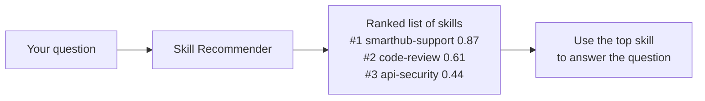
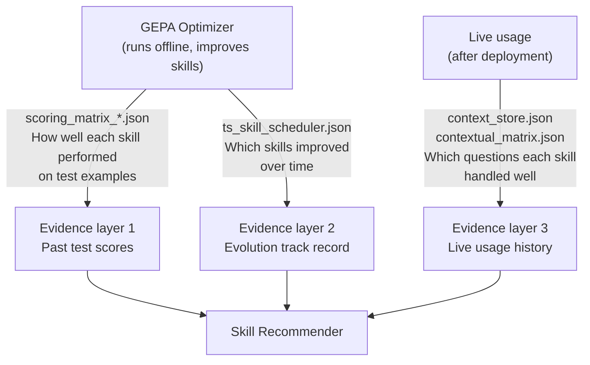
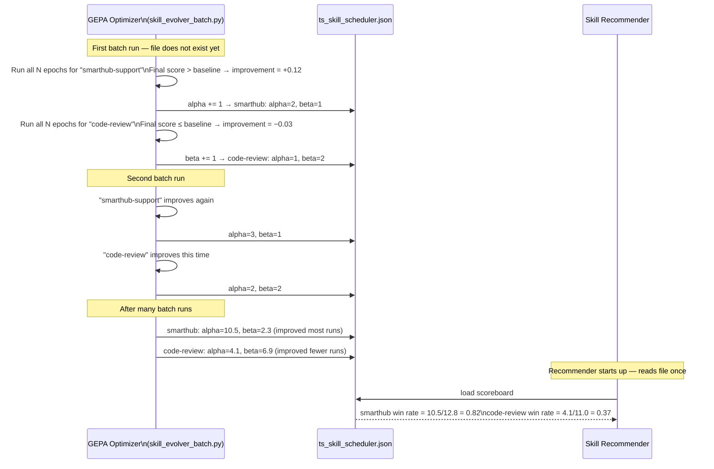
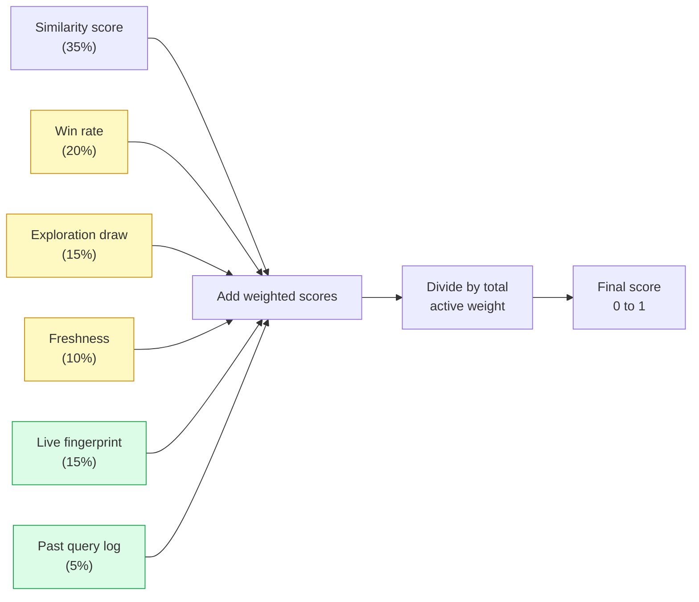
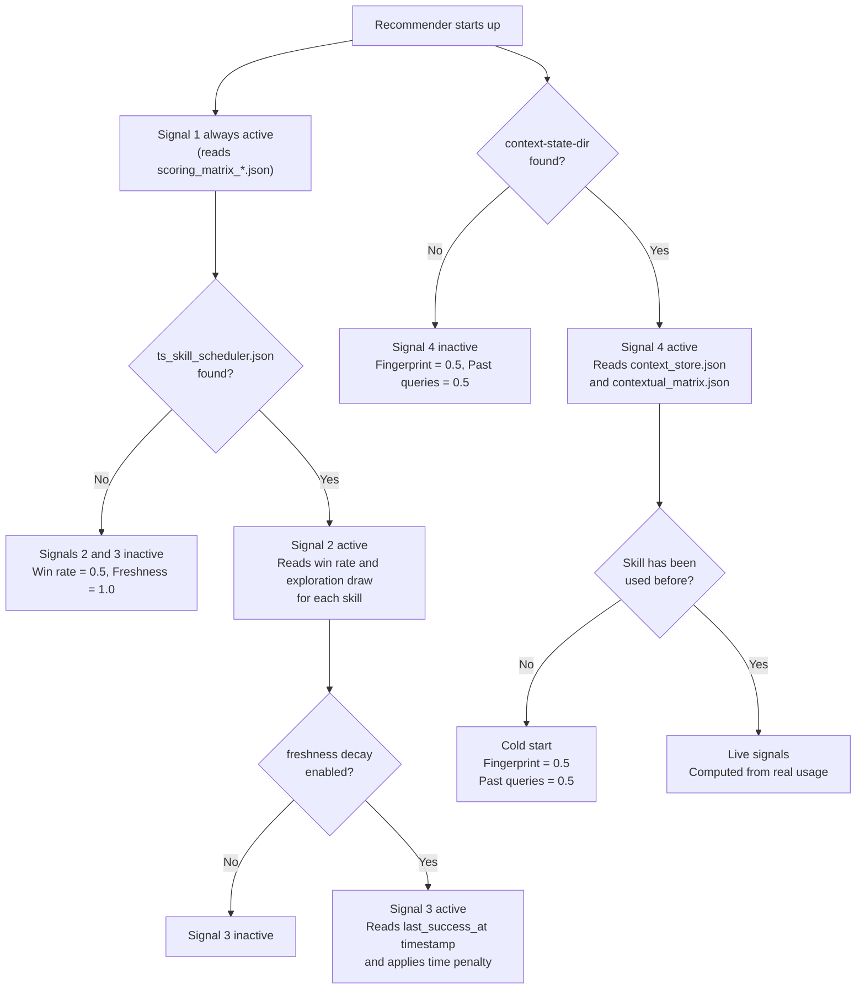

# Skill Recommender — How It Works

**Location**: `examples/offline/sage/skill_recommender/`

---

## What Does This Do?

When you ask a question, the Skill Recommender picks the best skill to answer it.

A **skill** is a prompt template — a set of instructions that tells an AI how to behave in a specific domain. Examples: `"code-review"`, `"smarthub-support"`, `"gsm8k"`. The system can have dozens of them.

The recommender looks at the question and scores every skill by how relevant it is, then returns a ranked list. The caller uses the top result to decide which skill to apply.



---

## Where Does It Get Its Data?

The recommender does not know anything on its own. It learns from three sources that are created by other parts of the system:



The recommender is **read-only** while answering questions. All three data sources are written by other processes (GEPA, or the deployment layer). The recommender just reads them at startup.

---

## The Four Scoring Signals

To score a skill for a given question, the recommender combines up to four signals. Each signal answers a different question about the skill:

| Signal | Plain English question | Source |
|---|---|---|
| **Similarity score** (Phase 0) | "Has this skill seen similar questions before, and how did it score?" | Past test scores |
| **Track record** (Phase 1) | "Has this skill been consistently improving during evolution?" | Evolution history |
| **Freshness** (Phase 2) | "Is that track record recent, or from months ago?" | Evolution history (timestamp) |
| **Live context match** (Phase 3) | "Have real users asked this kind of question and picked this skill?" | Live usage history |

Not all signals are always available. The recommender uses whichever data it can find and skips the rest.

---

## Signal 1 — Similarity Score (always active)

**The idea**: Find all the test examples this skill was evaluated on that look similar to your question. Average their fitness scores, weighted by how similar they are.

### The matrix — rows are prompts, columns are skills

GEPA evaluated each skill on its own set of test examples (prompts) and recorded how well the skill answered each one. The result is a matrix:

```
                                        ┌──────────────┬──────────────────┬──────────────┐
                                        │ code-review  │ smarthub-support │ api-security │
 ┌──────────────────────────────────────┼──────────────┼──────────────────┼──────────────┤
 │ "Review Python function for          │     0.56     │        —         │      —       │
 │  thread safety: def add(x):..."      │              │                  │              │
 ├──────────────────────────────────────┼──────────────┼──────────────────┼──────────────┤
 │ "Review Python function for          │     0.55     │        —         │      —       │
 │  performance: def find(lst):..."     │              │                  │              │
 ├──────────────────────────────────────┼──────────────┼──────────────────┼──────────────┤
 │ "My SmartHub keeps dropping          │      —       │      0.58        │      —       │
 │  WiFi every hour."                   │              │                  │              │
 ├──────────────────────────────────────┼──────────────┼──────────────────┼──────────────┤
 │ "My SmartHub shows 3 red blinks."    │      —       │      0.71        │      —       │
 ├──────────────────────────────────────┼──────────────┼──────────────────┼──────────────┤
 │ "Review this REST endpoint for       │      —       │        —         │     0.69     │
 │  SQL injection risk."                │              │                  │              │
 ├──────────────────────────────────────┼──────────────┼──────────────────┼──────────────┤
 │ "Review this Flask route for         │      —       │        —         │     0.74     │
 │  missing auth check."                │              │                  │              │
 └──────────────────────────────────────┴──────────────┴──────────────────┴──────────────┘
         ↑ rows = prompts (test examples)                ↑ columns = skills
         (hundreds to thousands of rows)                 (one column per skill)
```

**Cell value** = fitness score (0 to 1): how well that skill answered that prompt during GEPA evaluation.

**`—` (dash)** = this prompt was not used to evaluate that skill. Each skill is tested only on its own training examples, so most cells are empty.

### How a new query uses this matrix — step by step

Your question: *"Review this Go function for race conditions"*

**Step 1 — measure similarity of your question to every prompt row:**

```
                                        sim to your question
 "Review Python function / thread safety"   →   0.81  ← very similar (code + safety topic)
 "Review Python function / performance"     →   0.54  ← somewhat similar (code review topic)
 "SmartHub WiFi dropping"                   →   0.06  ← unrelated  ✗ below threshold, ignored
 "SmartHub 3 red blinks"                    →   0.04  ← unrelated  ✗ below threshold, ignored
 "REST endpoint / SQL injection"            →   0.31  ← weak match ✗ below threshold, ignored
 "Flask route / auth check"                 →   0.29  ← weak match ✗ below threshold, ignored
```

**Step 2 — for each skill, collect only rows above the threshold and compute a weighted average:**

```
code-review:
    row 1: similarity 0.81 × score 0.56 = 0.454
    row 2: similarity 0.54 × score 0.55 = 0.297
    ─────────────────────────────────────────────
    Signal 1 score = (0.454 + 0.297) / (0.81 + 0.54) = 0.556  ✓

smarthub-support:
    no rows passed the threshold
    → excluded from results

api-security:
    no rows passed the threshold
    → excluded from results
```

`code-review` is the only skill with matching rows → Signal 1 score = **0.556**.

### Where does this matrix come from?

`scoring_matrix_*.json` — produced by GEPA after each evaluation run. Each row is stored as a JSON object with the prompt text, the expected answer, what the skill actually produced, and the fitness scores:

```json
{
  "skill_name":       "code-review",
  "example_input":    "Review this Python function for thread safety: def add(x): self.total += x",
  "example_expected": "Flag the missing lock — concurrent calls will corrupt self.total.",
  "candidate_output": "There may be a thread-safety issue here.",
  "norm_semantic":    0.56,
  "norm_bag_of_words": 0.44
}
```

**How similarity is measured**: Every text is converted to a vector of numbers (either TF-IDF word frequencies, or OpenAI embeddings). Similarity is how closely the two vectors point in the same direction — 1.0 means identical, 0.0 means nothing in common.

---

## Signal 2 — Evolution Track Record (Phase 1)

**The idea**: Every time GEPA finishes working on a skill, it records whether the result was better than the starting point. Signal 2 reads that history and uses it as a confidence score.

### What one GEPA run means

When GEPA processes a skill, it runs the optimizer for N epochs (as configured). Each epoch tries various candidate improvements against training examples, picks the best candidate, and moves on to the next example. At the end of all epochs, it computes one single number: **did the final skill score higher than the baseline skill?** That difference is the `improvement` value.

After GEPA finishes one complete skill run, it calls the update in `skill_evolver_batch.py`:

```
improvement = (final evolved score) − (baseline score)

if improvement > 0:   alpha += 1   ← skill got better
else:                 beta  += 1   ← skill did not get better
```

So alpha and beta count **completed GEPA runs**, not individual epochs or individual examples.

### The two counters

Every skill has two counters (called an "arm"):
- `alpha` — GEPA runs that ended with a score improvement
- `beta` — GEPA runs that ended with no improvement (or a regression)

**Example**: `smarthub-support` with `alpha=10, beta=2` means GEPA ran 12 times on this skill, and 10 of those runs resulted in a measurably better skill.

**Confidence** = `alpha / (alpha + beta)` = 10 / 12 = **0.83**

### What "no improvement" actually means — and what it does not

A high `beta` (many failures) does **not** necessarily mean the skill is immature or poor quality. It could equally mean the skill is **already close to optimal** — so GEPA consistently cannot find anything better. The recommender treats a high-alpha skill as a "safe bet" because it has demonstrated it can absorb improvement, but a high-beta skill is not penalised in any absolute sense — its contribution just carries less weight relative to Signal 1.

### Why alpha and beta can be fractional (e.g. 10.5, 2.3)

When running in demo mode (`trainings.py`), the system uses a **soft update** instead of the binary +1 / +1 above. The improvement score is converted to a value between 0 and 1, and that fraction is added directly:

```
reward = clamp(improvement + 0.5, 0.0, 1.0)

alpha += reward        (e.g. 0.8)
beta  += 1 − reward    (e.g. 0.2)
```

So after 12 soft-update runs with varying improvement levels, you get fractional totals like `alpha=10.5, beta=2.3`. The binary update (used in batch mode) always adds whole numbers.

### The exploration draw

Alongside the win rate, the recommender also takes one random draw from the arm's probability distribution. This adds a small random boost that is larger when the arm has fewer observations. The practical effect: a skill with only 2 runs gets a wider random range, so it occasionally surfaces higher in the ranking even if its win rate looks mediocre. This prevents the recommender from permanently ignoring skills that have simply been run fewer times.

### What file stores this?

`ts_skill_scheduler.json` — written by GEPA after every skill run, and read by the recommender at startup:

```json
{
    "smarthub-support": {
        "alpha": 10.5,
        "beta": 2.3,
        "n_runs": 12,
        "last_success_at": 1718916234.5678
    },
    "code-review": {
        "alpha": 4.1,
        "beta": 6.9,
        "n_runs": 11,
        "last_success_at": 1717800000.0
    }
}
```

`n_runs` is informational only (the total run count). `last_success_at` is a Unix timestamp — used by Signal 3 (freshness).

**If a skill is not in this file** (GEPA has never run on it): the recommender assumes `alpha=1, beta=1`, which gives a win rate of 0.5 — neutral, neither favoured nor penalised.

### How the file gets built step by step



---

## Signal 3 — Freshness (Phase 2)

**The idea**: The track record in Signal 2 can be months old. A skill that was successfully improved yesterday is more reliable evidence than one whose last successful run was six months ago — because the skill itself may have changed significantly since then. Signal 3 reduces the weight of Signal 2 based on how much time has passed since the last successful GEPA run.

### Who records "last success" and when?

The same `skill_evolver_batch.py` code that updates alpha/beta also records the timestamp. Specifically, inside the arm's update logic:

```
Binary mode:  if improvement > 0   →  last_success_at = now()
Soft mode:    if reward > 0.5      →  last_success_at = now()
```

"Success" here means the same thing as in Signal 2: one complete GEPA run produced a measurably better skill. The timestamp is saved immediately to `ts_skill_scheduler.json` alongside alpha and beta (see the `last_success_at` field in the JSON example above).

The recommender reads this timestamp at startup and computes how many days have passed since then.

### What about skills that have never been run, or have never succeeded?

If `last_success_at` is absent from the file (the skill has never had a single successful GEPA run, or has never been run at all), the freshness score is set to **1.0** — full weight, no penalty.

The reasoning: it would be unfair to penalise a skill purely because it has not been tried yet. An untested skill is "fresh" by definition — we simply have no stale evidence to discount.

### How the penalty works

The penalty decays with time. A skill improved yesterday has freshness 1.0. One last improved 14 days ago has freshness ~0.5. One from 60 days ago is nearly ignored.

| Days since last success | Freshness score |
|---|---|
| 0 days (today) | 1.00 |
| 7 days | 0.70 |
| 14 days | 0.50 |
| 30 days | 0.22 |
| 60 days | 0.05 |
| Never succeeded (or never run) | **1.00** (no penalty) |

---

## Signal 4 — Live Context Match (Phase 3)

**The idea**: After a skill is deployed and real users start using it, we can record which queries it handled well. Signal 4 uses that live usage history to ask: "Has this skill seen queries like this before, and how did it do?"

This is separate from the offline test scores (Signal 1). Signal 1 comes from structured evaluation by GEPA. Signal 4 comes from real, unpredictable usage in production.

**Two sub-signals**:

**4a — Skill fingerprint** (`context_store.json`): Each skill accumulates a single "fingerprint" — a running average of the query embeddings that it handled well. Over time, a skill that's been used for customer support questions will develop a fingerprint that points toward customer support language. When a new query comes in, we measure how similar it is to that fingerprint.

**4b — Past query lookup** (`contextual_matrix.json`): A rolling log of the last 1000 real queries, each tagged with which skill was used and how well it scored. When a new query arrives, we find the most similar past queries and average the scores that skill received on them.

**What files does this use?**

These files live in the `--context-state-dir` folder and are updated by the deployment layer (not GEPA):

- `context_store.json` — one embedding vector per skill (a list of ~10 000 numbers). Not human-readable.
- `contextual_matrix.json` — a log of past `(query, skill, reward)` triples. The oldest entries are dropped when the log exceeds 1000 entries.

**If no live usage data exists yet**: both sub-signals return 0.5 (neutral). The system does not crash or degrade — it just uses fewer signals.

---

## Combining the Signals — Final Score

All active signals are blended into a single score between 0 and 1. Each signal has a weight. If a signal is not available, its weight is dropped and the remaining weights are rescaled so they still sum to 1.

**Default weights when all signals are available:**

| Signal | Weight |
|---|---|
| Similarity score (Phase 0) | 35% |
| Confidence — win rate (Phase 1) | 20% |
| Confidence — exploration draw (Phase 1) | 15% |
| Freshness (Phase 2) | 10% |
| Live fingerprint match (Phase 3) | 15% |
| Live past-query lookup (Phase 3) | 5% |
| **Total** | **100%** |

**Example: only Signal 1 is available** (no evolution history, no live usage):

The 35% weight gets rescaled to 100%. Final score = similarity score alone.

**Example: Signals 1 + 2 available** (evolution history exists, no live usage):

Weights are 35 + 20 + 15 = 70%. Rescaled: similarity=50%, win-rate=29%, exploration=21%.



---

## What Signals Are Available Depends on What Files Exist



---

## What You Get Back

`recommend(query)` returns a list of results sorted by score (highest first), cut off at `top_k`:

```python
[
    {
        "skill":               "smarthub-support",
        "metric":              "semantic",
        "score":               0.87,          # final blended score

        # Signal 1 (always present):
        "collaborative_score": 0.81,          # similarity-weighted test score

        # Signal 2 (if evolution history exists):
        "bayesian_confidence": 0.82,          # win rate  (alpha / alpha+beta)
        "uncertainty_sample":  0.79,          # exploration draw

        # Signal 3 (if freshness enabled):
        "freshness":           0.94,          # 1.0 = evolved recently

        # Signal 4 (if live context exists):
        "context_match":       0.71,          # similarity to skill fingerprint

        # Supporting info:
        "n_examples":          8,             # how many test rows matched
        "mean_similarity":     0.63,
        "similar_examples": [                 # top-3 matching test rows
            {
                "input":      "My SmartHub shows 3 red blinks...",
                "expected":   "Three red blinks indicate overtemperature...",
                "output":     "I see your SmartHub is showing red lights...",
                "similarity": 0.88,
            }
        ],
    },
    ...
]
```

---

## Files on Disk — Summary

| File | Created by | Read by | Contains |
|---|---|---|---|
| `scoring_matrix_*.json` | GEPA optimizer | Recommender | Past test scores for every skill on every example |
| `ts_skill_scheduler.json` | GEPA optimizer | Recommender | Win/loss scoreboard for every skill (alpha, beta, timestamp) |
| `context_store.json` | Deployment layer | Recommender | One fingerprint vector per skill (from live usage) |
| `contextual_matrix.json` | Deployment layer | Recommender | Log of last 1000 real queries with skill and score |

The recommender reads all these files once at startup and never writes to them.

---

## Default Values When Data Is Missing

| Situation | Value used | Why |
|---|---|---|
| Skill not in evolution history | Win rate = 0.5 | "We don't know yet — treat it as neutral" |
| Skill never successfully improved | Freshness = 1.0 | "Don't penalise a skill we've never tried" |
| Skill has no live usage fingerprint | Fingerprint match = 0.5 | "No evidence either way" |
| No similar past queries in log | Past-query score = 0.5 | "No evidence either way" |
| Query matches nothing above threshold | Returns empty list | Normal — not an error |
