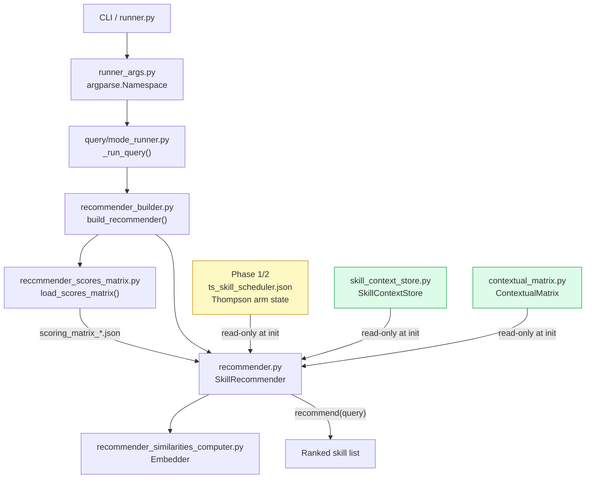
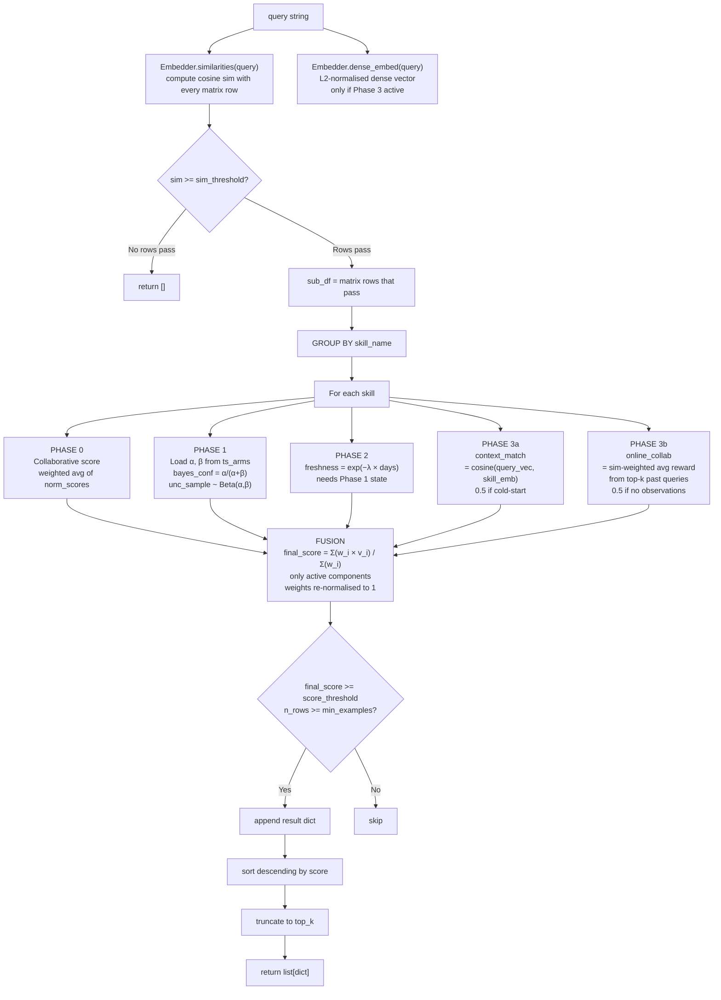
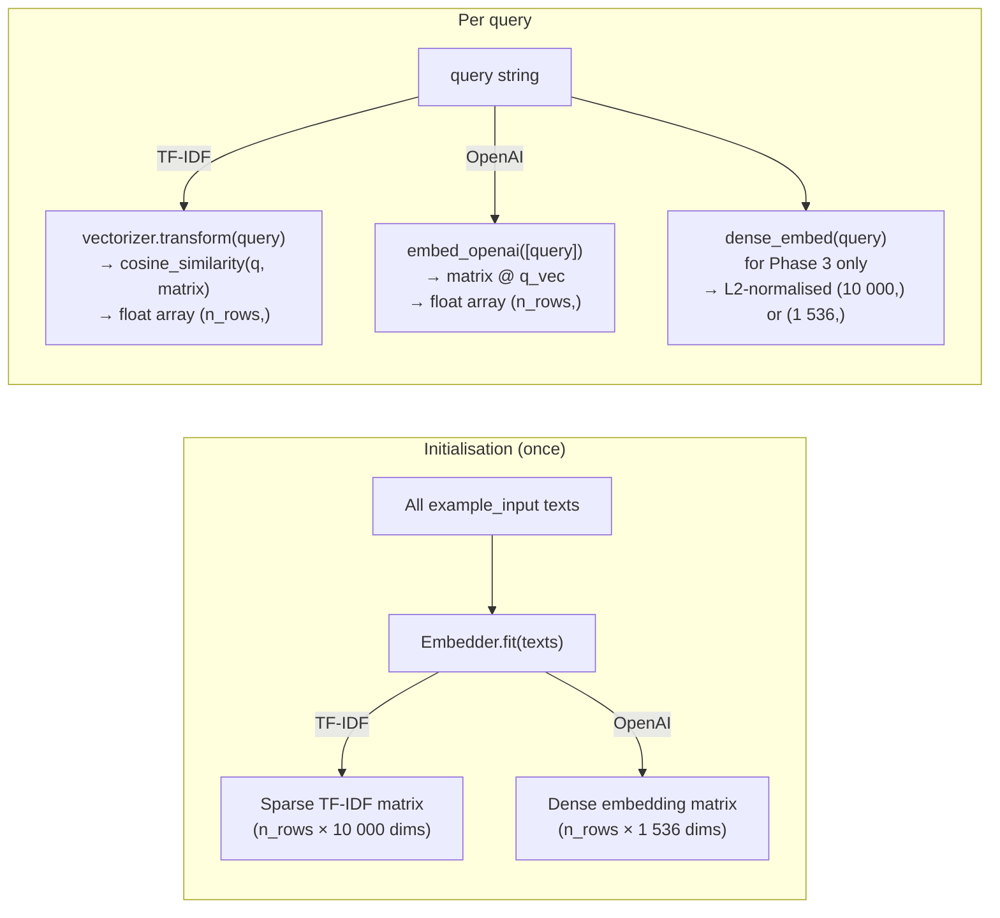
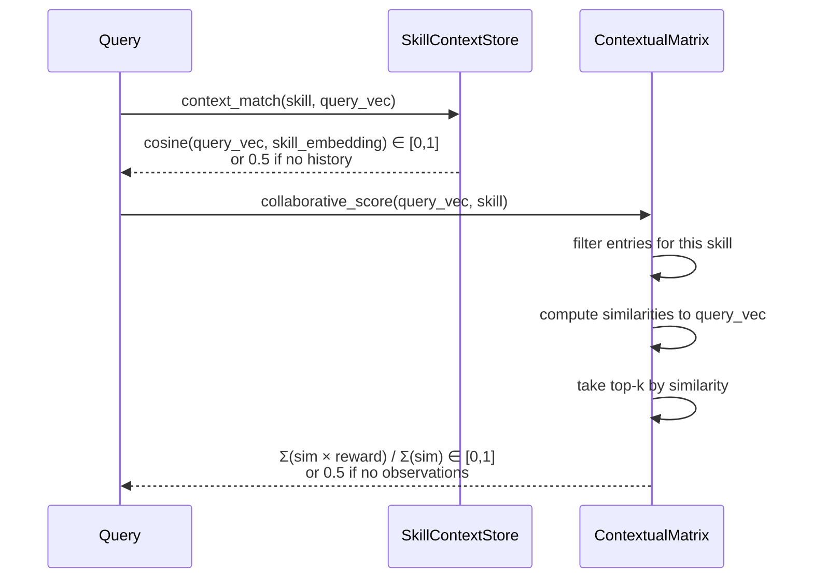
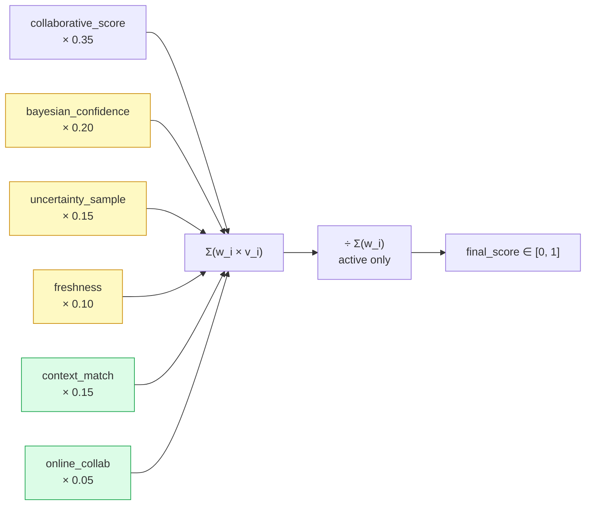
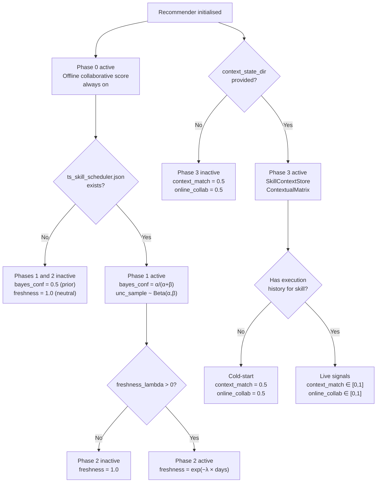

# Skill Recommender — Query Pass

**Module**: `examples/offline/sage/skill_recommender/`

The Skill Recommender is a **Contextual Bayesian Prompt-Skill Router**. Given a natural-language query it ranks all skills in the GEPA scoring matrix by how well they match the query, fusing up to four evidence streams: offline collaborative filtering, Bayesian arm posteriors, temporal freshness decay, and live execution embeddings. Each stream activates independently based on available state, so the recommender degrades gracefully from a full four-phase router down to a pure similarity search when no optional state is present.

---

## Architecture Overview



---

## Entry Point — CLI Arguments

**Runner**: `examples/offline/sage/skill_recommender/runner.py`
**Args parser**: `runner_args.py → args_parser(DEFAULT_ORACLE_DIR)`

| Argument | Type | Default | Purpose |
|---|---|---|---|
| `query` | str | — | Prompt to route; `-` reads from stdin |
| `--from-file PATH` | Path | — | File with one query per line |
| `--list-skills` | flag | — | Print all skills from matrix and exit |
| `--data-dir PATH` | Path | `~/.openjiuwen/oracle` | Directory containing `scoring_matrix_*.json` files |
| `--variant` | str | `"baseline"` | Matrix layer to load: `baseline`, `evolved`, or `both` |
| `--embedder` | str | `"tfidf"` | Embedding backend: `tfidf` (offline) or `openai` (semantic) |
| `--sim-threshold` | float | `0.25` | Minimum cosine similarity to consider an example relevant |
| `--score-threshold` | float | `0.20` | Minimum final blended score to include a result |
| `--top-k` | int | `10` | Maximum results returned |
| `--min-examples` | int | `1` | Minimum similar matrix rows a skill must have |
| `--cache-embedder PATH` | Path | — | Persist fitted TF-IDF vectorizer to disk |
| `--ts-state-path PATH` | Path | `~/.openjiuwen/ts_router_state/ts_skill_scheduler.json` | Phase 1/2: Thompson arm state |
| `--freshness-lambda` | float | `0.05` | Phase 2: exponential decay rate per day (≈ 14-day half-life) |
| `--context-state-dir PATH` | Path | `~/.openjiuwen/context_state` | Phase 3: directory for `context_store.json` and `contextual_matrix.json` |

---

## Query Pipeline — Full Data Flow



---

## Scoring Matrix — What Gets Loaded

`load_scores_matrix(oracle_dir, variant)` reads all `scoring_matrix_*.json` files from the oracle directory and flattens the 3-D structure (skill × example × metric) into a DataFrame.

**Auto-detected formats**:
- **Real GEPA output** — has both `"matrix"` and `"cross_eval"` keys; reads from `cross_eval`
- **Synthetic benchmark** — has `"baseline_cross_eval"` / `"evolved_cross_eval"` keys; reads the requested variant

**Key DataFrame columns**:

| Column | Content |
|---|---|
| `skill_name` | Name of the skill (`str`) |
| `example_input` | The input text used for this evaluation row |
| `example_expected` | Reference expected output (truncated to 300 chars) |
| `candidate_output` | Skill output produced during GEPA evaluation |
| `score_<metric>` | Raw fitness score for each metric (float or `None`) |
| `norm_<metric>` | Row-normalised score: `score / Σ all scores for this row` |

Row normalisation ensures all metric scores are on a comparable [0, 1] scale regardless of their absolute magnitudes.

---

## Embedder — Similarity Engine

**Class**: `Embedder` in `recommender_similarities_computer.py`

The embedder is fitted once on all `example_input` texts from the matrix at recommender initialisation. At query time it computes similarity against this fixed corpus.



**TF-IDF settings**: `ngram_range=(1, 2)`, `max_features=10 000`, `sublinear_tf=True`

**Embedder cache**: If `--cache-embedder` is provided, the fitted Embedder is pickled to disk and reloaded on the next run, skipping the fit step.

---

## Phase 0 — Offline Collaborative Score

Always active. The baseline signal.

For each skill and metric, the collaborative score is the similarity-weighted average of the normalised fitness scores across all matrix rows that passed the similarity threshold:

$$f_\text{collab}(S_i, P) = \frac{\sum_{j \in \mathcal{N}(P)} \text{sim}(P, x_j) \cdot \text{norm\_score}_{j}}{\sum_{j \in \mathcal{N}(P)} \text{sim}(P, x_j)}$$

where $\mathcal{N}(P)$ is the set of matrix rows with cosine similarity $\ge$ `sim_threshold`.

This is computed independently for each metric column (`norm_bag_of_words`, `norm_semantic`, etc.), producing one collaborative score per (skill, metric) pair. Each pair becomes a candidate result entry.

---

## Phase 1 — Bayesian Exploitation and Exploration

**Activates when**: `ts_skill_scheduler.json` exists and can be loaded.

The Thompson arm state file maps each skill name to its Beta distribution parameters accumulated during offline GEPA optimisation runs:

```json
{
    "smarthub-support": {
        "alpha": 10.5,
        "beta":  2.3,
        "last_success_at": 1718916234.5678
    }
}
```

Two signals are extracted per skill at query time:

**Bayesian Confidence** (exploitation):

$$\mu_i = \frac{\alpha_i}{\alpha_i + \beta_i} \in [0, 1]$$

High $\alpha$ relative to $\beta$ means the skill has a strong track record of accepting evolutionary improvements — evidence it is a high-quality, responsive asset.

**Uncertainty Sample** (exploration):

$$\tilde{\theta}_i \sim \text{Beta}(\alpha_i, \beta_i)$$

A random draw from the posterior. When $\alpha \approx \beta$ (few observations, high uncertainty) the draw has high variance, giving underexplored skills a chance to surface. When the posterior is tight ($\alpha \gg \beta$), the draw is reliably high.

**Cold-start default** (skill not in state file): $\alpha = \beta = 1$ — the non-informative uniform prior, giving $\mu_i = 0.5$ and $\tilde{\theta}_i \sim \text{Uniform}(0, 1)$.

---

## Phase 2 — Temporal Freshness Decay

**Activates when**: Phase 1 is active AND `--freshness-lambda > 0`.

Arm evidence accumulated months ago is less relevant than evidence from recent runs — a skill evolves, so stale posteriors may not reflect current quality. Freshness penalises the Bayesian signal by elapsed time:

$$\tau_i = \exp(-\lambda \cdot \Delta t_i)$$

where $\Delta t_i$ is days since `last_success_at` and $\lambda$ is the decay rate (`--freshness-lambda`, default 0.05).

| Age | Freshness (λ = 0.05) |
|---|---|
| 0 days | 1.000 |
| 7 days | 0.704 |
| 14 days | 0.497 (≈ half-life) |
| 30 days | 0.223 |
| 60 days | 0.050 |

**Special case**: if `last_success_at` is absent (skill never had a successful run), `freshness = 1.0` — unexplored skills are not penalised.

---

## Phase 3 — Adaptive Context Embeddings and Online Collaborative Matrix

**Activates when**: `--context-state-dir` is provided and the state files exist.

Phase 3 captures live deployment utility — which queries each skill handles well — independently of the offline GEPA evaluation history.

### 3a — Per-Skill Context Embeddings (`SkillContextStore`)

**State file**: `context_state/context_store.json`

Stores one L2-normalised embedding per skill — a running exponentially weighted average (EWA) of query vectors on which the skill was successfully executed:

$$\mathbf{e}_{S_i} \leftarrow \frac{(1 - \eta_r)\,\mathbf{e}_{S_i} + \eta_r\,\hat{P}}{\|(1 - \eta_r)\,\mathbf{e}_{S_i} + \eta_r\,\hat{P}\|_2}, \qquad \eta_r = \eta_0 \cdot r$$

where $\hat{P}$ is the L2-normalised query embedding, $r \in [0,1]$ is the observed reward, and $\eta_0 = 0.10$ is the base EWA rate. Zero-reward executions are skipped entirely (no update, no I/O).

At query time, the **context match score** is the cosine similarity between the current query and the skill's accumulated context:

$$f_\text{ctx}(S_i, P) = \langle \hat{P},\, \mathbf{e}_{S_i} \rangle \in [0, 1]$$

Cold-start default: `0.5` (neutral — neither promotes nor penalises).

### 3b — Online Prompt-Skill Utility Matrix (`ContextualMatrix`)

**State file**: `context_state/contextual_matrix.json`

A rolling buffer of at most 1 000 `(query_vec, skill, reward)` triples, with oldest entries evicted FIFO when the cap is reached.

At query time, the **online collaborative score** is the similarity-weighted average reward from the top-k most similar past queries for this skill:

$$f_\text{online}(S_i, P) = \frac{\displaystyle\sum_{j \in \text{top-}k(S_i, P)} \text{sim}(\hat{P}, \hat{P}_j) \cdot r_j}{\displaystyle\sum_{j \in \text{top-}k(S_i, P)} \text{sim}(\hat{P}, \hat{P}_j)}$$

Cold-start default: `0.5` (no observations for this skill in the buffer).



---

## Fusion — Weighted Score Composition

All active component scores are merged into a single final score with dynamic weight normalisation:

$$r(S_i, P) = \frac{\displaystyle\sum_{c \in \mathcal{A}} w_c \cdot v_c}{\displaystyle\sum_{c \in \mathcal{A}} w_c}$$

where $\mathcal{A}$ is the set of active components for this query. Normalising by $\sum w_c$ (rather than a fixed denominator) ensures $r \in [0,1]$ regardless of which phases are enabled.

**Default component weights**:

| Phase | Component | Weight | Activation condition |
|---|---|---|---|
| 0 | `collaborative_score` | 0.35 | Always |
| 1 | `bayesian_confidence` | 0.20 | Thompson state file exists |
| 1 | `uncertainty_sample` | 0.15 | Thompson state file exists |
| 2 | `freshness` | 0.10 | Phase 1 active AND `lambda > 0` |
| 3 | `context_match` | 0.15 | `SkillContextStore` provided |
| 3 | `online_collaborative` | 0.05 | `ContextualMatrix` has observations for this skill |
| | **Total (all active)** | **1.00** | |

**Example: Phase 0 only (no optional state)**

Active weights: `{collaborative: 0.35}` → total = 0.35 → normalised weight = 1.0 → `final_score = collaborative_score`.

**Example: Phases 0 + 1 (Thompson state present, no Phase 2/3)**

Active weights: `{collab: 0.35, bayes_conf: 0.20, unc_sample: 0.15}` → total = 0.70
→ effective weights: `{0.50, 0.286, 0.214}`



---

## Phase Activation Map

The four phases activate in layers depending on what state is available on disk:



---

## Output Structure

`SkillRecommender.recommend()` returns a `list[dict]` sorted by `score` descending, truncated to `top_k`. Each entry:

```python
{
    "skill":                str,    # skill name
    "metric":               str,    # fitness metric used as signal (e.g. "semantic")
    "score":                float,  # final blended score ∈ [0, 1]
    "collaborative_score":  float,  # Phase 0 score
    # Present if Phase 1 active:
    "bayesian_confidence":  float,  # posterior mean μ = α/(α+β)
    "uncertainty_sample":   float,  # Beta(α,β) sample
    # Present if Phase 2 active:
    "freshness":            float,  # exp(-λ × days)
    # Present if Phase 3 active:
    "context_match":        float,  # cosine(query, skill_embedding)
    "n_examples":           int,    # number of matrix rows that passed sim_threshold
    "mean_similarity":      float,  # mean cosine similarity of those rows
    "similar_examples": [           # top-3 most similar matrix rows
        {
            "input":      str,      # example_input (truncated to 160 chars)
            "expected":   str,      # example_expected (truncated to 120 chars)
            "output":     str,      # candidate_output (truncated to 160 chars)
            "similarity": float,
        },
        ...
    ],
}
```

---

## Disk I/O Summary

| File | Location | Read/Write | Phase |
|---|---|---|---|
| `scoring_matrix_*.json` | `--data-dir` | Read once at init | 0 |
| `ts_skill_scheduler.json` | `--ts-state-path` | Read once at init | 1/2 |
| `context_store.json` | `--context-state-dir` | Read at init; written via `record()` | 3 |
| `contextual_matrix.json` | `--context-state-dir` | Read at init; written via `record()` | 3 |
| Embedder cache (`.pkl`) | `--cache-embedder` | Read or written at init | — |

The recommender is **read-only during `recommend()`**. Phase 3 state is updated only when the caller explicitly invokes `recommender.record(query_vec, skill_name, reward)` after observing execution outcome.

---

## Cold-Start and Default Values

| Situation | Value returned | Reason |
|---|---|---|
| Skill not in Thompson state | `bayes_conf = 0.5`, `unc_sample ∈ [0,1]` | Beta(1,1) uninformed prior |
| Skill never had a successful run | `freshness = 1.0` | Not penalised for never being tried |
| Skill has no context embedding | `context_match = 0.5` | Neutral prior — no pull toward or away |
| Skill has no matrix observations | `online_collab = 0.5` | Neutral — no collaborative evidence |
| Query matches nothing above threshold | Returns `[]` | Empty result, no crash |

---

## Key Formulas Reference

| Formula | Description |
|---|---|
| $\frac{\sum_j \text{sim}_j \cdot \text{norm\_score}_j}{\sum_j \text{sim}_j}$ | Phase 0 collaborative score |
| $\mu_i = \frac{\alpha_i}{\alpha_i + \beta_i}$ | Phase 1 Bayesian confidence |
| $\tilde{\theta}_i \sim \text{Beta}(\alpha_i, \beta_i)$ | Phase 1 uncertainty sample |
| $\exp(-\lambda \cdot \Delta t_i)$ | Phase 2 freshness decay |
| $\langle \hat{P},\, \mathbf{e}_{S_i} \rangle$ | Phase 3a context match (cosine) |
| $\frac{\sum_{j \in \text{top-}k} \text{sim}_j \cdot r_j}{\sum_{j \in \text{top-}k} \text{sim}_j}$ | Phase 3b online collaborative |
| $\frac{\sum_{c \in \mathcal{A}} w_c v_c}{\sum_{c \in \mathcal{A}} w_c}$ | Final fusion (normalised) |
