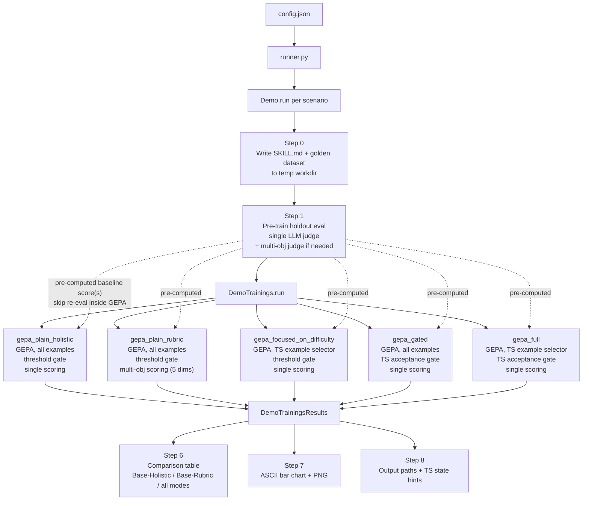
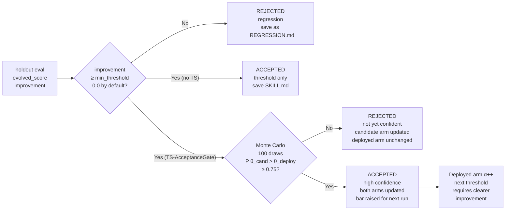
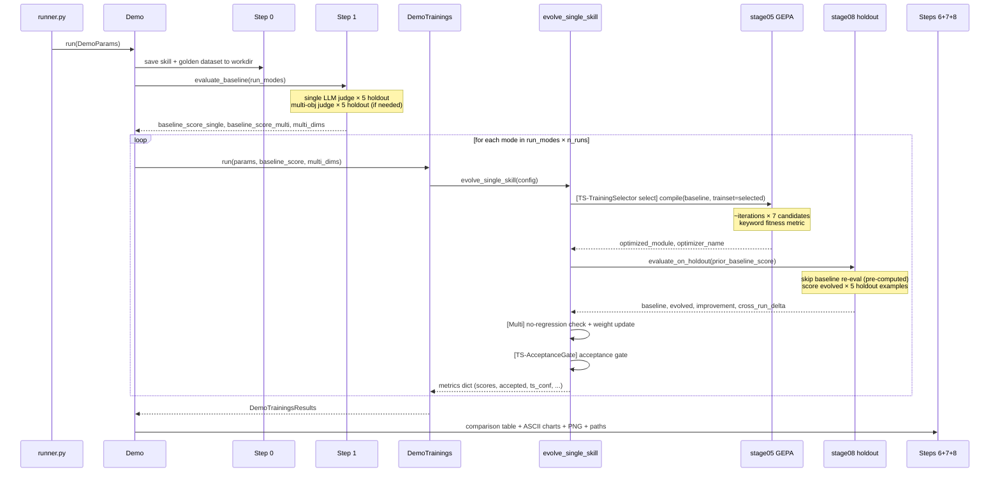
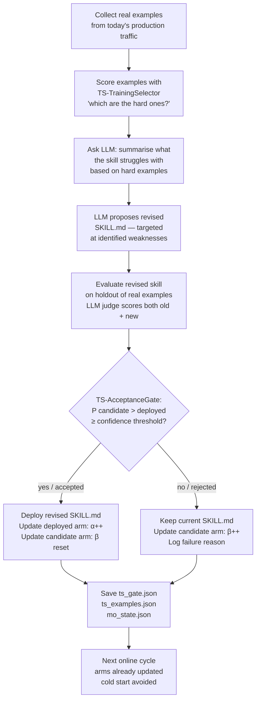
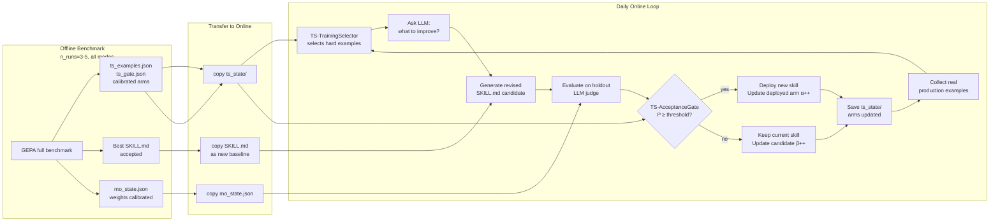

# GEPA + Thompson Sampling — Offline Benchmark

A side-by-side comparison framework that evolves an agent skill with **GEPA** across five independently configurable run modes, varying how Thompson Sampling guides training.  The system produces terminal charts, a matplotlib PNG, a persistable TS state, and metrics history that can directly seed an online skill-evolution system.

---

## Table of Contents

1. [One-Slide Summary — What We Have and What Is Being Added](#one-slide-summary--what-we-have-and-what-is-being-added)
2. [Quick Start](#quick-start)
3. [Concepts and Motivation](#concepts-and-motivation)
4. [High-Level Architecture](#high-level-architecture)
5. [Directory Structure](#directory-structure)
6. [Run Modes — What Each One Does](#run-modes--what-each-one-does)
7. [When Each Mode Excels and When It Struggles](#when-each-mode-excels-and-when-it-struggles)
8. [Theoretical Motivation — Why Each Mode Improves Over Pure GEPA](#theoretical-motivation--why-each-mode-improves-over-pure-gepa)
9. [How GEPA Works](#how-gepa-works)
10. [The Fitness Metric — Inner Loop Scoring](#the-fitness-metric--inner-loop-scoring)
11. [Thompson Sampling — Three Levels](#thompson-sampling--three-levels)
12. [Scoring Modes — Single vs Multi-Objective](#scoring-modes--single-vs-multi-objective)
13. [Constraint Validation](#constraint-validation)
14. [Step-by-Step Execution Flow](#step-by-step-execution-flow)
15. [Configuration Reference](#configuration-reference)
16. [Output Files and Artifacts](#output-files-and-artifacts)
17. [Scenarios and Golden Examples](#scenarios-and-golden-examples)
18. [Reading the Output](#reading-the-output)
19. [Good Usage Patterns](#good-usage-patterns)
20. [Online Skill Improvement with Offline TS Priors](#online-skill-improvement-with-offline-ts-priors)

---

## One-Slide Summary — What We Have and What Is Being Added

> **Audience:** colleagues unfamiliar with the internals; intended to fit on a single presentation slide.

### What we have today — Base-Holistic

GEPA (*Genetic-Pareto Reflective Prompt Evolution*) iteratively rewrites an agent's skill instruction using an LLM, evaluates the result on held-out examples with a single holistic judge (composite score: correctness × 0.5 + procedure × 0.3 + conciseness × 0.2), and keeps the rewrite if it exceeds a fixed fitness threshold.  This produces our current production baseline, measured as **Base-Holistic**.

*Plain English: we ask an LLM to improve the instructions, score the result on test cases, and keep it if it scores higher.*

---

### What is being added and tested

Each addition targets a distinct, well-known failure mode of plain gradient-free optimisation:

| Addition | Failure mode it fixes | Mechanism |
|---|---|---|
| **Base-Rubric** | *Goodhart's Law* — optimising one score causes regressions on unmeasured dimensions | 5-dimension rubric judge; each dimension scored independently; weights adapt when a dimension stagnates |
| **GEPA-Focused** | *Training distribution mismatch* — uniform sampling wastes budget on examples that are too easy or too hard to learn from | Beta-Bernoulli bandit (TS-TrainingSelector) up-weights "medium-difficulty" examples where GEPA sometimes succeeds; achieves O(log n) regret vs O(n) for uniform |
| **GEPA-Gated** | *Noisy single-run acceptance* — a lucky high-scoring run gets deployed even if the skill is not genuinely better | Bayesian credibility gate (TS-AcceptanceGate): deploy only if P(θ_candidate > θ_deployed) ≥ 0.75 from posterior Beta draws — analogous to Bayesian A/B testing |
| **GEPA-Full** | Both training-distribution and evaluation-noise failure modes simultaneously | TS-TrainingSelector + TS-AcceptanceGate combined; because they act on independent pipeline stages, the gain is **multiplicative**, not additive |

---

### Why each extension is theoretically grounded

- **Base-Rubric:** multi-objective Pareto optimisation — no single dimension can improve at the expense of the others.
- **GEPA-Focused:** Beta-Bernoulli multi-armed bandit; the medium-difficulty zone corresponds to the *zone of proximal development* (Vygotsky, 1978); TS naturally finds it without explicit labelling.
- **GEPA-Gated:** replaces a point decision with a posterior probability — equivalent to the ROPE criterion in Bayesian hypothesis testing (Kruschke, 2015); ratchet property guarantees monotone deployment quality.
- **GEPA-Full:** training-selector reduces *bias* (better training signal); acceptance-gate reduces *variance* (more robust evaluation); statistical independence of the two stages makes the compound improvement multiplicative.

*Plain English: we grade on more dimensions, practise on the most informative examples, and only deploy when genuinely confident.  The full version does all three at once — and doing all three is better than the sum of doing each separately.*

---

## Quick Start

```bash
# 1. Set your API key and model in config.json
# 2. Run
python runner.py
```

**Minimal config.json:**

```json
{
  "scenarios":     ["rtos-review"],
  "run_modes":     ["gepa_plain_holistic", "gepa_plain_rubric"],
  "api_key":       "sk-...",
  "model":         "deepseek/deepseek-chat",
  "api_base":      "https://api.deepseek.com",
  "iterations":    5,
  "ts_batch_size": 4,
  "n_runs":        1,
  "verbose":       false
}
```

| Parameter | Type | Default | Effect |
|-----------|------|---------|--------|
| `scenarios` | `list[str]` | — | Which domain scenarios to run; can be a list for batch |
| `run_modes` | `list[str]` | — | Which training passes to execute; `[]` = baseline only |
| `api_key` | `str` | — | LLM API key; overridden by `DEEPSEEK_API_KEY` env var |
| `model` | `str` | — | DSPy model string, e.g. `"deepseek/deepseek-chat"` |
| `api_base` | `str` | — | API base URL |
| `iterations` | `int` | 10 | GEPA inner iterations — more = slower but better evolved skill |
| `ts_batch_size` | `int` | 4 | How many examples TS-TrainingSelector picks per batch (of ~10) |
| `n_runs` | `int` | 1 | Independent GEPA runs per mode; ≥3 for statistical CIs |
| `verbose` | `bool` | false | Print DSPy INFO / reflection logs |

**Environment variable override:**
```bash
DEEPSEEK_API_KEY=sk-... python runner.py
```

---

## Concepts and Motivation

### The problem: skill evolution is expensive

Evolving an agent skill with GEPA requires:
1. Hundreds of LLM calls in the inner GEPA loop (candidate scoring)
2. Expensive LLM-as-judge calls on the holdout set (5 examples × ~25 s each)
3. Multiple independent runs to establish statistical confidence

Without guidance, GEPA wastes budget on examples the current skill already handles, and risks deploying one-off improvements that won't hold.

### The solution: Thompson Sampling at three decision points

```
 Decision 1 — WHERE to spend budget     → Level 2: Example Selector
 Decision 2 — WHETHER to deploy         → Level 3: Acceptance Gate
 Decision 3 — WHICH skill to evolve     → Level 1: Skill Scheduler (multi-skill, not in this demo)
```

Thompson Sampling (TS) frames each decision as a **multi-armed bandit**: maintain a Beta(α, β) distribution per arm, sample to make decisions, and update based on outcomes. Arms accumulate evidence across runs, so the system improves its decisions without starting over each time.

### What this benchmark measures

Running multiple modes side by side on the same skill and scenario lets you isolate the contribution of each TS level:

| Comparison                                   | What it isolates |
|----------------------------------------------|-----------------|
| `gepa_plain_holistic` vs `gepa_focused_on_difficulty` | Contribution of focused example selection |
| `gepa_plain_holistic` vs `gepa_gated`                 | Contribution of confidence-gated deployment |
| `gepa_plain_holistic` vs `gepa_full`                  | Combined TS benefit |
| `gepa_plain_holistic` vs `gepa_plain_rubric` | Benefit of multi-objective vs single judge |

---

## High-Level Architecture

### Mermaid overview



### ASCII architecture

```
 ┌─────────────────────────────────────────────────────────────────────────┐
 │  OFFLINE GEPA + THOMPSON SAMPLING BENCHMARK                             │
 │                                                                         │
 │  config.json ──► runner.py                                              │
 │                      │  foreach scenario                                │
 │                      ▼                                                  │
 │              Demo.run(DemoParams)                                       │
 │                      │                                                  │
 │            ┌─────────▼──────────┐                                      │
 │            │  Step 0            │  Write SKILL.md + golden_dataset/     │
 │            │  Step 1 (Baseline) │  LLM judge on 5 holdout examples      │
 │            │  Base-Holistic = 0.44      │  Multi-obj judge (if gepa_rubric)     │
 │            │  Base-Rubric = 0.65      │                                       │
 │            └─────────┬──────────┘                                      │
 │                      │  pass baseline scores down                       │
 │      ┌───────────────┼────────────────┬──────────────┐                 │
 │      ▼               ▼                ▼              ▼                 │
 │  ┌───────┐     ┌──────────┐     ┌─────────┐   ┌────────┐             │
 │  │ gepa_plain │     │  gepa_focused_on_difficulty │     │ gepa_gated │   │ gepa_full  │  ...        │
 │  │ GEPA  │     │ GEPA +   │     │ GEPA +  │   │ GEPA + │             │
 │  │ plain │     │ TS-TrainingSelector    │     │ TS-AcceptanceGate   │   │ GEPA-Full  │             │
 │  └───┬───┘     └────┬─────┘     └────┬────┘   └───┬────┘             │
 │      └───────────────┴────────────────┴────────────┘                  │
 │                      │  DemoTrainingsResults                           │
 │            ┌─────────▼──────────┐                                      │
 │            │  Step 6            │  Comparison table (Base-Holistic/Base-Rubric/modes)│
 │            │  Step 7            │  ASCII charts + PNG                  │
 │            │  Step 8            │  Paths + TS inspect commands         │
 │            └────────────────────┘                                      │
 │                                                                         │
 │  ts_state/                                                              │
 │  ├── ts_examples_<skill>.json   Level-2 Beta arms (example selector)   │
 │  └── ts_gate_<skill>.json       Level-3 Beta arms (acceptance gate)    │
 └─────────────────────────────────────────────────────────────────────────┘
```

---

## Directory Structure

```
offline_05_thompson_vs_baseline/
│
├── runner.py                       Entry point — loads config, iterates scenarios
├── config.json                     All runtime settings
├── config_loader.py                Loads config.json + env overrides
│
├── demo/
│   ├── demo.py                     Top-level orchestrator (Demo class)
│   ├── demo_config.py              DemoConfig dataclass (shared settings)
│   ├── demo_params.py              DemoParams dataclass (per-scenario derived paths)
│   ├── demo_trainings.py           Runs all training modes, collects scores + timings
│   ├── demo_trainings_results.py   DemoTrainingsResults aggregation dataclass
│   │
│   ├── steps/
│   │   ├── step_00_save_skill_and_dataset.py   Write baseline skill + golden examples
│   │   ├── step_01_evaluate_baseline.py        Holdout eval before any training
│   │   ├── step_02_run_gepa_plain.py      gepa_plain_holistic / gepa_plain_rubric pass
│   │   ├── step_03_run_gepa_focused_on_difficulty.py gepa_focused_on_difficulty pass
│   │   ├── step_04_run_gepa_gated.py gepa_gated pass
│   │   ├── step_05_run_gepa_full.py  gepa_full pass
│   │   ├── step_06_results_comparison.py       Print comparison table
│   │   ├── step_07_plot_results.py             ASCII charts + matplotlib PNG
│   │   └── step_08_final_prints.py             Print output paths
│   │
│   └── helpers/
│       ├── ascii_plotter.py        Pure-stdlib terminal bar/sparkline/CI charts
│       ├── plotter.py              Matplotlib PNG (3 panels)
│       ├── printer_banner.py       Section header printer
│       ├── printer_mode_summary.py Mode summary + timing printer
│       ├── stats.py                bootstrap_ci_diff, mean, std (no scipy)
│       └── writer_*.py / reader_*.py   Skill + dataset file I/O
│
└── scenarios/
    ├── scenario.py                 Scenario dataclass + registry
    ├── rtos_review/                Embedded C / FreeRTOS scenario
    │   ├── skill/body.py           Baseline skill text (deliberately shallow)
    │   ├── skill/frontmatter.py    YAML header (name, description, version)
    │   └── golden_examples/
    │       ├── easy.py             4 easy examples
    │       ├── medium.py           8 medium examples
    │       └── hard.py             8 hard examples
    ├── paper_review/               Research paper review scenario
    ├── ml_review/                  ML / data-science review
    ├── api_security/               REST API security review
    ├── contract_review/            Commercial contract review
    └── code_review/                Python code review
```

**Key external files** (in `openjiuwen/agent_evolving_hermes/offline/evolvers/`):

```
skill_evolver_single.py             Main 11-stage GEPA pipeline
skill_evolver_config.py             EvolverConfig dataclass
selection/
    example_selector.py             Level-2 TS (ThompsonExampleSelector)
    acceptance_gate.py              Level-3 TS (ThompsonAcceptanceGate)
adaptive_rubric_weights.py          AdaptiveRubricWeights — dynamic weights
skill_evolver_stages/
    stage05_gepa_optimizer.py       GEPA / MIPROv2 optimizer + fitness metric
    stage08_holdout_evaluator.py    Holdout scoring orchestrator
    stage08_holdout_evaluator_judge.py        Single LLM judge
    stage08_holdout_evaluator_judge_multi.py  Multi-objective LLM judge
```

---

## Run Modes — What Each One Does

All modes start from the **identical baseline skill** and the **identical pre-computed baseline score** (evaluated once in Step 1).  The only differences are which TS levels are active and which scoring judge is used.

| Mode                         | TS-TrainingSelector Selector | TS-AcceptanceGate Gate | Scoring | Purpose |
|------------------------------|:--------------:|:----------:|---------|---------|
| `gepa_plain_holistic`        | — | — | single | Pure GEPA baseline — control group |
| `gepa_plain_rubric`          | — | — | multi (5-dim) | Multi-objective GEPA without TS |
| `gepa_focused_on_difficulty` | ✓ | — | single | TS example selection, threshold acceptance |
| `gepa_gated`                 | — | ✓ | single | All examples, TS confidence gate |
| `gepa_full`                  | ✓ | ✓ | single | Both TS levels combined |

**How to configure which modes run:**

```json
// Fastest: just see whether multi-obj scoring helps
"run_modes": ["gepa_uniform", "gepa_rubric"]

// Classic TS ablation: isolate each level
"run_modes": ["gepa_uniform", "gepa_focused_on_difficulty", "gepa_gated", "gepa_full"]

// Full benchmark (all 5 modes)
"run_modes": ["gepa_uniform", "gepa_focused_on_difficulty", "gepa_gated", "gepa_full", "gepa_rubric"]

// Baseline evaluation only — no training
"run_modes": []
```

### What each mode produces

**`gepa_uniform` (control group)**
- Uses all training examples with equal weight every iteration
- Accepts any improvement ≥ 0.0
- Sets the GEPA-without-TS reference point
- Δ is compared against `Base-Holistic` (single LLM baseline)

**`gepa_rubric`**
- Same GEPA procedure as `gepa_uniform` but evaluated with the 5-dimension judge
- No-regression check: rejects if any dimension drops more than 0.02
- Dynamic weight update: stagnant dimensions get higher weight next run
- Δ is compared against `Base-Rubric` (multi-objective baseline) — **not** Base-Holistic
- Best used to answer: "does a richer rubric produce a better-rounded evolved skill?"

**`gepa_focused_on_difficulty`**
- TS example selector picks the top `ts_batch_size` examples (default: 4 of 10) based on learned Beta arms
- Hard examples (rare domain keywords) accumulate high α → almost always selected
- Easy examples accumulate high β → rarely selected after first few runs
- Generally converges faster than `gepa_uniform` on domain-specific improvements
- Uses threshold acceptance gate (same as `gepa_uniform`)

**`gepa_gated`**
- Uses all examples (same as `gepa_uniform`)
- Acceptance requires **both**: improvement ≥ 0.0 **and** P(θ_candidate > θ_deployed) ≥ 0.75
- On a single run this may result in rejection even when improvement is positive — the confidence is not yet high enough
- Over multiple runs, the bar calibrates: easy-to-reach improvements pass readily; one-off lucky runs are filtered
- Best used to answer: "are these improvements reliable or just variance?"

**`gepa_full`**
- Combines both TS levels
- Example selector focuses training budget; acceptance gate filters deployment
- With enough runs (`n_runs ≥ 3`), typically produces the highest **reliable** improvement
- Most expensive: each run uses a smaller trainset (TS-TrainingSelector) and may reject more often (TS-AcceptanceGate)

### Mode names

| Mode ID (config / code) | Display label (output) | What it means |
|---|---|---|
| `gepa_uniform` | `GEPA-Uniform` | GEPA with no Thompson Sampling — all examples equally weighted |
| `gepa_rubric` | `GEPA-Rubric` | GEPA evaluated by the 5-dimension rubric judge |
| `gepa_focused_on_difficulty` | `GEPA-Focused` | GEPA with TS-TrainingSelector — training focuses on discriminating examples |
| `gepa_gated` | `GEPA-Gated` | GEPA with TS-AcceptanceGate — confidence gate on acceptance |
| `gepa_full` | `GEPA-Full` | GEPA with both TS-TrainingSelector + TS-AcceptanceGate — full Thompson Sampling |
| *(pre-training)* | `Base-Holistic` | Pre-training score from the holistic (single) judge |
| *(pre-training)* | `Base-Rubric` | Pre-training score from the rubric (multi) judge |

---

### Mode influence on the comparison table

```
 Base-Holistic  Base-Rubric   GEPA-Uniform  GEPA-Rubric  GEPA-Focused  GEPA-Gated  GEPA-Full
 0.44   0.65    0.64   0.73         0.71     0.66      0.74
  —      —     +0.20   +0.08       +0.27     +0.22    +0.30
```

- **Base-Holistic** and **Base-Rubric** are pre-training baselines — they have no Δ (there is nothing to compare against)
- **GEPA-Uniform** Δ = `evolved_single − Base-Holistic`
- **GEPA-Rubric** Δ = `evolved_multi − Base-Rubric` (different scale, different judge)
- **GEPA-Focused/GEPA-Gated/GEPA-Full** Δ = `evolved_single − Base-Holistic`
- **Best accepted** line shows the mode with highest mean score among accepted evolutions

---

### How to compare GEPA-Uniform (+0.20) vs GEPA-Rubric (+0.08) — are they the same?

**Short answer: No.  They are not directly comparable as numbers.**

The two deltas are measured on different scales with different rubrics, so +0.20 in single-judge does not mean the same thing as +0.20 in multi-judge.  The question is not which delta is bigger, but what each delta tells you about the improvement.

```
 GEPA-Uniform    Base-Holistic=0.44 → evolved=0.64   Δ = +0.20
 GEPA-Rubric  Base-Rubric=0.65 → evolved=0.73   Δ = +0.08
```

**What each delta actually tells you:**

```
 GEPA-Uniform +0.20 (single judge):
   The skill improved on the holistic score — likely better at correctness,
   procedure, and conciseness overall.  But you cannot tell from this score
   alone whether completeness or specificity got better or worse.
   It's one number averaging over the things the single judge cares about.

 GEPA-Rubric +0.08 (multi-objective):
   The skill improved on ALL 5 dimensions simultaneously (or the composite
   rose despite some dimensions stagnating, as long as none dropped > 0.02).
   A smaller delta here can mean MORE than a larger delta from the single judge
   because it represents balanced improvement across harder criteria.
```

**Conceptual comparison — what to look for:**

```
 Case 1: GEPA-Uniform large delta, GEPA-Rubric small delta
   → GEPA improved the skill on correctness/procedure/conciseness,
     but completeness and specificity did not benefit much.
   → The skill got better at "following instructions correctly"
     but not at "being thorough and concrete."

 Case 2: GEPA-Uniform small delta, GEPA-Rubric large delta
   → GEPA improved completeness and specificity meaningfully,
     but the holistic judge didn't weight those as heavily.
   → The skill got better at "saying everything and being concrete"
     but the overall holistic judgment didn't move as much.

 Case 3: Both similar deltas
   → The improvement is broad and consistent — both judges agree.
   → This is the strongest signal that GEPA genuinely improved the skill.

 Case 4: GEPA-Uniform positive, GEPA-Rubric zero or negative
   → The rubric judge rejected because one dimension regressed.
   → The single-judge improvement was misleading — the skill got better
     at one thing by getting worse at another.
   → This is the most important failure case to catch, and why
     GEPA-Rubric exists.
```

**The practical question to ask:**

> *"Does the improvement I care about show up in the judge that measures what I care about?"*

- If you care about **overall quality** and the task is well-defined: single judge delta is sufficient.
- If you care about **no silent regressions** (skill got better at X but worse at Y): run `gepa_rubric` and look at the per-dimension breakdown in the output.
- If both judges show a positive delta: high confidence the improvement is real.
- If only single judge shows improvement: inspect the multi-obj dimension scores to understand what was traded off.

---

## When Each Mode Excels and When It Struggles

Each run mode makes different assumptions about your data and your time budget. Matching the mode to your situation is the single biggest lever for getting useful results.

---

### Understanding training example difficulty

All modes use the same training set, but they differ in how they **weight** examples.  Understanding difficulty is essential to understanding why some modes work better than others for a given dataset.

#### What makes an example easy, medium, or hard?

Difficulty is measured from the perspective of the **GEPA optimizer**, not the final user.  An example is **easy** if GEPA can reliably find evolved candidates that score well on it — meaning even modest rewrites of the skill produce the right keywords/content.  An example is **hard** if even the best GEPA candidate consistently fails to produce the expected content — meaning the fitness metric never rises above 0.5 no matter what GEPA tries.

The **medium** zone is where TS-TrainingSelector adds the most value: examples where GEPA sometimes succeeds and sometimes fails.  These provide a learning signal precisely because there is variance.

The examples below use a **recipe review skill** — a skill that reviews written recipes and identifies problems.  No technical knowledge needed.

```
 EASY example
 ─────────────────────────────────────────────────────────────────────
 Task:      Review this recipe step: "Bring a large pot of water to a
            boil, then add a generous pinch of salt before adding pasta."
 Expected:  Correct technique. Salt before pasta is standard.
            Mention: timing, proportion (1 tsp per litre), flavour benefit.

 The recipe assistant skill already handles basic pasta/salt questions.
 Every version of the skill — even the original unimproved one — will
 mention "salt," "boiling," "pasta," "correct" and score ≥ 0.5 on the
 fitness metric.  GEPA always "succeeds" on this example.

 Impact on TS arm (α++ when fitness ≥ 0.5, β++ otherwise):
   → Almost every GEPA run scores ≥ 0.5 here
   → α grows steadily: Alpha=1 → 2 → 3 → 4 → 5 after 5 runs
   → Beta stays low: Beta=1 → 1 → 1 → 1 → 1
   → Arm mean rises to ≈ 0.83 (Alpha=5, Beta=1)
   → Example gets selected frequently — high exploitation
   → But: since the skill already handles this, selection here
     adds no new signal. GEPA "polishes" something already polished.

 Identifying them: any topic the current skill covers confidently;
 fitness ≥ 0.7 consistently; judge score ≥ 0.7 regardless of skill version.
```

```
 MEDIUM example
 ─────────────────────────────────────────────────────────────────────
 Task:      Review: "Use room temperature butter when making shortcrust pastry."
 Expected:  Flag as potentially incorrect. Cold butter is better for
            shortcrust pastry — fat must stay solid to create flaky layers.
            Room temperature butter is correct for creaming (cakes, cookies),
            not for rubbed-in pastry. Suggest: butter straight from fridge,
            cut into cubes.

 A partially-improved skill might correctly say "cold butter is better"
 but miss the explanation of WHY (solid fat = flaky layers). Some GEPA
 candidates produce the right keywords ("cold," "flaky," "layers");
 others just say "incorrect" without the technical reason.
 Fitness varies run to run: sometimes ≥ 0.5, sometimes < 0.5.

 Impact on TS arm:
   → Run 1: fitness=0.6 → α=2, β=1 (arm mean=0.67)
   → Run 2: fitness=0.3 → α=2, β=2 (arm mean=0.50) ← reverted
   → Run 3: fitness=0.7 → α=3, β=2 (arm mean=0.60)
   → Run 4: fitness=0.4 → α=3, β=3 (arm mean=0.50) ← reverted again
   → Both Alpha and Beta growing → arm has HIGH VARIANCE
   → Thompson sampling sometimes draws a high θ from this arm
   → Example gets selected regularly, providing real learning signal

 Identifying them: fitness oscillates between 0.3 and 0.7; topic is
 in the skill's domain but requires nuanced knowledge; judge score
 between 0.4 and 0.7; sometimes correct, sometimes partially wrong.
```

```
 HARD example
 ─────────────────────────────────────────────────────────────────────
 Task:      Review: "Melt dark chocolate by placing the bowl directly
            over a pot of vigorously boiling water."
 Expected:  Two specific problems: (1) vigorous boiling → steam can
            enter the bowl → even a single drop of water seizes
            chocolate (turns grainy and unusable); (2) bowl touching
            boiling water → chocolate overheats above 55°C → becomes
            dull and grainy. Correct: gentle simmer, bowl not touching
            water, stir constantly, use thermometer, target 45–50°C.

 Even a well-evolved recipe skill will say "use a double boiler" and
 "be careful of water" — but will miss the SPECIFIC failure modes:
 the steam seizing mechanism, the exact temperature range, the vigorous
 vs gentle simmer distinction. The rare keywords ("seize," "55°C,"
 "steam contamination," "grainy") never appear in GEPA candidates.

 Impact on TS arm:
   → Fitness consistently < 0.5 across all GEPA runs
   → β grows steadily: Beta=1 → 2 → 3 → 4 → 5 after 5 runs
   → Alpha stays low: Alpha=1 → 1 → 1 → 1 → 1
   → Arm mean drops to ≈ 0.17 (Alpha=1, Beta=5)
   → Example rarely selected — Thompson sampling rarely draws
     a θ this low high enough to compete with medium/easy examples
   → Effectively deprioritized until the skill base improves enough
     for GEPA to find candidates that include these specific terms

 Identifying them: fitness < 0.3 on almost every run; expected output
 contains rare domain-specific terms; even the best GEPA candidate
 misses the key content; judge score ≤ 0.4.
```

> **Important nuance:** TS-TrainingSelector does NOT primarily focus on the hardest examples.  It focuses on examples where GEPA can make progress — the "medium" zone.  Truly hard examples (where GEPA always fails) get deprioritized because the fitness signal there provides no useful gradient.  The TS-TrainingSelector arm is asking "can GEPA learn from this example right now?" not "is this example hard for the final skill?"

#### Why difficulty distribution matters for mode choice

```
 All examples easy:
   → No mode benefits from TS example selection (TS-TrainingSelector)
   → gepa_uniform will already find improvements quickly
   → gepa_full has no benefit over gepa_uniform; the arms never diverge

 All examples hard:
   → All examples always selected (arms stay uniform)
   → TS-TrainingSelector adds no filtering benefit
   → GEPA may struggle to improve at all: fitness stays low everywhere
   → Better action: improve the skill baseline first, then re-run

 Mixed (some easy, some hard):
   → This is where TS-TrainingSelector adds real value
   → Arms diverge: easy examples filtered out after run 2–3
   → GEPA consistently trains on the hard subset from run 3 onward
   → gepa_focused_on_difficulty and gepa_full outperform gepa_uniform reliably

 Example for rtos-review:
   Easy:   null-pointer, buffer overflow (skill already covers these well)
   Medium: mutex in callback context, stack overflow in task
   Hard:   ISR-context semaphore with portMAX_DELAY, priority inversion
           in ISR chain, xQueueSendFromISR with incorrect parameters
```

---

### `gepa_uniform` — No Thompson Sampling

**What it does:** Trains GEPA on all available training examples with equal weight.  The acceptance gate is a simple threshold check (`improvement ≥ min_improvement_threshold`).

> **In plain English:** Imagine you are a teacher preparing a student for a test.  You give the student all 10 practice questions every session, regardless of which ones they already know and which ones they keep getting wrong.  At the end, you check their score; if it improved at all, you consider the session a success.  Simple, fair, but potentially wasteful — the student spends half the session on easy questions they already know.

#### When it works well
- **Baseline establishment** — the right first run; gives a reliable reference point before adding TS complexity
- **Small datasets (≤ 10 examples)** — TS arms need at least 3–4 observations per example to converge; with fewer examples, the selector has no signal advantage
- **Homogeneous tasks** — when every example tests roughly the same sub-skill, TS example selection adds no benefit
- **Debugging / ablation** — when you want to know whether the gain comes from TS or from GEPA itself

#### When it struggles
- **Heterogeneous trainsets** — some examples are easy, some hard; GEPA wastes budget on easy ones that don't differentiate skill quality
- **Volatile LLM judge** — no confidence gate means a lucky holdout evaluation can accept a regression; you need `n_runs ≥ 3` to get a stable estimate
- **Very tight acceptance threshold** — all-or-nothing; a single bad holdout fold causes rejection even if 4 out of 5 folds would have passed

#### What you need for best results

```
n_runs:          ≥ 3  (single run scores fluctuate ±0.05 from judge noise)
iterations:      5–10
examples:        ≥ 8 training, ≥ 5 holdout
trainset:        balanced difficulty — if all easy, no signal; if all hard, GEPA can't start
baseline skill:  any valid SKILL.md; the less evolved the better (more room to improve)
```

---

### `gepa_rubric` — Multi-Objective, No TS

**What it does:** Identical training loop to `gepa_uniform`, but the holdout judge scores 5 independent dimensions (correctness, procedure_following, conciseness, completeness, specificity).  Acceptance requires a weighted aggregate improvement **and** no single dimension dropping more than 0.02 below baseline.

> **In plain English:** Same teacher, same 10 questions — but now the grading rubric has five separate categories (accuracy, format, clarity, coverage, specificity) instead of one overall grade.  You accept the session's result only if the student improved overall **and** didn't fall behind in any single category.  A student who aced accuracy but suddenly stopped covering all aspects of the question fails even if the total score went up.  More demanding, but you catch improvements that came at the cost of something important.

#### When it works well
- **Quality regression prevention** — when a skill has known weak dimensions (e.g. always concise but sometimes incomplete), multi-obj catches trades that would look like improvements in single-score
- **Broad skill coverage** — the skill is expected to handle a wide range of sub-tasks; single-score would average over all of them and miss per-dimension regressions
- **Multi-run weight calibration** — after 3–5 runs, the dynamic weight table (`mo_state.json`) reliably up-weights stagnant dimensions; the optimizer naturally focuses effort where the skill is still weak

#### When it struggles
- **Noisy judges on novel dimensions** — `completeness` and `specificity` require the judge LLM to reliably assess these; small/cheap judge models produce inconsistent scores, making the no-regression check unstable
- **Cold start (run 1)** — dynamic weights start at `[1.0, 1.0, 1.0, 1.0, 1.0]`; the first run has no calibrated weighting, so it behaves identically to `gepa_uniform` from the GEPA side
- **Skills with inherent tradeoffs** — a longer, more complete answer is less concise by definition; the 0.02 no-regression threshold can repeatedly reject otherwise-good evolutions

#### What you need for best results

```
n_runs:          ≥ 3  (dynamic weights don't add value until run 2+)
judge model:     capable (GPT-4-class); cheaper models misgrade completeness/specificity
holdout size:    ≥ 5 per holdout fold (5 × judge calls per dimension = 25 total)
scoring_mode:    "multi" in config.json
dimensions:      review MultiObjectiveJudgeSignature prompts — customise per skill domain
```

---

### `gepa_focused_on_difficulty` — Thompson Sampling on Example Selection

**What it does:** Uses Beta arms (one per training example) to select the top-`ts_batch_size` examples for each GEPA run.  The arm update rule is: **α++ when fitness ≥ 0.5** (GEPA produced a good output on this example), **β++ when fitness < 0.5** (GEPA struggled).  The example with the highest sampled θ from its Beta(α, β) distribution gets selected.  The acceptance gate is still a simple threshold.

> **In plain English:** Same teacher, but now they keep a notebook tracking which practice questions are producing useful study sessions.  Here is how the notebook works:
>
> Each practice question starts with a "track record" of Alpha=1, Beta=1 — a fresh, unknown question.  Think of Alpha as "this question helped the student improve" tallies, and Beta as "this question was a dead end" tallies.  After each study session, the teacher updates the notebook: if working on this question led to a good result (fitness ≥ 0.5), they add a tally to Alpha.  If it didn't help (fitness < 0.5), they add a tally to Beta.
>
> Before each session, the teacher picks questions by "rolling a weighted die" for each one — a die loaded according to each question's Alpha vs Beta history.  Questions with more Alpha tallies roll high more often and get picked more.  Questions with more Beta tallies roll low more often and rarely get picked.
>
> **Run 1:** All questions are unknown (Alpha=1, Beta=1 each) → die roll is random → any question can be picked.
>
> **Run 3+:** Questions where training keeps working (medium difficulty, progress is real) have accumulated Alpha tallies → their die rolls high consistently → they get picked most sessions.  Questions where training never works (too hard for GEPA to make progress) have accumulated Beta tallies → they roll low → rarely picked.  Questions the skill already handles perfectly (easy) also accumulate Alpha → picked often, but they add no learning value.
>
> **The sweet spot** is medium-difficulty questions: sometimes the die rolls high, sometimes not.  This uncertainty is exactly what Thompson Sampling exploits — by occasionally picking any example type (exploration) while mostly sticking with productive ones (exploitation), GEPA naturally gravitates toward the examples that are currently at the frontier of what it can improve.

#### When it works well
- **Heterogeneous, large trainsets (≥ 10 examples)** — TS finds the discriminating hard examples after 2–3 runs; budget concentrates exactly where the skill needs improvement
- **When you want faster convergence** — selecting `ts_batch_size=4` from 10 examples cuts inner-loop cost while maintaining difficulty signal
- **Iterative offline sessions** — since `ts_examples_<skill>.json` persists across runs, each session starts smarter; arms converge toward a stable hard-example subset

#### When it struggles
- **Cold start (first run)** — arms start at `Beta(1,1)`; the first run selects examples nearly uniformly, no different from `gepa_uniform`; the benefit only appears from run 2 onward
- **Very small trainsets (< 6 examples)** — selecting `ts_batch_size=4` from 5 examples is almost the full set; TS provides minimal filtering benefit
- **Tasks where all examples are hard** — if all examples consistently yield low fitness, arm β values grow uniformly; selection stays random and TS-TrainingSelector gives no benefit
- **When `ts_batch_size` is too large** — if `ts_batch_size ≈ n_training`, the TS filter is effectively off; set `ts_batch_size ≤ n_training / 2`

#### What you need for best results

```
n_runs:          ≥ 3  (arms need ≥ 2 observations to differentiate examples)
ts_batch_size:   3–5  (≤ 50% of training set size for meaningful filtering)
training set:    ≥ 8 examples with genuine difficulty variation
iterations:      5–10  (more iterations = more fitness observations per arm update)
arm persistence: keep ts_state/ between sessions for warm-start benefit
```

#### Arm convergence table (example)

```
                    Run 1   Run 2   Run 3   Run 4   Run 5
example-isr-edge    α=1.2   α=2.1   α=3.8   α=5.1   α=6.4   ← hard, selected every run
example-null-check  α=0.8   α=0.7   α=0.6   α=0.5   α=0.4   ← easy, almost never selected
example-race-cond   α=1.0   α=1.4   α=2.0   α=2.9   α=3.5   ← medium, selected often

α = arm "select this example" weight; higher → selected more often
After run 3, GEPA consistently sees the 2 hard examples every run.
```

---

### `gepa_gated` — Thompson Sampling on Acceptance Gate

**What it does:** Trains on all examples (no TS filtering), but replaces the threshold gate with a **confidence gate**: `P(candidate arm > deployed arm) ≥ 0.75` (100 Monte Carlo draws from Beta distributions).  The deployed arm starts at Beta(1, 1); each accepted evolution adds Alpha++ to the deployed arm; each rejected candidate adds Beta++ to the candidate arm.

> **In plain English:** Same teacher, same 10 questions — but now the teacher has a "two track records" notebook, not a question selector.
>
> **Track 1 — Deployed skill:** represents the current published version of the skill.  Alpha = number of times an evolution was accepted and raised the quality bar.  Beta = starts at 1 (prior).  Think of it as: "how much history of real improvement does the current skill have?"
>
> **Track 2 — Candidate skill:** represents the new version GEPA just produced.  Alpha starts at 1 (no evidence yet), Beta grows each time a candidate is rejected.  Think of it as: "how many times has this type of candidate failed before being accepted?"
>
> **Before deploying the new skill:** the teacher doesn't just check "is the new score higher?"  Instead they flip both coins 100 times and count: "in how many of those 100 imaginary trials did the candidate coin land higher than the deployed coin?"  If the candidate beat the deployed version in 75 or more out of 100 flips, deploy.  Otherwise, reject.
>
> **What Alpha and Beta represent in the gate:**
> - Deployed arm's Alpha grows every time an evolution is accepted → the deployed bar gets harder to beat with each successful deployment
> - Candidate arm's Beta grows every time a candidate is rejected → a series of rejections makes the next candidate even less likely to be accepted (it starts with a worse prior)
> - A candidate arm's Alpha grows when it's eventually accepted → but Beta resets for the next candidate cycle
>
> **The key insight:** if the deployed skill has been accepted 3 times (Alpha=4), its Beta distribution is concentrated toward high quality.  A new candidate with no history (Beta(1,1)) must score clearly higher on the holdout to flip its coin above the deployed coin in 75% of 100 trials.  One lucky evaluation is not enough — the math requires consistent evidence across the simulated comparisons.

#### When it works well
- **Preventing lucky-shot acceptance** — the confidence requirement means a single strong holdout evaluation isn't enough; the gate requires consistent evidence across runs
- **Gradual quality ratchet** — once accepted, the deployed arm becomes harder to beat; the quality bar rises automatically with each accepted evolution
- **Stable production skills** — when the deployed skill is already good and you want to ensure online evolutions don't deploy marginal improvements

#### When it struggles
- **Very early runs** — TS-AcceptanceGate arms start at `Beta(1,1)` for both candidate and deployed; with no history, `P(cand > deploy)` is close to 0.50 and fluctuates; the gate provides little signal until run 3+
- **When improvements are small** — the confidence gate is calibrated for clear improvements; if the real improvement is 0.01–0.02 (close to judge noise), the gate may never reach P ≥ 0.75 even if the skill is genuinely better
- **Using without TS-TrainingSelector** — training on all examples means GEPA may not focus on the hard cases; the gate can end up repeatedly rejecting a skill that improved on 8/10 examples but regressed on 2 noisy holdout evaluations

#### What you need for best results

```
n_runs:                   ≥ 3  (gate arms need history)
ts_confidence_threshold:  0.70–0.80  (raise if you want stricter gate, lower to accept modest gains)
holdout size:             ≥ 5  (P estimate is noisy with fewer examples)
baseline skill:           must be genuinely good — if baseline is weak,
                          deployed arm starts with low α and gate is too easy to pass
```

---

### `gepa_full` — Full Thompson Sampling (TS-TrainingSelector + TS-AcceptanceGate)

**What it does:** Combines example-selection arms (TS-TrainingSelector) and acceptance-gate arms (TS-AcceptanceGate).  GEPA trains on the TS-selected hard-example subset **and** requires P ≥ 0.75 confidence before accepting.

> **In plain English:** The most careful teacher: they use *both* notebooks at the same time — the question-selector notebook (TS-TrainingSelector Alpha/Beta per question) and the deployment-gate notebook (TS-AcceptanceGate track records for deployed vs candidate skill).
>
> **TS-TrainingSelector notebook in action:** Over 3+ sessions, the teacher's per-question Alpha/Beta tallies have stabilised.  The productive medium-difficulty questions have balanced or slightly Alpha-leaning records → their die rolls are sometimes high → they get selected consistently.  Dead-end questions have high Beta → rarely picked.
>
> **TS-AcceptanceGate notebook in action:** Each session, after training on the TS-TrainingSelector-selected questions, the teacher evaluates the result with the coin-flip test: flip both coins 100 times, see if the candidate beats the deployed version in ≥ 75 flips.
>
> **Why the combination matters:** TS-TrainingSelector focuses the training on the productive zone (medium-difficulty questions); TS-AcceptanceGate ensures only genuinely better skills get deployed.  Without TS-TrainingSelector, you might train on easy questions, produce a superficially better candidate, and TS-AcceptanceGate might accept it even though the hard cases weren't addressed.  Without TS-AcceptanceGate, you might train on great questions but deploy a lucky outlier.  Together: focused training AND conservative deployment.

#### When it works well
- **Production-grade offline benchmark** — the gold-standard mode for skills that will be deployed; both filtering and confidence protection active
- **`n_runs ≥ 3`** — TS-TrainingSelector arms converge by run 3, TS-AcceptanceGate arms gain confidence by run 3; the combination is only meaningful after both converge
- **Well-calibrated arm history** — warm-starting from a previous `gepa_full` run (or even `gepa_focused_on_difficulty` run for the TS-TrainingSelector arms) directly enters the convergence regime

#### When it struggles
- **`n_runs = 1`** — both TS-TrainingSelector and TS-AcceptanceGate are in cold-start; the first run behaves nearly identically to `gepa_uniform` but rejects more often due to the TS-AcceptanceGate confidence gate; net effect can be a lower acceptance rate without the benefit of arm convergence
- **Very small datasets** — TS-TrainingSelector filtering on ≤ 6 examples has limited benefit; TS-AcceptanceGate needs a reliable holdout to build arm confidence; both mechanisms underperform
- **Mismatched `ts_batch_size`** — if `ts_batch_size = n_training`, the TS-TrainingSelector filter is effectively disabled and you pay the TS-AcceptanceGate's stricter rejection rate without the TS-TrainingSelector improvement in training quality

#### What you need for best results

```
n_runs:          ≥ 3  (non-negotiable for this mode to add value over gepa_uniform)
ts_batch_size:   3–5  (≤ 50% of training examples; see gepa_focused_on_difficulty guidance)
training set:    ≥ 8 diverse examples
holdout set:     ≥ 5 examples (separate from training)
iterations:      5–10
arm persistence: keep ts_state/ — each session should warm-start from the last
```

---

### Summary: which mode to use when

```
 Situation                                 Recommended mode
 ─────────────────────────────────────────────────────────────────────
 First run, no prior history               gepa_uniform          (baseline)
 Want quality-dimension breakdown          gepa_rubric
 Large heterogeneous trainset              gepa_focused_on_difficulty        (run 2+)
 Want to protect a good deployed skill     gepa_gated
 Production-grade benchmark, n_runs ≥ 3   gepa_full          (gold standard)
 Pure ablation: is TS helping at all?      gepa_uniform + gepa_full  (compare both)
 Iterative sessions over weeks             gepa_full, warm-start each session
 ─────────────────────────────────────────────────────────────────────
```

---

### What each mode needs from training data to "win"

A mode "wins" in the comparison table when it produces the highest mean accepted score after `n_runs` runs.  Each mode has specific conditions under which it can win — if those conditions are not met by your training data, the mode will not outperform simpler alternatives.

```
 Mode           Training data requirement to win
 ─────────────────────────────────────────────────────────────────────
 gepa_uniform          Any training data works.  Wins by default when:
                  • dataset is small (< 8 examples)
                  • all examples are similar difficulty (no variation)
                  • n_runs = 1 (no TS convergence possible anyway)
                Wins easily but produces the lowest ceiling — cannot
                improve further once the obvious gains are found.

 gepa_rubric    Requires a capable judge LLM (GPT-4 class).  Wins when:
                  • training covers diverse sub-tasks (breadth)
                  • you care about completeness and specificity
                  • n_runs ≥ 3 (weight calibration adds value)
                Can beat gepa_uniform on total improvement if the skill has
                silent weaknesses in completeness/specificity that
                the single judge misses.

 gepa_focused_on_difficulty        Requires genuine difficulty variation in training.  Wins when:
                  • ≥ 8 training examples with at least 3 hard ones
                  • n_runs ≥ 3 (arms need time to diverge)
                  • ts_batch_size ≤ 50% of training set
                Does NOT win if all examples are easy (no filtering signal)
                or all hard (arms stay uniform, no filtering benefit).
                Needs the hard examples to be *identifiable* — i.e., the
                fitness metric must score them differently from easy ones.

 gepa_gated        Requires stable, reliable holdout evaluation.  Wins when:
                  • holdout ≥ 5 examples
                  • judge LLM produces consistent scores across runs
                  • n_runs ≥ 3 (gate arms need history)
                Does NOT win if judge noise is high (gate never clears)
                or if the improvement ceiling is low (gate threshold
                never reached even with a genuinely better skill).
                Can match gepa_full if the hard examples are already covered.

 gepa_full          Requires both: difficulty variation AND stable holdout.  Wins when:
                  • All gepa_focused_on_difficulty conditions met (hard examples present)
                  • All gepa_gated conditions met (holdout reliable)
                  • n_runs ≥ 3 (both arm types need convergence)
                This is the hardest mode to win with on small datasets
                (both mechanisms underperform), but the most reliable
                winner with good data and enough runs.
 ─────────────────────────────────────────────────────────────────────
```

---

### Are the current demo scenarios good enough for each mode?

The demo scenarios (rtos-review and others) have **20 golden examples each**: 4 easy, 8 medium, 8 hard.  The dataset is split as train=10, val=5, holdout=5.

Assuming a balanced split (~2 easy, ~4 medium, ~4 hard in training; ~1 easy, ~2 medium, ~2 hard in holdout):

```
 Mode           Is the demo dataset good enough?
 ─────────────────────────────────────────────────────────────────────
 gepa_uniform          ✓  Always works — no special requirements.
                   Expected improvement: moderate (+0.15 to +0.25 on
                   a baseline skill with deliberate gaps).

 gepa_rubric    ✓  With a capable judge, the 5 dimensions are all
                   meaningful for rtos-review (specificity and
                   completeness are exactly what the baseline skill
                   lacks).  Dynamic weights become useful by run 3.
                   Expected: smaller delta than gepa_uniform, but a healthier
                   improvement with no dimension regressions.

 gepa_focused_on_difficulty        ✓  4 hard examples in training is enough for TS-TrainingSelector arms
                   to diverge.  The 8 hard rtos-review examples are
                   genuinely hard (ISR-context, memory barriers, torn
                   reads) — fitness scores on these are reliably low
                   for a non-expert skill.  Arms should converge clearly
                   by run 3 with ts_batch_size=4.
                   Caveat: run 1 will look like gepa_uniform (cold start).

 gepa_gated        ~ With only 5 holdout examples, the TS-AcceptanceGate confidence
                   estimate is coarse.  Judge score variance on the 2
                   hard holdout examples can move the P(cand>deploy)
                   estimate by ±0.10 between runs.  Works but benefits
                   from n_runs ≥ 4.  With 5 holdout examples and a
                   capable judge, the gate is usable but not tight.

 gepa_full          ~ Same caveats as gepa_gated on holdout size.  The TS-TrainingSelector
                   component works well (see above).  The TS-AcceptanceGate may
                   be slightly noisy with only 5 holdout examples.
                   Recommendation: use n_runs=3 minimum; with n_runs=5
                   the gate becomes reliable.
                   With the current demo examples: expect gepa_full to win
                   over gepa_uniform clearly by run 3, but with high variance
                   on single runs.
 ─────────────────────────────────────────────────────────────────────

 Overall assessment for rtos-review with 20 examples:
   • The dataset is well-designed for TS — deliberate difficulty gradient
   • Hard examples are clearly hard (domain-specific, multi-step)
   • n_runs=3 is sufficient for gepa_focused_on_difficulty; n_runs=4 recommended for gepa_full
   • The main limitation is holdout size (5 examples) — this creates
     score variance that limits how tight the TS-AcceptanceGate can be
   • Expanding holdout to 8 examples (and training to 12) would make
     gepa_full significantly more reliable
```

---

## Theoretical Motivation — Why Each Mode Improves Over Pure GEPA

*This section explains the scientific rationale behind each mode — why they should work, grounded in established theory.  The goal is to be convincing to someone who has read papers on optimisation, Bayesian inference, or multi-objective learning, while remaining readable without that background.  Plain-English summaries follow each technical argument.*

---

### Three systematic failure modes of plain gradient-free prompt optimisation

GEPA without Thompson Sampling (`gepa_uniform`) is a **zeroth-order optimiser** over the space of natural-language skill texts.  It generates candidate rewrites, evaluates them with a proxy metric (keyword fitness), and uses the best candidate to guide reflection and the next generation.  This is the prompt-optimisation equivalent of evolution strategies or random search with guided mutation.

Gradient-free optimisers applied to noisy, proxy-metric objective functions face three well-known systematic failure modes.  Understanding them is the key to understanding why each mode improves over `gepa_uniform`.

---

**Failure mode 1 — Training distribution mismatch**

When all training examples are weighted equally, the optimiser spends equal budget on examples the current skill already handles well and examples at the frontier of what the skill can learn.  In the limit, the fitness gradient is dominated by the easy-majority rather than the hard-minority, causing the optimiser to converge to a local minimum that handles average cases well but never improves on the hardest cases.

This is the core motivation for *curriculum learning* (Bengio et al., 2009): learning proceeds fastest when the training distribution adapts to the learner's current competence level, prioritising tasks that are neither trivially solved nor impossibly hard.

> **In plain English:** If a student practises the questions they already know for 80% of session time, they will not improve at the questions they find hard — even though the total practice hours are identical to a student who focuses on weaknesses.  Equal time ≠ equal learning.

---

**Failure mode 2 — Noisy single-sample evaluation**

Evaluating an evolved skill on a small holdout set with a stochastic LLM judge produces an *unbiased but high-variance* estimate of true skill quality.  Accepting a skill based on a single such evaluation introduces selection bias toward positive noise: a candidate that happens to get a lucky evaluation gets accepted; one that gets an unlucky evaluation gets rejected.  Over many runs, this means the accepted skill is not systematically better — it is the one that happened to be evaluated on a good day.

This is the same problem that motivates *sequential testing* (Wald, 1945) and *Bayesian A/B testing* (Deng et al., 2016) in clinical trials and product decisions: a single observation is not sufficient to conclude that treatment A is better than treatment B.  You need to account for the probability that the observed difference is real, not noise.

> **In plain English:** If you flip a fair coin 5 times, you can get 4 heads by chance.  Concluding "this coin is biased toward heads" from that would be wrong.  In the same way, concluding "this evolved skill is better" from a single 5-example holdout evaluation — with a judge that naturally varies by ±0.05 — can be wrong roughly 20–30% of the time.  A threshold rule cannot distinguish a genuinely better skill from a lucky one.

---

**Failure mode 3 — Single-objective reward hacking**

*Goodhart's Law* (Goodhart, 1975; Strathern, 1997): *when a measure becomes a target, it ceases to be a good measure.*  A single composite fitness score gives the optimiser one number to maximise.  Any optimiser powerful enough to find improvements will eventually find rewrites that maximise the score by improving one component at the cost of a component the metric does not penalise.

In prompt optimisation this manifests as: the evolved skill produces outputs that score well on correctness and conciseness, but become increasingly vague and incomplete — because vagueness reduces length (conciseness gains) without triggering keyword-match failures (correctness maintained).  The metric is gamed rather than the underlying capability improved.

> **In plain English:** A student asked to maximise their grade on a multiple-choice test will study the answer patterns if they know them — not the material.  A skill optimiser that knows its score comes 20% from conciseness will learn to be shorter, even if that sacrifices completeness.  This is not a bug in GEPA specifically; it is a universal property of any optimiser given a proxy target.

---

### Why rubric scoring (`gepa_rubric`) addresses failure mode 3

**Scientific claim:** Multi-objective scoring with a Pareto-style no-regression constraint and dynamic weight adaptation reduces reward hacking and produces evolved skills that improve across a broader front of capabilities.

**Theoretical grounding:**

*Multi-objective optimisation (MOO)* does not collapse multiple objectives into a single scalar; instead it seeks solutions that are *Pareto-non-dominated* — no objective can be improved without degrading another.  The `gepa_rubric` no-regression constraint (`evolved[dim] ≥ baseline[dim] − 0.02`) directly implements a weak Pareto condition: the evolved skill must not harm any dimension, even if the composite improves.

The *dynamic weight update* is a form of **adaptive scalarisation with stagnation detection**.  In multi-objective evolutionary algorithms (MOEA/D, Zhang & Li, 2007; NSGA-II, Deb et al., 2002), fixed-weight scalarisation is known to under-explore directions where progress is slow.  The weight adaptation here — increase weight of stagnant dimensions, decrease weight of improving ones — is equivalent to *prioritised gradient descent* across objectives, ensuring the optimiser does not permanently ignore any dimension.

**Why this matters beyond a single run:** Over multiple runs with `gepa_uniform`, all improvement pressure stays on the single composite score.  The score can plateau while individual dimensions shift — specificity improves, completeness degrades, composite stays flat.  With multi-objective scoring, each dimension is an independent signal; the dynamic weights detect exactly which dimensions have stalled and amplify pressure there on the next run.

> **In plain English:** Imagine scoring a student on one overall mark vs five separate subject marks.  With one overall mark, a student who gets 90% in maths and 30% in English can look the same as one who gets 60% in both — same average.  With separate marks, you see exactly which subject needs work, and the teacher can focus the next session accordingly.  Crucially: the separate marks prevent a student from appearing to "improve" overall while secretly getting worse at one subject.

**Required condition:** The dimensions must be genuinely independent and measurable.  If the judge LLM conflates `completeness` with `correctness` (gives them near-identical scores), the multi-objective signal degrades to a noisy single-objective signal.

---

### Why Thompson Sampling example selection (`gepa_focused_on_difficulty`) addresses failure mode 1

**Scientific claim:** Adaptive example selection using Thompson Sampling converges to a training distribution that concentrates budget on the examples providing the most gradient information at the current competence level of the skill, consistent with theoretical guarantees on regret-minimising allocation.

**Theoretical grounding:**

The *multi-armed bandit (MAB) problem* asks: given K options with unknown reward distributions, how do you allocate exploration/exploitation budget to maximise cumulative reward?  Thompson Sampling (Thompson, 1933) solves this by maintaining a Bayesian posterior over each arm's reward probability and sampling the arm whose posterior sample is highest.  It achieves **logarithmic regret** (Agrawal & Goyal, 2012) — the theoretical best possible rate — meaning the gap between Thompson Sampling's cumulative reward and the clairvoyant optimal allocation grows only as O(log n) in the number of samples.

Here, each "arm" is a training example.  The "reward" is a binary signal: did GEPA produce a good output on this example (fitness ≥ 0.5)?  The **Beta-Bernoulli** model is used because the Beta distribution is the *conjugate prior* for Bernoulli observations — posterior updates are exact and closed-form (no approximation, no hyperparameter tuning): simply α++ for success, β++ for failure.

The resulting allocation has a natural curriculum structure.  Examples where GEPA reliably produces good outputs accumulate high α → arm mean θ = α/(α+β) rises toward 1 → example is sampled high and selected often.  Examples where GEPA never produces good outputs accumulate high β → arm mean falls toward 0 → deprioritised.  Examples at the frontier — where GEPA sometimes succeeds and sometimes fails — have arms with high posterior variance → Thompson sampling's randomness ensures these are regularly selected.  This is the **zone of proximal development** (Vygotsky, 1978) emerging naturally from the Bayesian allocation, without any explicit difficulty labelling.

**Why this beats uniform selection:** Uniform allocation is optimal only when all examples contribute equal gradient information.  In practice, easy examples saturate quickly (the skill already handles them) and the hardest examples are temporarily out of reach (no fitness signal even after improvement).  The informative frontier is a small subset.  Thompson Sampling converges to concentrating budget there.  In MAB terms: uniform allocation accumulates O(n) regret, while Thompson Sampling accumulates O(log n) regret — a fundamental improvement.

> **In plain English:** Imagine a language student choosing which vocabulary words to study.  Words they already know perfectly — studying them more adds nothing.  Words in a completely foreign writing system they have never seen — studying them also adds nothing right now; the prerequisite knowledge is not there yet.  The productive zone is words they half-know: they recognise them sometimes but forget them other times.  Thompson Sampling finds this zone automatically by keeping a win/loss record per word and using the uncertainty in that record to decide what to study next.  No teacher labelling required.

**Required condition:** There must be genuine variance in per-example fitness across GEPA candidates.  If all examples produce identical fitness regardless of skill version, all arms converge identically and TS reduces to uniform selection.

---

### Why Thompson Sampling acceptance gate (`gepa_gated`) addresses failure mode 2

**Scientific claim:** Bayesian acceptance testing using Beta-distributed arm comparison provides an unbiased, uncertainty-aware deployment criterion that eliminates selection bias toward lucky evaluations and implements a monotonically non-decreasing quality ratchet.

**Theoretical grounding:**

A threshold acceptance rule — "accept if evolved score > baseline score + δ" — is a *frequentist point decision* using a single stochastic observation.  Its type I error rate (false acceptance) is proportional to the judge's score variance; with a small holdout and a noisy LLM judge, this error rate is non-negligible.

The TS-AcceptanceGate replaces the point decision with a **Bayesian credibility criterion**: compute P(θ_candidate > θ_deployed) where both θ values are sampled from their respective posterior Beta distributions.  Deploy only if this probability exceeds 0.75.  This is directly analogous to the *region of practical equivalence* (ROPE) criterion in Bayesian hypothesis testing (Kruschke, 2015) and to Bayesian A/B testing approaches that replace p-values with posterior probabilities.

The key property is **coherent uncertainty propagation**: a candidate that scores 0.70 on one holdout evaluation contributes one Bernoulli observation to its Beta arm.  That single observation barely shifts P(θ_candidate > θ_deployed) from 0.50 — correctly reflecting high uncertainty.  Only after multiple successful evaluations (α accumulates across runs) does P rise enough to clear the 0.75 threshold.

**The ratchet property (formal):** When a candidate is accepted, the deployed arm's α increments.  The deployed arm's posterior mean E[θ_deployed] = α/(α+β) increases monotonically with each acceptance.  For any fixed candidate posterior, P(θ_candidate > θ_deployed) decreases as the deployed arm accumulates acceptances.  Therefore: the quality bar that a future candidate must clear rises strictly with each successful deployment.  Regression is impossible by construction — accepting a worse skill would require it to pass a gate calibrated by better skills.

> **In plain English:** Think of it like a hiring committee that keeps track of how good their recent hires have been.  A committee that has recently hired three excellent people will be more demanding about the next candidate than one that just hired its first person.  The bar rises with every good hire — not because of bureaucracy, but because the committee now has evidence of what "good" looks like.  A single impressive interview is not enough to get hired; you need to beat the accumulated record of previous hires, accounting for the fact that one interview is a noisy signal.

**Required condition:** The holdout evaluation must be a reliable signal.  With ≥ 5 holdout examples and a capable judge, individual evaluations are noisy but Beta arms converge over 3+ runs.  With fewer examples or an inconsistent judge, Beta arms never concentrate and P oscillates — the gate cannot distinguish signal from noise.

---

### Why `gepa_full` beats either mechanism alone

**Scientific claim:** TS-TrainingSelector and TS-AcceptanceGate address statistically independent failure modes in different stages of the learning pipeline; their combination produces compound improvement that is multiplicative, not merely additive.

**Theoretical grounding:**

Consider the total error of a skill evolution pipeline as decomposable into:

```
Total error = Training distribution error + Evaluation noise error + Metric-gaming error
```

- `gepa_uniform` addresses none of these
- `gepa_focused_on_difficulty` reduces **training distribution error** (better allocation → less wasted budget)
- `gepa_gated` reduces **evaluation noise error** (Bayesian gate → fewer lucky acceptances)
- `gepa_rubric` reduces **metric-gaming error** (multi-objective → harder to game any single dimension)
- `gepa_full` reduces **both training error and evaluation error simultaneously**

Because the two mechanisms act on separate, non-overlapping stages of the pipeline — TS-TrainingSelector on training data selection, TS-AcceptanceGate on acceptance decision — they are **conditionally independent improvements**.  If TS-TrainingSelector reduces training error by a factor f₁ (producing a better candidate to evaluate) and TS-AcceptanceGate reduces evaluation error by a factor f₂ (ensuring only genuinely better candidates are accepted), the combined error reduction is approximately f₁ × f₂ rather than f₁ + f₂.

This is analogous to the *bias-variance tradeoff* in supervised learning: methods that simultaneously reduce bias (TS-TrainingSelector → better training signal) and variance (TS-AcceptanceGate → more robust evaluation) achieve performance gains that neither bias reduction nor variance reduction alone can reach.

**The convergence caveat:** Both mechanisms require multiple runs to accumulate arm evidence.  On run 1, TS-TrainingSelector arms are all Beta(1,1) (uniform selection) and TS-AcceptanceGate arms are Beta(1,1) (uninformative gate).  The mechanism behaves identically to `gepa_uniform` on run 1.  By run 3, both arm types have accumulated enough evidence to diverge meaningfully.  This is not a weakness — it is standard behaviour of Bayesian methods: the prior dominates when evidence is scarce, the data dominates as evidence accumulates.

> **In plain English:** Imagine improving a factory's output by: (A) making sure workers practise on the tasks they're actually struggling with, and (B) setting a strict quality-control gate that only passes parts that are genuinely better than the last batch.  Doing A alone gives you better practice but your quality gate still accepts lucky-but-mediocre output.  Doing B alone gives you a stricter gate but workers are still practising the wrong tasks.  Doing both: workers improve on the right tasks AND only genuinely improved parts pass — and the two effects multiply rather than just add up.

**Summary of what the evidence should show** (testable predictions from the theory):

```
 With n_runs ≥ 3 and a heterogeneous training set:

 gepa_full  > gepa_focused_on_difficulty  (TS-AcceptanceGate removes lucky gepa_focused_on_difficulty acceptances)
 gepa_full  > gepa_gated  (TS-TrainingSelector training focuses produce higher-quality candidates for TS-AcceptanceGate to evaluate)
 gepa_focused_on_difficulty > gepa_uniform   (better training → better candidates on average)
 gepa_gated ≈ gepa_uniform   (same training quality, but stricter gate; similar peak, higher reliability)
 gepa_rubric δ ≠ gepa_uniform δ  (different rubric, different scale — not directly comparable)

 If gepa_full does NOT outperform both gepa_focused_on_difficulty and gepa_gated, likely explanations:
   • n_runs too low (arms haven't converged)
   • All examples are easy (TS-TrainingSelector arms don't diverge — no curriculum signal)
   • Holdout too small (TS-AcceptanceGate arms don't concentrate — evaluation noise dominates)
```

---

## How GEPA Works

GEPA (Genetic-Pareto Reflective Prompt Evolution) is a DSPy optimizer that treats the skill text as an evolvable string, applying LLM-guided reflection and rewriting to improve it.

### The two-loop structure

```
 ┌─────────────────────────────────────────────────────────────────────────┐
 │  OUTER LOOP — runs once per mode invocation                             │
 │                                                                         │
 │  1. Load baseline skill                                                 │
 │  2. Build / reuse dataset  (train=10, val=5, holdout=5)                 │
 │  3. [TS-TrainingSelector] Select training subset from full trainset                   │
 │  4. ─────────────────────────────────────────────────────────────────── │
 │  │  INNER LOOP — iterations × ~7 candidates                            │
 │  │                                                                      │
 │  │  dspy.GEPA(metric=skill_fitness_metric, max_full_evals=iterations)   │
 │  │    ├── Candidate generation: LLM rewrites current skill text         │
 │  │    ├── Candidate scoring: skill_fitness_metric() — keyword match     │
 │  │    │   (~1000 calls total, NO LLM judge, fast)                      │
 │  │    └── Reflection: LLM reflects on best/worst candidates            │
 │  │                                                                      │
 │  5. [TS-TrainingSelector] Update example arms with per-example fitness               │
 │  6. Evaluate on holdout: LLM judge (5 examples × ~25 s each)           │
 │  7. [TS-AcceptanceGate] Acceptance gate: threshold + confidence check              │
 │  8. Save evolved skill (or regression artifact)                        │
 └─────────────────────────────────────────────────────────────────────────┘
```

### The 11-stage pipeline in `evolve_single_skill()`

```
Stage  1  skill_finder_and_loader          Load SKILL.md, parse frontmatter + body
Stage  2  baseline_constraint_validator    Size ≤ 15 KB, growth ≤ 50%, valid YAML
Stage  3  dataset_builder                  Build or reuse train/val/holdout split
Stage  4  dspy_configurator                Configure DSPy LM, wrap skill as SkillModule
Stage  5  gepa_optimizer                   [TS-TrainingSelector select] → GEPA → [TS-TrainingSelector update]
Stage  6  evolved_skill_extractor          Extract rewritten skill text
Stage  7  evolved_constraint_validator     Same constraints on evolved text
Stage  8  holdout_evaluator                Score baseline (pre-computed) + evolved
Stage 8b  (multi-objective handler)        No-regression check + weight update
Stage  9  acceptance_gate                  threshold + [TS-AcceptanceGate confidence check]
Stage 10  results_display                  Rich table: all metrics + constraint rows
Stage 11  output_saver                     Write SKILL.md or REGRESSION.md + JSONL
```

**Stage 5 detail — GEPA with optional MIPROv2 fallback:**

```python
try:
    optimizer = dspy.GEPA(
        metric=skill_fitness_metric,   # keyword match, NOT LLM judge
        max_full_evals=config.iterations,
        reflection_lm=dspy.settings.lm,
    )
    optimized = optimizer.compile(baseline_module, trainset=selected, valset=valset)
    optimizer_name = "GEPA"
except AttributeError:
    # GEPA not available in this DSPy version → fall back
    optimizer = dspy.MIPROv2(metric=skill_fitness_metric, auto="light")
    optimized = optimizer.compile(baseline_module, trainset=selected, valset=valset)
    optimizer_name = "MIPROv2"
```

**Why the pre-computed baseline (Step 1) matters:**

Without pre-computing, each mode would re-evaluate the baseline skill on the holdout set, costing 5 LLM judge calls × ~25 s = ~2 minutes per mode.  With 5 modes that would be 10 minutes wasted re-scoring the same unchanged skill.  Step 1 evaluates once and passes the result down to all modes.

---

## The Fitness Metric — Inner Loop Scoring

The inner GEPA loop runs a **keyword-based fitness metric**, not an LLM judge.  This is the key performance decision that makes GEPA practical.

### Why keywords instead of LLM-as-judge

| | Keyword metric | LLM-as-judge |
|--|---------------|-------------|
| Speed | ~0 ms | ~25 s |
| Total calls per run | ~1000 | 5–20 |
| Deterministic | Yes | No |
| Discriminating signal | High for domain tasks | High |

LLM judge calls would make the inner loop 1000× slower.  Keyword matching captures approximately the same information because `expected_behavior` fields use precise domain-specific terms.

### Three-tier keyword extraction

```python
def _extract_technical_keywords(text: str) -> Set[str]:
    keywords = set()

    # Tier 1: backtick-wrapped terms — highest precision
    # "`portENTER_CRITICAL()`" → "portenter_critical()"
    for m in re.finditer(r"`([^`]+)`", text):
        keywords.add(m.group(1).lower().strip())

    # Tier 2: ALL-CAPS acronyms + math-like patterns
    # "TOCTOU", "ISR", "DSB", "O(N)" → as-is lowercased
    for m in re.finditer(r"\b([A-Z]{2,}(?:[+\-*/()\d]*)?)\b", text):
        keywords.add(m.group(1).lower())

    # Tier 3: snake_case / dotted identifiers with ≥2 segments
    # "xTaskCreate", "threading.Lock", "select_related" → exact match
    for m in re.finditer(r"\b([a-z][a-z0-9]*(?:[._][a-z][a-z0-9]*)+)\b", text):
        keywords.add(m.group(1).lower())

    return keywords
```

### Blended score formula

```
score = 0.80 × (tech_keywords_matched / tech_keywords_total)
      + 0.20 × (expected_words ∩ output_words) / expected_words

# No-keyword fallback (rare):
score = 0.30 + 0.70 × bag_of_words_overlap   # floor at 0.30
```

### Concrete example

```
expected_behavior: "Must flag ISR calling `malloc()` — heap lock causes
                    deadlock; use a fixed-size pool from `pvPortMalloc()`
                    or statically allocate."

Extracted keywords: {"isr", "malloc()", "deadlock", "pvportmalloc()", "pvportmalloc"}

Baseline skill output: "Check return value of malloc() for NULL."
  tech_score  = 1/5 = 0.20  (only "malloc()" found)
  blend       ≈ 0.20×0.8 + general×0.2 ≈ 0.20

Evolved skill output: "ISR calls malloc() which acquires the heap lock —
                       deadlock risk. Replace with pvPortMalloc() or a
                       statically allocated buffer."
  tech_score  = 5/5 = 1.00
  blend       ≈ 1.00×0.8 + general×0.2 ≈ 0.92
```

This signal tells GEPA that the evolved skill is dramatically better on this example → TS arm is updated with high fitness → example is selected more often in future runs.

---

## Thompson Sampling — Three Levels

### Level 1 — Skill Scheduler (not used in this demo)

Applies to multi-skill batch jobs.  A Beta arm per skill decides which skill to evolve next.  Skills that have been improving more frequently are sampled more often.  Not relevant for single-skill benchmarks.

### Level 2 — Example Selector

**File:** `selection/example_selector.py`
**State:** `<ts_state_dir>/ts_examples_<skill_name>.json`

#### What it does

Instead of giving GEPA all 10 training examples, TS-TrainingSelector selects a subset of `ts_batch_size` (default 4).  Examples that have historically caused the skill to improve a lot — "discriminating" examples — are selected more often.

#### Beta arm per example

```python
@dataclass
class _ExampleArm:
    key: str
    alpha: float = 1.0   # prior + successful hits (fitness ≥ 0.5)
    beta:  float = 1.0   # prior + misses         (fitness < 0.5)

    def sample(self) -> float:
        return random.betavariate(self.alpha, self.beta)

    def update(self, fitness: float, threshold: float = 0.5) -> None:
        if fitness >= threshold:
            self.alpha += 1.0
        else:
            self.beta += 1.0
```

The expected value `E[θ] = α / (α + β)` estimates the probability that this example is discriminating.  Initially both arms have prior Beta(1, 1) = Uniform[0, 1].

#### Example key

```python
def _example_key(example) -> str:
    text = getattr(example, "task_input", None) or str(example)
    return str(abs(hash(text)) % (10 ** 10))   # 10-digit stable hash
```

The same `task_input` always maps to the same key, across runs and sessions.

#### Select-update cycle

```
 Every GEPA run:

 1. select()
    ├── For each example: draw θ ~ Beta(α, β)
    ├── Rank all examples by θ (descending)
    └── Return top ts_batch_size examples

 2. GEPA optimizes skill on selected subset

 3. update(selected, fitnesses)
    ├── For each selected example:
    │   ├── Run optimized skill on example
    │   ├── Compute fitness = skill_fitness_metric(example, prediction)
    │   └── arm.update(fitness)   → α++ if ≥ 0.5, β++ otherwise
    └── Save arms to JSON (atomic write)
```

#### Evolution of arm values over runs

```
 Run 1 (all arms = Beta(1,1), random selection):
   selected: [ex3, ex7, ex1, ex9]   (random — all flat prior)
   ex7 (hard, ISR/malloc): fitness=0.85 → α=2.0, β=1.0   E[θ]=0.67
   ex1 (easy, NULL check): fitness=0.20 → α=1.0, β=2.0   E[θ]=0.33

 Run 3 (arms starting to diverge):
   ex7: α=4.0, β=1.0  E[θ]=0.80   almost always in top-4
   ex1: α=1.0, β=4.0  E[θ]=0.20   almost never selected

 Run 10 (converged):
   Hard examples dominate selection; GEPA budget spent on domain-specific issues
   Easy examples rarely selected; their skills haven't improved → confirms they're easy
```

#### JSON state

```json
{
  "8472918374": {"alpha": 6.2, "beta": 1.4},
  "1234567890": {"alpha": 1.2, "beta": 5.1},
  "5550192837": {"alpha": 3.0, "beta": 2.0},
  "9182736450": {"alpha": 4.8, "beta": 1.6}
}
```

#### ASCII: TS-TrainingSelector arm evolution

```
 Run 1:  ex1 ex2 ex3 ex4 ex5 ex6 ex7 ex8 ex9 ex10
         1.0 1.0 1.0 1.0 1.0 1.0 1.0 1.0 1.0 1.0   (all flat prior)

 Run 5:  ex1 ex2 ex3 ex4 ex5 ex6 ex7 ex8 ex9 ex10
 α:      1.1 1.2 2.5 2.1 1.8 3.8 4.5 4.1 3.2 1.3
 β:      3.8 3.4 1.5 1.7 2.1 1.1 1.0 1.1 1.4 3.2
 E[θ]:  0.22 0.26 0.63 0.55 0.46 0.78 0.82 0.79 0.70 0.29
         ▼ low priority           ▲ high priority

 Top-4 sample (run 5):  [ex7, ex8, ex6, ex9]  — all hard examples
```

### Level 3 — Acceptance Gate

**File:** `selection/acceptance_gate.py`
**State:** `<ts_state_dir>/ts_gate_<skill_name>.json`

#### What it does

The threshold gate (`gepa_uniform`, `gepa_focused_on_difficulty`) accepts any evolution where `improvement ≥ min_improvement`.  This can deploy a one-off lucky run that won't reliably repeat.

The TS acceptance gate adds a confidence check: the candidate's Beta arm must win against the deployed arm with probability ≥ 0.75 in a 100-sample Monte Carlo test.

#### Two Beta arms per skill

```python
@dataclass
class _BetaArm:
    name: str
    alpha: float = 1.0
    beta:  float = 1.0
    n_runs: int = 0

    def update(self, improvement: float) -> None:
        self.n_runs += 1
        if improvement > 0.0:
            self.alpha += 1.0
        else:
            self.beta += 1.0

    def sample(self) -> float:
        return random.betavariate(self.alpha, self.beta)
```

- **candidate arm** — updated every GEPA run (win if `improvement > 0`)
- **deployed arm** — updated only when acceptance gate passes

#### Decision algorithm

```python
def decide(self, improvement, evolved_score, skill_name, ...):
    candidate, deployed = self._load_arms(skill_name)

    # Step 1: Always update candidate with this run's result
    candidate.update(improvement)

    # Step 2: Hard threshold
    hard_pass = improvement >= self._min_improvement  # default 0.0

    # Step 3: TS confidence (Monte Carlo)
    wins = sum(candidate.sample() > deployed.sample()
               for _ in range(100))          # 100 draws
    ts_conf = wins / 100
    ts_pass = ts_conf >= 0.75                # default confidence

    accepted = hard_pass and ts_pass

    # Step 4: Only update deployed arm on acceptance
    if accepted:
        deployed.update(improvement)

    self._save_arms(skill_name, candidate, deployed)
    return accepted, ts_conf   # ts_conf shown in output table
```

#### Why the deployed arm raises the bar

```
 After run 1 (accepted):
   candidate: α=2.0, β=1.0   deployed: α=2.0, β=1.0
   → P(cand > deploy) ≈ 0.50   (same distributions)
   Next run needs clear improvement to push P back to 0.75+

 After 3 acceptances:
   candidate: α=4.0, β=1.0   deployed: α=4.0, β=1.0
   A marginal +0.01 improvement → candidate α=5, deploy α=4
   P(cand > deploy) ≈ 0.60   → REJECTED (< 0.75)
   The bar gets higher as the deployed skill gets better.
```

#### JSON state

```json
{
  "rtos-review__candidate": {"alpha": 4.0, "beta": 2.0, "n_runs": 6},
  "rtos-review__deployed":  {"alpha": 3.0, "beta": 0.0, "n_runs": 3}
}
```

#### Mermaid: full TS decision flow



### Level 2 + Level 3 interaction

When both are active (`gepa_full`):

```
 TS-TrainingSelector focuses the training budget → GEPA improves on hard examples → higher quality candidate
 TS-AcceptanceGate filters the deployment decision → only reliably good candidates are deployed

 Combined effect: fewer wasted runs, higher quality accepted evolutions

 Trade-off: with ts_batch_size=4/10 and ts_conf=0.75, more runs may be needed
            before the first acceptance compared to gepa_uniform
```

---

## Scoring Modes — Single vs Multi-Objective

### Single judge — what it measures and how (`gepa_uniform`, `gepa_focused_on_difficulty`, `gepa_gated`, `gepa_full`)

**File:** `stage08_holdout_evaluator_judge.py`

One LLM-as-judge call per holdout example.  The judge scores three dimensions and a length penalty is computed separately:

```python
@dataclass
class FitnessScore:
    correctness:          float   # weight 0.50 — did the agent do the right thing?
    procedure_following:  float   # weight 0.30 — did it follow the specified workflow?
    conciseness:          float   # weight 0.20 — appropriately concise?
    length_penalty:       float   # ramps 0 → 0.30 between 90% and 100% of max_size

    @property
    def composite(self) -> float:
        raw = 0.50 * self.correctness + 0.30 * self.procedure_following + 0.20 * self.conciseness
        return max(0.0, raw - self.length_penalty)
```

#### What each single-judge dimension means

**`correctness` (weight 0.50)**
- *What it asks:* Did the agent identify the right problem, produce the right answer, or take the right action — given the task input and the expected output?
- *How the judge measures it:* The LLM judge compares the agent's output to the gold/expected answer and scores 0–1 based on factual accuracy, logical correctness, and absence of errors.
- *In rtos-review terms:* Did the skill correctly identify the specific RTOS violation (e.g. "ISR-context semaphore acquire") rather than a generic comment ("possible concurrency issue")?
- *Why it dominates (50%):* Getting the right answer is the primary requirement; procedure and conciseness are secondary.

**`procedure_following` (weight 0.30)**
- *What it asks:* Did the agent follow the workflow and steps specified in the skill definition, or did it improvise?
- *How the judge measures it:* Checks whether the output structure, analysis steps, and required elements match what the SKILL.md specifies (e.g. "identify ISR context → check blocking call → state risk level → suggest fix").
- *In rtos-review terms:* Did the review include all required sections (issue description, severity, code location, fix recommendation) in the correct order and format?
- *Why it matters:* A skill that gets the right answer but ignores its own procedure will be inconsistent in production.

**`conciseness` (weight 0.20)**
- *What it asks:* Is the output appropriately brief — no padding, no repeated content, no walls of boilerplate?
- *How the judge measures it:* LLM judges whether the output contains only necessary information, penalising repetition, filler sentences, and obvious statements.
- *In rtos-review terms:* Does the review say "ISR uses xSemaphoreTake — blocking call not safe in ISR context, replace with xSemaphoreTakeFromISR" rather than two paragraphs explaining FreeRTOS ISR semantics?
- *Why it matters:* An agent that always produces very long outputs passes the length constraint but provides poor user experience; conciseness keeps the evolved skill sharp.

**Length penalty (separate, not from judge)**
- Applied *after* the composite is computed based on the evolved skill file size, not the output content.
- Purpose: prevent GEPA from padding the skill definition with keywords to artificially boost the fitness metric.

```
 Skill size    Penalty
 0–13,500 B    0.00    (0–90% of 15 KB limit)
 13,500 B      0.00
 14,250 B      0.15    (halfway to limit)
 15,000 B      0.30    (at limit — maximum penalty)
 >15,000 B     0.30    (capped; size constraint will also reject this)
```

---

### Multi-objective judge — what it measures and how (`gepa_rubric`)

**File:** `stage08_holdout_evaluator_judge_multi.py`

Five independent dimensions, each scored 0–1:

```python
@dataclass
class MultiObjectiveFitnessScore:
    correctness:          float   # did the agent identify the right issue?
    procedure_following:  float   # did it follow the skill's specified workflow?
    conciseness:          float   # concise, no padding?
    completeness:         float   # covered all required aspects?
    specificity:          float   # findings specific and actionable, not vague?
    feedback:             str     # one-sentence diagnosis from the judge
```

#### What each multi-judge dimension means

**`correctness`**
- *Same as single judge* — factual accuracy against gold answer. Consistent across both judges.

**`procedure_following`**
- *Same as single judge* — did the agent follow the SKILL.md workflow steps?

**`conciseness`**
- *Same as single judge* — no padding, no filler, appropriately brief.

**`completeness` (new in multi-judge)**
- *What it asks:* Did the output cover **all** required aspects, not just the most obvious one?
- *How the judge measures it:* Checks whether every required element named in the skill definition was addressed in the output. Missing elements (e.g. "gave severity but no fix recommendation") lower the score.
- *In rtos-review terms:* A review that correctly identifies the ISR issue but omits a fix recommendation scores high on correctness but low on completeness.
- *Key difference from correctness:* Correctness = "was what you said right?"; Completeness = "did you say everything that needed to be said?"

**`specificity` (new in multi-judge)**
- *What it asks:* Are the findings concrete and actionable, not vague and generic?
- *How the judge measures it:* Penalises output that could apply to any codebase ("this may cause issues"), rewards output that references specific code constructs, line numbers, variable names, or API names.
- *In rtos-review terms:* "The call to `xSemaphoreTake(mutex, portMAX_DELAY)` on line 47 of `isr_handler.c` will block the ISR indefinitely — replace with `xSemaphoreTakeFromISR()`" scores high; "there is a potential synchronisation problem" scores low.
- *Why it matters:* GEPA can produce outputs that are technically correct but useless in practice ("check your concurrency primitives"). Specificity catches this.

#### How single and multi judge differ in practice

```
 Dimension       Single judge    Multi judge    Notes
 ─────────────────────────────────────────────────────────────────────
 correctness         ✓               ✓          identical definition
 procedure_fol       ✓               ✓          identical definition
 conciseness         ✓               ✓          identical definition
 completeness        —               ✓          multi-only
 specificity         —               ✓          multi-only
 length_penalty      ✓               —          single-only (applied post-composite)
 ─────────────────────────────────────────────────────────────────────

 A skill can score well on the single judge (correct + follows procedure + concise)
 while still being incomplete and vague.  The multi judge catches both failure modes.

 Example:
   Output: "The ISR uses a semaphore incorrectly. This is a common RTOS issue."
   Single judge: correctness=0.6, procedure=0.5, conciseness=0.8 → composite≈0.62
   Multi  judge: correctness=0.5, procedure=0.5, conciseness=0.8,
                 completeness=0.2 (no fix), specificity=0.1 (no concrete info)
                 → composite≈0.42
```

**Composite at baseline (equal weights):**

```
composite = (correctness + procedure_following + conciseness + completeness + specificity) / 5
```

**Composite after weight update (dynamic weights):**

```
composite = Σ(weight_i × score_i) / Σ(weight_i)
```

---

### Dynamic weight update — full algorithm

```
 Initial weights: [1.0, 1.0, 1.0, 1.0, 1.0]  (equal, sum = 5)

 After each GEPA run, for each dimension i:
   if evolved[i] > baseline[i]:
       stagnation[i] = 0
       weights[i] = max(0.50, weights[i] − 0.10)    ← down-weight: it's improving
   else:
       stagnation[i] += 1
       if stagnation[i] >= 3:
           weights[i] += 0.25                         ← up-weight: 3 runs without improvement

   Normalize so sum(weights) = 5

 Weight bounds: min = 0.50 (floor), no hard ceiling
 Stagnation trigger: 3 consecutive runs without improvement in that dimension
```

**Example weight evolution over 5 runs:**

```
 Dim             Run0   Run1   Run2   Run3   Run4   Run5
 correctness     1.00   0.90   0.81   0.90   0.81   0.73  (consistently improving)
 procedure_fol   1.00   1.00   1.00   1.25   1.25   1.25  (stagnant ×3 at run3 → +0.25)
 conciseness     1.00   0.90   0.81   0.73   0.90   0.81  (yo-yo)
 completeness    1.00   1.00   1.00   1.25   1.25   1.50  (stagnant ×3 + ×3 again)
 specificity     1.00   0.90   0.81   0.73   0.65   0.58  (consistently improving)

 Interpretation: GEPA is pushed harder on procedure_following and completeness;
                 correctness and specificity receive less pressure because they
                 are already improving on their own.
```

---

### No-regression check

Runs before the acceptance gate.  If any dimension drops more than 0.02 below its baseline value, the candidate is **rejected** even if the composite score improved.

```
 Example: evolved completeness = 0.37, baseline completeness = 0.44
          0.37 < 0.44 − 0.02 = 0.42   → FAIL

 Even if composite improved by +0.07, this candidate is rejected.
 Saved as evolved_REGRESSION.md with the failure reason.
```

This prevents the optimizer from trading off one capability for another (e.g., gaining specificity by becoming less complete).

---

### How the judge actually works — prompts and score extraction

Both judges are built on **DSPy ChainOfThought** with a typed **Signature** class.  Understanding this helps you know exactly what the LLM sees and how the numbers come out.

#### What the LLM receives (both judges)

Every judge call sends four pieces of text to the LLM:

```
┌────────────────────────────────────────────────────────────────────┐
│  task_input        The task given to the agent.                    │
│                    Example: "Review this recipe for problems..."   │
│                                                                    │
│  expected_behavior The rubric: what a good response looks like.    │
│                    This is the golden example's description of     │
│                    what the correct answer should contain.         │
│                    Example: "A correct review should identify:     │
│                    (1) steam seizing risk, (2) temperature limit   │
│                    of 55°C, (3) gentle simmer recommendation"      │
│                                                                    │
│  agent_output      What the skill actually produced on this task.  │
│                    The evolved skill's real response.              │
│                                                                    │
│  skill_text        The full text of the current SKILL.md.          │
│                    The judge can see what instructions the agent   │
│                    was working from.                               │
└────────────────────────────────────────────────────────────────────┘
```

#### What the LLM is asked to output

The DSPy Signature docstring is the instruction to the judge LLM.  The exact text:

**Holistic judge instruction:**
```
"Score an agent response against the expected behavior rubric.
 Return three independent float scores (0.0–1.0) and brief feedback."
```

**Rubric judge instruction:**
```
"Score an agent response across five independent quality dimensions.
 Return five independent float scores (0.0–1.0) and brief feedback.
 Each dimension is scored independently — do not let one influence another."
```

Each output field also has a description shown to the LLM:

| Field | Description shown to LLM |
|-------|--------------------------|
| `correctness` | "0.0–1.0: Did the agent do the right thing according to the task?" |
| `procedure_following` | "0.0–1.0: Did the agent follow the specified workflow in the skill?" |
| `conciseness` | "0.0–1.0: Was the response appropriately concise and free of padding?" |
| `completeness` *(rubric only)* | "0.0–1.0: Did the response cover all required aspects of the task?" |
| `specificity` *(rubric only)* | "0.0–1.0: Are findings specific and actionable rather than vague?" |
| `feedback` | "One sentence explaining the main strength or weakness." |

#### ChainOfThought: the LLM reasons first, then outputs numbers

DSPy's ChainOfThought means the LLM:
1. First produces internal reasoning (the "chain of thought") — comparing the agent output against expected_behavior for each dimension
2. Then outputs the structured fields (the float values)

The float values are **directly output by the LLM** as numbers between 0.0 and 1.0.  DSPy parses these from the structured output — it does not parse free-text or look for keywords in the LLM's reasoning.  If the LLM fails to return a valid float, DSPy defaults to 0.5.

#### In plain English: what the judge does

```
 Imagine you are grading a student's essay.  You receive:
   - The essay question (task_input)
   - The marking scheme describing what a full-marks answer contains (expected_behavior)
   - The student's actual essay (agent_output)
   - The instructions the student was given (skill_text)

 Holistic judge: read everything, give three marks (accuracy, followed-instructions,
                 brevity) from 0 to 10, and one sentence of feedback.

 Rubric judge:   same, but give five separate marks (accuracy, followed-instructions,
                 brevity, covered-everything, gave-specific-details).
                 The rubric says explicitly: mark each criterion independently —
                 don't let "they covered everything" make you generous on "was it concise."

 The LLM thinks step-by-step (chain of thought) before giving each mark.
 The marks are literal decimal numbers (e.g. 0.75) — not grades like "B+" or "good."
```

#### How this affects reliability

Because the LLM outputs raw floats:
- Scores from a capable model (GPT-4 class) tend to be consistent across runs (±0.05)
- Scores from smaller models can be noisy (±0.15 or more)
- The `completeness` and `specificity` dimensions require the most careful reasoning; cheaper models often give them random scores
- The `length_penalty` (holistic judge only) is computed in Python code — NOT by the LLM — based on the actual byte size of the skill file

---

### Two separate baselines (Base-Holistic vs Base-Rubric)

```
 Base-Holistic = single judge on pre-training skill = 0.44
 Base-Rubric = multi-obj judge on pre-training skill = 0.65

 These values differ because the judges use different rubrics.
 Each mode is always delta'd against its own baseline:

   GEPA-Uniform    delta = 0.64 − Base-Holistic (0.44) = +0.20  ✓ correct
   GEPA-Rubric  delta = 0.73 − Base-Rubric (0.65) = +0.08  ✓ correct

   WRONG:   GEPA-Rubric delta = 0.73 − Base-Holistic (0.44) = +0.29  ✗ inflated
```

---

## Constraint Validation

Runs at Stage 2 (baseline) and Stage 7 (evolved).  All constraints must pass; failure at Stage 2 stops the run.

| Constraint | Check | Hard limit |
|------------|-------|-----------|
| `non_empty` | Skill text is non-empty after strip | — |
| `size_limit` | `len(text) ≤ max_skill_size` | 15,000 bytes |
| `growth_limit` | `(len(evolved) − len(baseline)) / len(baseline) ≤ max_prompt_growth` | 50% (demo config) |
| `skill_structure` | Valid YAML frontmatter (`---`…`---`) with `name` and `description` fields | — |
| `test_suite` | (opt-in) pytest passes in < 300 s | — |

**Growth limit detail:**

```
 baseline = 987 chars
 max_prompt_growth = 0.50  (50%)
 max_allowed = 987 × 1.50 = 1480 chars

 Evolved skill at 1457 chars: growth = (1457−987)/987 = 47.6% ≤ 50%  ✓
 Evolved skill at 1600 chars: growth = (1600−987)/987 = 62.1% > 50%  ✗ REJECTED
```

The growth limit prevents GEPA from simply appending text — it must revise existing content.

**Skill frontmatter format:**

```markdown
---
name: rtos-review
description: Embedded C / FreeRTOS code review skill
version: "1.0"
---

When reviewing RTOS C code, check for:
...
```

---

## Step-by-Step Execution Flow

### Mermaid sequence diagram



### ASCII timeline (two modes, n_runs=1)

```
 wall time →
 0s    30s   60s   90s   120s  150s  180s  210s  240s  270s  300s  330s  360s
 │     │     │     │     │     │     │     │     │     │     │     │     │
 ├─S1──┤                                                  single + multi baseline eval
 │     ├─────────── gepa_uniform GEPA + holdout eval ────────────┤          (~5 min)
 │                                                         ├───── gepa_rubric ─────────┤
 │                                                                                     │
 │                                                            Steps 6/7/8 prints ──────┤
```

### What happens at each numbered step

**Step 0 — Save skill and dataset**
- Writes `<workdir>/skills/<skill_name>/SKILL.md` from scenario frontmatter + body
- Writes golden examples to `<workdir>/skills/<skill_name>/golden_dataset/`
- Prints paths for inspection

**Step 1 — Pre-training baseline evaluation**

```python
def step_01_evaluate_baseline(
    skills_root, skill_name, model, output_baseline, verbose,
    run_modes=None,
) -> Tuple[float, Optional[float], Optional[Dict[str, float]]]:
```

- Always runs single LLM judge on 5 holdout examples
- Only runs multi-objective judge if `"gepa_rubric"` is in `run_modes`
- Returns `(single_score, multi_score_or_None, multi_dims_or_None)`
- Both scores are passed to all downstream modes so no re-evaluation is needed

**Steps 2–5 — Training passes**

Each step builds an `EvolverConfig` with the appropriate TS flags, calls `evolve_single_skill()`, and returns the metrics dict.

```python
# step_02 (gepa_uniform / gepa_rubric):
config = EvolverConfig(
    ts_example_selector=False,
    ts_acceptance_gate=False,
    scoring_mode="single",   # or "multi" for gepa_rubric
    iterations=n_iterations,
    max_prompt_growth=0.5,   # more generous in demo
    ...
)

# step_03 (gepa_focused_on_difficulty):
config = EvolverConfig(
    ts_example_selector=True,
    ts_example_batch_size=ts_batch_size,
    ts_acceptance_gate=False,
    ts_state_dir=ts_state_dir,
    ...
)

# step_05 (gepa_full):
config = EvolverConfig(
    ts_example_selector=True,
    ts_example_batch_size=ts_batch_size,
    ts_acceptance_gate=True,
    ts_acceptance_confidence=0.75,
    ts_acceptance_n_samples=100,
    ts_state_dir=ts_state_dir,
    ...
)
```

**Step 6 — Results comparison table**

Printed only when ≥ 2 modes ran.  Shows:

- Header row: `Base-Holistic  Base-Rubric  GEPA-Uniform  GEPA-Rubric  ...`
- Holdout score row
- Δ over baseline row (using correct baseline per mode)
- Accepted row (✓ / ✗)
- Acceptance gate type
- Example selector type
- Best accepted line (or best-score-not-accepted if nothing was accepted)
- Multi-run section (when `n_runs > 1`): per-run table, mean ± std, bootstrap 95% CI vs GEPA-Uniform

**Step 7 — Charts**

ASCII bar chart always printed.  Matplotlib PNG saved to `<workdir>/plots/comparison.png` if matplotlib is installed.  Three PNG panels:
1. Bar chart by mode (all modes + Pre-train baseline bar + optional Base-Rubric dashed line)
2. Run-by-run line chart (only when `n_runs > 1`)
3. Bootstrap 95% CI forest plot vs GEPA-Uniform (only when `n_runs > 1` and GEPA-Uniform ran)

---

## Configuration Reference

### config.json — full schema

```json
{
  "scenarios":     ["rtos-review"],
  "run_modes":     ["gepa_uniform", "gepa_focused_on_difficulty", "gepa_gated", "gepa_full", "gepa_rubric"],
  "api_key":       "sk-...",
  "model":         "deepseek/deepseek-chat",
  "api_base":      "https://api.deepseek.com",
  "iterations":    10,
  "ts_batch_size": 4,
  "n_runs":        3,
  "verbose":       false
}
```

### EvolverConfig — all parameters

| Parameter | Type | Default | Description |
|-----------|------|---------|-------------|
| `skills_root` | `Path` | `~/.jiuwen/skills` | Root directory for skill files |
| `iterations` | `int` | `10` | GEPA inner iterations (candidates evaluated) |
| `population_size` | `int` | `5` | Number of candidates per iteration |
| `optimizer_model` | `str` | `"openai/gpt-4.1"` | LLM used for GEPA reflection passes |
| `eval_model` | `str` | `"openai/gpt-4.1-mini"` | LLM used for holdout scoring |
| `judge_model` | `str` | `"openai/gpt-4.1"` | LLM used for dataset generation |
| `max_skill_size` | `int` | `15_000` | Hard size cap in bytes |
| `max_prompt_growth` | `float` | `0.20` | Max fractional growth over baseline (demo uses 0.50) |
| `eval_dataset_size` | `int` | `20` | Total examples (train + val + holdout) |
| `train_ratio` | `float` | `0.50` | Fraction used for training (10 examples) |
| `val_ratio` | `float` | `0.25` | Fraction used for validation (5 examples) |
| `holdout_ratio` | `float` | `0.25` | Fraction used for holdout scoring (5 examples) |
| `ts_skill_scheduler` | `bool` | `False` | Level 1 TS (multi-skill, not used here) |
| `ts_example_selector` | `bool` | `False` | Level 2 TS — Thompson example selection |
| `ts_example_batch_size` | `int` | `0` | Top-k selection; `0` = use full trainset |
| `ts_acceptance_gate` | `bool` | `False` | Level 3 TS — Thompson acceptance gate |
| `ts_acceptance_confidence` | `float` | `0.75` | P(θ_candidate > θ_deployed) threshold |
| `ts_acceptance_n_samples` | `int` | `100` | Monte Carlo draws for confidence |
| `ts_state_dir` | `Path\|None` | `output_dir` | Where to read/write TS JSON state |
| `output_dir` | `Path` | `./skill_evolver_output` | Run output directory |
| `scoring_mode` | `str` | `"single"` | `"single"` or `"multi"` |
| `run_pytest` | `bool` | `False` | Run test suite as a constraint |
| `pytest_timeout` | `int` | `300` | pytest timeout in seconds |
| `verbose` | `bool` | `False` | Print DSPy INFO logs |

### Key thresholds summary

| Constant | Value | Where used |
|----------|-------|-----------|
| `no_regression_threshold` | `0.02` | Multi-obj: max allowed per-dim drop |
| `weight_down_step` | `0.10` | Multi-obj: decrement when dimension improves |
| `weight_up_step` | `0.25` | Multi-obj: increment after 3 stagnant runs |
| `weight_min` | `0.50` | Multi-obj: floor for any dimension weight |
| `stagnation_trigger` | `3` | Multi-obj: runs before weight boost |
| `ts_acceptance_confidence` | `0.75` | Gate: P(cand > deployed) threshold |
| `ts_acceptance_n_samples` | `100` | Gate: Monte Carlo draw count |
| `fitness_tech_weight` | `0.80` | Inner loop: keyword match weight |
| `fitness_general_weight` | `0.20` | Inner loop: bag-of-words overlap weight |
| `fitness_fallback_floor` | `0.30` | Inner loop: no-keyword fallback base |
| `beta_prior_alpha` | `1.0` | Both TS levels: arm initialization |
| `beta_prior_beta` | `1.0` | Both TS levels: arm initialization |
| `length_penalty_start` | `13,500 B` | Single judge: 90% of max_skill_size |
| `length_penalty_max` | `0.30` | Single judge: max composite reduction |
| `single_judge_correctness_weight` | `0.50` | Single judge composite formula |
| `single_judge_procedure_weight` | `0.30` | Single judge composite formula |
| `single_judge_conciseness_weight` | `0.20` | Single judge composite formula |

---

## Output Files and Artifacts

### Full working directory tree

```
<workdir>/                                    ← unique tmpdir per scenario run
│
├── skills/<skill_name>/
│   ├── SKILL.md                              ← original baseline skill
│   └── golden_dataset/
│       ├── train/                            ← 10 examples for GEPA
│       ├── val/                              ← 5 examples for GEPA validation
│       └── holdout/                          ← 5 examples for final scoring (never seen by GEPA)
│
├── output_baseline/                          ← Step 1 eval artifacts
│
├── output_gepa_uniform/<skill_name>/
│   ├── 20260602_172504/                      ← timestamp of this run
│   │   ├── SKILL.md                          ← evolved skill (if ACCEPTED)
│   │   ├── evolved_REGRESSION.md             ← evolved skill (if REJECTED)
│   │   └── run_details.json                  ← full metrics + constraint results
│   └── metrics_history.jsonl                 ← one line per run, appended forever
│
├── output_gepa_rubric/<skill_name>/          ← same structure for gepa_rubric
├── output_gepa_focused_on_difficulty/<skill_name>/              ← same structure for gepa_focused_on_difficulty
├── output_gepa_gated/<skill_name>/              ← same structure for gepa_gated
├── output_gepa_full/<skill_name>/                ← same structure for gepa_full
│
├── plots/
│   └── comparison.png                        ← matplotlib 3-panel chart
│
└── ts_state/
    ├── ts_examples_<skill_name>.json         ← Level-2 Beta arms per example
    └── ts_gate_<skill_name>.json             ← Level-3 Beta arms (candidate + deployed)
```

### metrics_history.jsonl

One JSON line per run, appended:

```json
{"timestamp": "20260602_172504", "skill": "rtos-review", "optimizer": "GEPA",
 "baseline_score": 0.84, "evolved_score": 0.84, "improvement": -0.003,
 "accepted": false, "ts_confidence": null, "elapsed_s": 460,
 "constraints_passed": true, "cross_run_delta": null}
```

Use this file to track improvement trends over many sessions:

```bash
# Show improvement trend over last 20 runs
grep '"accepted": true' output_gepa_rubric/rtos-review/metrics_history.jsonl \
  | python -c "import sys, json; [print(json.loads(l)['evolved_score']) for l in sys.stdin]" \
  | tail -20
```

### run_details.json

Full detail for a single run:

```json
{
  "skill":            "rtos-review",
  "optimizer":        "GEPA",
  "iterations":       5,
  "baseline_score":   0.84,
  "evolved_score":    0.84,
  "improvement":     -0.003,
  "accepted":         false,
  "elapsed_s":        460,
  "baseline_chars":   987,
  "evolved_chars":    988,
  "constraints": [
    {"name": "non_empty",       "passed": true,  "message": "Content is non-empty."},
    {"name": "size_limit",      "passed": true,  "message": "Size 988 ≤ 15000."},
    {"name": "growth_limit",    "passed": true,  "message": "Growth 0.1% ≤ 50%."},
    {"name": "skill_structure", "passed": true,  "message": "Frontmatter is valid."}
  ]
}
```

### Inspecting TS state directly

```bash
# Example selector arms — see which examples are hardest
python -m json.tool ts_state/ts_examples_rtos-review.json

# Acceptance gate arms — see current confidence level
python -m json.tool ts_state/ts_gate_rtos-review.json
```

### Atomic write pattern

All JSON state files use write-then-rename to prevent corruption on interrupted runs:

```python
tmp = path.with_suffix(".tmp")
tmp.write_text(json.dumps(data, indent=2), encoding="utf-8")
tmp.rename(path)   # atomic on POSIX systems
```

---

## Scenarios and Golden Examples

### Available scenarios

| Scenario name | Domain | Core skill gap | Key hard example types |
|---------------|--------|---------------|----------------------|
| `rtos-review` | Embedded C / FreeRTOS | RTOS primitives, ISR safety, memory barriers | ISR heap lock, 64-bit torn read, missing DSB barrier |
| `paper-review` | Academic research | Statistical methods, research integrity | HARKing, p-hacking, underpowered effect sizes |
| `ml-review` | ML / data science | Data leakage, evaluation strategy | Feature leakage, temporal CV split, test contamination |
| `api-security` | REST APIs | Auth, injection, crypto | SSRF via user-supplied URL, JWT none algorithm, IDOR |
| `contract-review` | Commercial contracts | Penalty clauses, liability | Hidden indemnification, unlimited liability, auto-renewal |
| `code-review` | Python | Bugs, security, performance | SQL injection, race condition, quadratic complexity |

### How scenarios are constructed

Each scenario has:

1. **Baseline skill** (`skill/body.py`) — deliberately shallow; uses general advice that any reviewer might give but misses domain-specific issues.  This creates a large gap for GEPA to improve.

2. **Golden examples** (`golden_examples/*.py`) — 20 hand-crafted task/rubric pairs:
   - 4 easy: general issues the baseline already catches (NULL check, magic numbers)
   - 8 medium: domain-adjacent issues the baseline partially catches
   - 8 hard: expert-level domain-specific issues the baseline almost never catches

### Example rtos-review hard examples

| # | Task (summary) | Expected keywords | Why baseline fails |
|---|---------------|-------------------|-------------------|
| 1 | 64-bit timestamp read on Cortex-M4 | `__disable_irq()`, `portENTER_CRITICAL()`, "torn read" | Baseline doesn't know about ISR preemption |
| 2 | Long I2C/flash/SPI in timer callback | `xTaskNotify()`, "worker task", "xTimerTask" | Baseline doesn't know FreeRTOS timer constraints |
| 3 | GPIO polling without volatile | `volatile uint32_t`, "compiler hoists", "register" | Baseline mentions volatile in general but not compiler caching |
| 4 | DMA setup without memory barrier | `__DSB()`, "Data Synchronisation Barrier", "cache coherency" | Baseline has no knowledge of ARM memory barriers |
| 5 | 2 KB locals in 512-word stack | `uxTaskGetStackHighWaterMark()`, "stack overflow", "configMINIMAL_STACK_SIZE" | Baseline gives generic stack advice |
| 6 | Watchdog not refreshed in long op | `HAL_IWDG_Refresh()`, "watchdog task", "liveness" | Baseline doesn't model watchdog refresh patterns |
| 7 | `printf` in HardFault_Handler | `BKPT`, `ITM_SendChar()`, `.noinit`, `NVIC_SystemReset()` | Baseline doesn't know semihosting hangs without debugger |
| 8 | Task notification race (bits cleared) | `EventGroupHandle_t`, "bits cleared between read and clear", "event loss" | Baseline doesn't model notification race conditions |

### Baseline skill deliberate gaps (rtos-review)

```markdown
When reviewing C code, check for:
1. Memory safety — malloc/NULL, double-free
2. Buffer safety — overflows, strcpy/sprintf
3. Error handling — check return values
4. Code quality — magic numbers, function length
5. Undefined behaviour — uninit vars, signed/unsigned mismatch
```

This skill will catch `malloc()` without NULL check but **not**:
- `malloc()` called from an ISR (heap lock deadlock)
- Missing `volatile` on MMIO registers
- Blocking calls in timer callbacks
- Missing memory barriers before DMA
- Stack overflow in FreeRTOS tasks

The gap is intentional — it gives GEPA room to improve and creates the discriminating signal that TS-TrainingSelector needs to learn from.

### Difficulty baseline scores (approximate, rtos-review)

```
 Easy   examples:  baseline  0.85–0.95   (general issues well-covered)
 Medium examples:  baseline  0.40–0.70   (partial coverage, misses nuance)
 Hard   examples:  baseline  0.05–0.30   (almost completely missed)

 Overall baseline composite: ~0.44–0.65 (single / multi respectively)
```

---

## Reading the Output

### During training

```
 ② GEPA — without Thompson Sampling (scoring mode single)
 ════════════════════════════════════════════════════════════════
   Example selector : all training examples, equal weight
   Acceptance gate  : threshold only (improvement ≥ 0.0)

 Average Metric: 0.44 / 3 (14.7%): 100%|██████████| 3/3 [00:00<00:00]
```

- `②` — step number (all training modes show `②` because they're all training)
- `Average Metric: 0.44 / 3 (14.7%)` — mean keyword fitness across training examples; NOT the LLM judge score
- The tqdm bar shows candidates evaluated (`3/3` = 3 training examples per batch × 1 parallel worker)

### Holdout evaluation

```
   [1/5] evolved skill → 0.9750
   [2/5] evolved skill → 0.5000
   [3/5] evolved skill → 0.7600
   [4/5] evolved skill → 0.4600
   [5/5] evolved skill → 0.5000
   Evolved holdout score:   0.6390  (5 examples)
```

These are real LLM judge scores on the 5 holdout examples.  The average is the final evolved score used for acceptance.

### Multi-objective holdout evaluation

```
   [1/5] evolved skill → composite 0.9700 |
         (correctness: 1.00, procedure_following: 1.00,
          conciseness: 0.95, completeness: 0.90, specificity: 1.00)
```

Each line shows the weighted composite and all 5 raw dimensions.

### Acceptance output

```
 Acceptance gate  (threshold only):
   Score change: -0.0030  ✗ below minimum 0.0000
   Decision: REJECTED — saved to evolved_REGRESSION.md
```

```
 No-regression check FAILED — completeness dropped > 0.02 vs baseline
```

```
 No-regression check ✓  all 5 dimensions passed
 Acceptance gate  (threshold only):
   Score change: +0.1340  ✓ above minimum 0.0000
   Decision: ACCEPTED — evolved skill will be deployed
```

### Results table (single mode)

```
 ┌───────────────────────────────────────┐
 │ Pre-train score   │  0.8400           │
 │ Evolved score     │  0.8370           │
 │ Improvement       │ -0.0030           │
 │ Accepted          │  ✗ NO             │
 │ Elapsed           │  460s             │
 └───────────────────────────────────────┘
```

### Results table (multi mode)

```
 │ Sub-scores (multi)    │   baseline → evolved   delta │
 │   correctness         │     0.80 → 0.89        +0.09 │
 │   procedure_following │     0.80 → 0.96        +0.16 │
 │   conciseness         │     0.58 → 0.73        +0.15 │
 │   completeness        │     0.78 → 0.91        +0.13 │
 │   specificity         │     0.84 → 0.98        +0.14 │
 │   weights             │ 1.00  1.00  1.00  1.00  1.00 │
```

### Comparison table

```
                                    Base-Holistic        Base-Rubric        GEPA-Uniform  GEPA-Rubric
  ────────────────────────────  ───────────  ───────────  ───────────  ───────────
  Holdout score                      0.8400       0.7600       0.8370       0.8940
  Δ over baseline                         —            —      -0.0030      +0.1340
  Accepted                                —            —         ✗ no        ✓ yes
  Acceptance gate                         —            —    threshold    threshold
  Example selector                        —            —    all train    all train

  ▶  Best accepted: GEPA-Rubric  (mean holdout 0.8940)
```

- `Base-Holistic` / `Base-Rubric` have `—` in the Δ row because they are the reference, not results
- `▶  Best accepted` shows the winner among modes where the evolved skill was actually deployed

### ASCII bar chart

```
  Holdout scores
  ┌─────────────────────────────────────────────────────────────────────┐
  │  Base-Holistic        █████████████████████████████████▉    0.8400          │
  │  Base-Rubric        ██████████████████████████████▋       0.7600          │
  │  GEPA-Uniform        █████████████████████████████████▊    0.8370          │
  │  GEPA-Rubric  ████████████████████████████████████  0.8940          │
  └─────────────────────────────────────────────────────────────────────┘
```

All bars are on the same 0–1 scale.  Base-Rubric appears shorter than Base-Holistic here because the multi-obj judge gave a lower initial score (different rubric, not worse skill).

---

## Good Usage Patterns

### Pattern 1 — Single-mode sanity check (fastest)

```json
"run_modes": ["gepa_uniform"],
"n_runs": 1,
"iterations": 5
```

5–10 minutes.  Verifies GEPA can improve the skill at all on this scenario.  If `improvement < 0`, the fitness metric may not be discriminating enough or the skill is already near-optimal.

### Pattern 2 — Multi-objective vs single judge comparison

```json
"run_modes": ["gepa_uniform", "gepa_rubric"],
"n_runs": 1,
"iterations": 5
```

Run both judges on the same GEPA procedure.  If `gepa_rubric` shows higher delta, the 5-dimension rubric is guiding GEPA toward a more complete improvement.  If they're similar, judge choice doesn't matter much for this scenario.

### Pattern 3 — TS ablation study

```json
"run_modes": ["gepa_uniform", "gepa_focused_on_difficulty", "gepa_gated", "gepa_full"],
"n_runs": 3,
"iterations": 10
```

The standard ablation.  With `n_runs=3`, the comparison table shows bootstrap 95% CIs vs GEPA-Uniform.  A CI entirely above 0 means the TS level provides a reliably detectable improvement.  With `n_runs=5`, the CIs narrow further.

Expected outcome pattern:
```
 gepa_focused_on_difficulty  > gepa_uniform   (TS-TrainingSelector focuses budget → higher quality candidate)
 gepa_gated  ≈ gepa_uniform   (TS-AcceptanceGate only filters, same budget → similar peak but higher confidence)
 gepa_full    > gepa_focused_on_difficulty (both levels → highest reliable improvement)
```

### Pattern 4 — Cross-scenario benchmarking

```json
"scenarios": ["rtos-review", "paper-review", "ml-review"],
"run_modes": ["gepa_uniform", "gepa_full"],
"n_runs": 1
```

Runs the same two modes on three different scenarios back to back.  Produces separate comparison tables per scenario.  Use to verify that TS improvements generalize across domains.

### Pattern 5 — Warm-starting from prior TS state

```bash
# After a good run:
cp -r /tmp/gepa_ts_rtos-review_prev/ts_state/ /tmp/gepa_ts_rtos-review_new/ts_state/
python runner.py
```

The new run will load existing Beta arms instead of starting from Beta(1,1).  The TS-TrainingSelector immediately focuses on hard examples; the TS-AcceptanceGate starts with the calibrated confidence bar from prior runs.  This is the recommended way to run ongoing improvement campaigns.

### Pattern 6 — Full benchmark with statistical significance

```json
"run_modes": ["gepa_uniform", "gepa_focused_on_difficulty", "gepa_gated", "gepa_full", "gepa_rubric"],
"n_runs": 5,
"iterations": 10
```

The gold-standard benchmark.  With 5 runs per mode and 10 iterations per run, comparison table shows:
- Mean ± std per mode
- Per-run sparklines (learning curve proxy)
- Bootstrap 95% CI vs GEPA-Uniform for each TS mode

Reliable CI interpretation:
```
 CI entirely above 0  →  ★ reliably better than GEPA-Uniform
 CI straddles 0       →  ~ inconclusive (need more runs or stronger scenario)
 CI entirely below 0  →  ✗ reliably worse (unexpected — investigate)
```

### Pattern 7 — Iterative improvement campaign

```
 Session 1:  n_runs=1, iterations=5   → first improvement, TS arms initialized
 Session 2:  n_runs=1, iterations=5   → warm-start, arms converging
             warm-start from session 1 ts_state/
 Session 3:  n_runs=3, iterations=10  → statistical validation
             warm-start from session 2 ts_state/
             copy best accepted SKILL.md back as new baseline
```

Each session starts from a better baseline skill and better-calibrated TS arms.  This is how iterative deployment would work in production.

---

## Online Skill Improvement with Offline TS Priors

The offline benchmark is not a one-shot analysis.  Its real value is as a **prior** that seeds and guides continuous online skill improvement.  This section describes how to close the loop: use the calibrated TS distributions from the offline run to drive daily, production-grade skill evolution without starting from scratch each time.

---

### The core idea

```
 Offline GEPA (intensive, controlled):
   n_runs = 3–5, all modes, fixed evaluation dataset
   → Calibrates which examples are hard (TS-TrainingSelector arms)
   → Calibrates how confident to be before deploying (TS-AcceptanceGate arms)
   → Finds the best skill version so far

 Online GEPA (lightweight, continuous, today):
   Collect real production examples from today's traffic
   Ask the LLM: "what should this skill improve?"
   Generate a revised skill candidate
   Evaluate it against a small holdout of real examples
   TS-AcceptanceGate decides: deploy or reject
   Save TS state — arms keep accumulating evidence

 The offline distributions are the starting point.
 Each online run makes them more accurate.
```

---

### The online improvement loop in detail



---

### Step-by-step: today's online run

#### Step 1 — Collect real examples

Gather production inputs from today's traffic for the target skill.  Unlike the fixed offline evaluation set, these examples reflect what the skill is actually seeing right now.

```python
# Pseudocode: collect today's real examples
todays_examples = fetch_production_examples(
    skill_name="rtos-review",
    since="today",
    max_examples=20,
)
```

**Requirement:** Examples must have both `task_input` and `expected_output` (or a reference you can judge against).  If your system doesn't log expected outputs, you need at least a gold answer or a human-rating for each example.

---

#### Step 2 — Identify hard examples using TS-TrainingSelector

Load the offline-calibrated `ts_examples_<skill>.json`.  For each new production example, hash its input and look up the Beta arm.  If the example is new (no arm yet), it starts at `Beta(1,1)`.

Thompson-sample the arms: draw θ ~ Beta(α, β) per example; select the top-`ts_batch_size` examples by θ.

```python
# TS-TrainingSelector sampling: which examples to focus on?
arm_state = load_json("ts_state/ts_examples_rtos-review.json")
selected = thompson_sample_top_k(todays_examples, arm_state, k=4)
# selected = the 4 examples the offline run found hardest
# (or uniform sample if they're new examples — arms start at Beta(1,1))
```

**Why this matters:** The offline run already learned which example *types* are hard.  If today's traffic includes a similar type (same hash or similar structure), the TS-TrainingSelector arm immediately up-weights it — no 3-run cold start.

---

#### Step 3 — Ask the LLM what to improve

Run the selected hard examples through the current deployed skill.  Collect the outputs.  Ask the judge LLM (or a reflection LLM) to identify the pattern of failures.

```python
# Run current skill on hard examples
results = [run_skill(skill=current_skill, example=ex) for ex in selected]

# Ask LLM: what should we improve?
improvement_summary = ask_llm(
    prompt=f"""
    Here are {len(selected)} examples where the skill struggled today.
    For each, the expected output and the actual output are shown.

    {format_examples_with_outputs(selected, results)}

    In 2–3 sentences: what specific aspect of the skill should be improved
    to handle these cases better?  Be concrete and actionable.
    """
)
# Example output:
# "The skill fails to identify priority inversion in ISR callbacks when
#  semaphore acquisition appears in a non-ISR context. It should explicitly
#  check whether the calling context is an ISR before recommending semaphores."
```

---

#### Step 4 — Generate a revised skill candidate

Use GEPA (or a simpler LLM rewrite call) to produce a revised `SKILL.md` that addresses the identified weakness.

```python
# Option A: full GEPA run (slow but thorough)
candidate_skill = run_gepa(
    current_skill=current_skill,
    training_examples=selected,
    improvement_hint=improvement_summary,
    iterations=3,
    scoring_mode="multi",  # or "existing"
)

# Option B: direct LLM rewrite (fast, one LLM call)
candidate_skill = ask_llm(
    prompt=f"""
    Here is the current skill definition:

    {current_skill}

    Improvement needed: {improvement_summary}

    Rewrite the skill to address the improvement.
    Keep all existing frontmatter and structure.
    Only change the instructions that relate to the identified weakness.
    Output the complete revised SKILL.md.
    """
)
```

---

#### Step 5 — Evaluate candidate against holdout

Evaluate both the current deployed skill and the revised candidate on a **holdout** set (different from the hard examples used for training).  Use the same LLM judge as the offline benchmark.

```python
baseline_score = evaluate_holdout(skill=current_skill, holdout=holdout_examples)
evolved_score  = evaluate_holdout(skill=candidate_skill, holdout=holdout_examples)
improvement    = evolved_score - baseline_score
```

The holdout can be:
- A fixed set from the offline benchmark (reuse the same 5 holdout examples)
- A rolling window of yesterday's production examples with known good answers
- A held-out subset of today's traffic

---

#### Step 6 — TS-AcceptanceGate decides deployment

Load `ts_gate_<skill>.json`.  Run Monte Carlo confidence check.

```python
gate_state = load_json("ts_state/ts_gate_rtos-review.json")
cand_arm   = gate_state["rtos-review__candidate"]  # {alpha, beta}
deploy_arm = gate_state["rtos-review__deployed"]   # {alpha, beta}

# 100 draws: how often does candidate beat deployed?
p_better = monte_carlo_p_better(
    alpha_cand=cand_arm["alpha"], beta_cand=cand_arm["beta"],
    alpha_dep=deploy_arm["alpha"],  beta_dep=deploy_arm["beta"],
    n_draws=100,
)

if improvement > min_threshold and p_better >= ts_confidence_threshold:
    decision = "ACCEPTED"
    deploy_arm["alpha"] += 1    # candidate quality confirmed
    cand_arm["beta"]     = 1    # reset candidate for next cycle
    current_skill = candidate_skill
    save_skill(current_skill)
else:
    decision = "REJECTED"
    cand_arm["beta"] += 1       # candidate failed again
    # current_skill unchanged
```

**The offline prior matters here:**  If the offline run already accepted 3 evolutions, `deploy_arm["alpha"]` starts at `≥ 3`.  An online candidate must beat that quality bar — a marginal improvement won't pass the gate just because it's the first online run.

---

#### Step 7 — Update and save TS state

Write `ts_gate.json`, `ts_examples.json`, and `mo_state.json` back to disk atomically (write to `.tmp`, then rename — matches the offline implementation).

```python
# Update TS-TrainingSelector arms based on today's GEPA fitness
for example, fitness in zip(todays_examples, per_example_fitness):
    arm = arm_state.get(hash(example.input), {"alpha": 1.0, "beta": 1.0})
    if fitness >= 0.5:
        arm["alpha"] += 1
    else:
        arm["beta"] += 1
    arm_state[hash(example.input)] = arm

save_json_atomic("ts_state/ts_examples_rtos-review.json", arm_state)
save_json_atomic("ts_state/ts_gate_rtos-review.json", gate_state)
```

---

### Offline → online transfer: what moves and why

| Artifact | Transfers? | Role in online loop |
|----------|:----------:|---------------------|
| `ts_examples_<skill>.json` | ✓ | Tells TS-TrainingSelector which example types are hard — skip 3-run cold start |
| `ts_gate_<skill>.json` | ✓ | Tells TS-AcceptanceGate what quality bar the deployed skill already cleared — prevents marginal regression |
| `mo_state.json` | ✓ | Dynamic weights already calibrated — online run knows which dimensions are stagnant |
| Best accepted `SKILL.md` | ✓ | Online GEPA starts from evolved baseline, not original weak skill |
| `metrics_history.jsonl` | ✓ | Historical trend for cross-run delta tracking and stagnation detection |
| DSPy compiled module | ✗ | Model-version-specific, not portable |
| Holdout score cache | ✗ | Scoped to offline tmpdir, not reusable |

---

### Cold start vs warm start comparison

```
 TS-TrainingSelector — WITHOUT offline prior:
   All arms start at Beta(1,1)
   Run 1: uniform selection — GEPA wastes budget on easy examples
   Run 2: slight differentiation, but still noisy
   Run 3: arms start to converge → first meaningful signal
   Cost: 3 wasted runs before online improvement is focused

 TS-TrainingSelector — WITH offline prior (5 runs):
   Hard examples start at α ≈ 6, β ≈ 1
   Easy examples start at α ≈ 1, β ≈ 5
   Run 1: immediately selects the hard discriminating subset
   No wasted budget — focused improvement from day one


 TS-AcceptanceGate — WITHOUT offline prior:
   Both arms start at Beta(1,1) → P ≈ 0.50, nearly random
   First online run often gets accepted (lucky noise)
   Risk: a regression gets deployed on the first day

 TS-AcceptanceGate — WITH offline prior (3 accepted offline runs):
   Deployed arm starts at α = 3, β = 0
   Candidate arm starts at α = 1, β = 1
   P(cand > deploy) ≈ 0.30 on first run — correctly skeptical
   Online candidate must beat a well-calibrated quality bar
   Protection: no lucky-noise deployment
```

---

### Mermaid: offline → online full cycle



---

### Practical transfer commands

```bash
# After offline benchmark completes:
OFFLINE_DIR=/tmp/gepa_ts_rtos-review_offline
ONLINE_TS_DIR=/path/to/online/ts_state

# 1. Transfer TS arms (TS-TrainingSelector + TS-AcceptanceGate)
cp ${OFFLINE_DIR}/ts_state/ts_examples_rtos-review.json  ${ONLINE_TS_DIR}/
cp ${OFFLINE_DIR}/ts_state/ts_gate_rtos-review.json      ${ONLINE_TS_DIR}/

# 2. Use best accepted skill as new online baseline
BEST_SKILL=$(ls -t ${OFFLINE_DIR}/output_gepa_full/rtos-review/*/SKILL.md 2>/dev/null | head -1)
if [ -n "$BEST_SKILL" ]; then
    cp "$BEST_SKILL" /path/to/online/skills/rtos-review/SKILL.md
    echo "Transferred: $BEST_SKILL"
fi

# 3. Transfer multi-objective state (if using multi mode online)
BEST_MO=$(ls -t ${OFFLINE_DIR}/output_gepa_rubric/rtos-review/*/mo_state.json 2>/dev/null | head -1)
if [ -n "$BEST_MO" ]; then
    cp "$BEST_MO" /path/to/online/output_gepa_rubric/rtos-review/mo_state.json
fi

# 4. Periodic re-sync: after 1 week of online runs, feed enriched arms back offline
cp ${ONLINE_TS_DIR}/ts_examples_rtos-review.json  ${OFFLINE_DIR}/ts_state/
cp ${ONLINE_TS_DIR}/ts_gate_rtos-review.json      ${OFFLINE_DIR}/ts_state/
# Run offline benchmark again with warm-start arms — more accurate than cold start
```

---

### Recommended online cadence

```
 Day 0:   Run offline benchmark (n_runs=3, all modes)
          Transfer best SKILL.md + ts_state/ to online system

 Daily:   Online loop (Steps 1–7 above)
          Collect today's hard examples
          Ask LLM what to improve
          Generate candidate, evaluate, gate, deploy/reject
          Arms accumulate evidence every day

 Weekly:  Re-run offline benchmark
          Warm-start from online ts_state/ (already enriched)
          Explore all modes with n_runs=3
          Transfer back best accepted skill + updated arms

 Monthly: Deep offline run (n_runs=5, all modes, more iterations)
          Statistical validation of long-term improvement trend
          Reset mo_state.json weights if scoring dimensions have shifted
```

---

### Why this matters for production

```
 Problem: Skills degrade as user behaviour drifts, but retraining from
          scratch each day is expensive and risky.

 Solution: Offline benchmark builds confidence in controlled conditions.
           Online loop applies that confidence to today's real traffic.
           TS arms transfer between the two — no knowledge lost.

 Key insight: The offline TS-TrainingSelector arms encode "which input types are hard
              for this skill" — a form of curriculum knowledge.
              The offline TS-AcceptanceGate arms encode "what quality bar did the
              last accepted skill version clear."
              Both are exactly what you need for safe online improvement.

 Result:  Online GEPA is focused (TS-TrainingSelector), conservative (TS-AcceptanceGate), and starts
          from the best known skill (SKILL.md transfer) — from day one.
```
